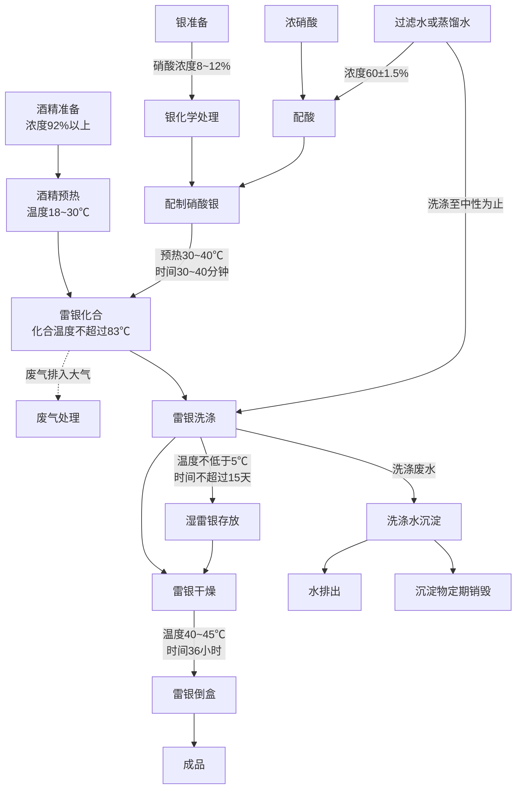

# 第一章 起爆药制造法

## 1 概 述

起爆药是爆破器材装药的主要材料，当它受到外界作用(冲击、摩擦、火焰等)的影响时，能在瞬间放出大量的起爆能，引爆各种炸药。

起爆药是雷管、火帽和底火等火工品的主装药。因此，对起爆药的基本要求是：
(1)起爆力大。起爆力愈强，则被起爆的炸药所作的功就愈大；
(2)对外界的作用有足够的敏感性，以保证在使用中准确发火；
(3)有良好的疏散性和压药性；
(4)化学安定性好，如在光、空气和水分的影响下，其理化性质和爆炸性质不变化；
(5)在常温条件下，能长期贮存。

起爆药的种类很多，如雷汞、氮化铅和三硝基间苯二酚铅等，但在实际生产中大量采用的是雷汞。

制取雷汞的原料为水银、硝酸和酒精。其主要工序是化合反应，通常采用耐 100℃ 以上的玻璃制的曲颈瓶(如图1所示)来完成反应。

  
  
图 1 曲颈瓶

在抗战时期，制造雷管、手榴弹、地雷等爆破器材，需要采用大量的雷汞。在当时制取雷汞无论在生产方式和设备的选择上，一方面要满足工艺条件的要求；另一方面也要符合战时条件和解放区当时的资源条件。根据制取雷汞的基本原理，采用了陶瓷罐作为进行化合反应的设备。经过研究和试验，总结出了罐法制造雷汞的工艺方法。

在当时，制取雷汞所使用的硝酸，主要是由本厂供给。酒精是采用民间饮用的烧酒自行蒸馏。而水银是依靠外购。

1942年以后，敌人对解放区实行了更加严密的经济封锁，在人民群众的积极支持下，水银仍能继续不断的满足需要。为了坚持长期斗争，必须使原料立足于解放区。在制取雷汞的同时，还以元宝和银元(纯银均可)为原料，试制成雷银并能大量生产。根据雷汞和雷银的性质，在当时是将它们配合使用，雷汞多用于底火、火帽和铜壳雷管的主装药，而雷银常做为纸壳雷管的主装药。

雷银(又称雷酸银)是一种白色细小的针状物质，对冲击、摩擦和火焰等外界作用很敏感，与一般金属均能起作用。在水中受冲击摩擦也能爆炸。取制雷银具有较大的危险性，因此，在国外以前很少采用它。

雷银每次的制取量，一般均小于十五分之一克。在制取时，若能很好地了解它的特性，掌握住生产的操作要领，并能选择合适的加工方法和设备，是可以安全进行生产的。抗战期间，就是在保证安全的前提下，生产了大量的雷银。

雷银的制成，不但使原材料立足于解放区，而且也增加了起爆药生产的品种。

## 2 雷汞的性质

雷汞(又称雷酸汞)俗称白药。外观为白色或灰色的斜状结晶。化学式为  $Hg(ONC)_2$，分子量为 284，假密度为 1.2～1.5 克/厘米 $^3$，晶体的比重为 4.39～4.41。它的纯度与比重有关，纯度愈大，比重则愈小。

| 留汞含量% | 97.0 | 98.0 | 99.0 | 99.7 |
| --------- | ---- | ---- | ---- | ---- |
| 比重      | 4.40 | 4.38 | 4.36 | 4.32 |

雷汞的吸湿性很小，在不同的条件下它的吸湿量如下：

| 相对湿度 %  | 样品存放时间(昼夜)    | 吸收水分数量 %  |
| :--------: | :------------------: | :------------: |
|     50     |          60          |      0.02      |
|     80     |          80          |      0.02      |
|    100     |          80          |      0.16      |

雷汞在稀酸、浓酸或强碱的作用下，能发生分解或爆炸。如用稀硫酸或稀硝酸处理时，则发生缓慢的分解；和浓硫酸作用时能立即爆炸。因此，在制取雷汞时或在存有雷汞的工厂和工作间中，禁止存放硫酸。雷汞在硫代硫酸钠的作用下能发生分解，所以常采用硫代硫酸钠来处理废雷汞及雷汞洗涤的废水。

雷汞的温度为 50℃ 时，在两小时后它才开始分解；若加热到 100℃ 时，则在 48 小时以内即发生爆炸，它的反应方程式为：

$$
Hg(ONC)_2 \longrightarrow Hg + 2CO + N_2(理论的)
$$

$$
Hg(ONC)_2 \longrightarrow 1.01Hg + 1.99CO + 0.98N_2(气体分析结果)
$$

| 金属名称 | 作用情况                                                                                             | 作用条件                                | 作用速度 |
| :------: | :------------------------------------------------------------------------------------------------- | :-------------------------------------- | :------: |
|    铜    | (1)$Hg(ONC)_2 + Cu \rightarrow Cu(ONC)_2 + Hg$   (2) 生成 $Cu(ONC)_2 \cdot Cu(OH)_2$ (摩擦感度高) | (1) 有水存在时并加热  (2) 有水存在时 |          |
|    镁    | 放出大量热，并生成非爆炸性的镁化合物                                                                 | 有大量水存在时                          |   激烈   |
|    铝    | 生成氧化铝                                                                                         | 有水存在时                              |   激烈   |
|    锌    | 生成雷酸锌(有爆炸性)                                                                               | 湿雷汞                                  |   较慢   |
|    锡    | 生成锡汞齐                                                                                        | 有水存在时                              |          |
|    铅    | 生成雷酸铅                                                                                        | 有水存在时                              |   微弱   |
|    铁    | 不起作用                                                                                          |                                        |          |

雷汞的起爆温度为 160～180℃，爆速为 5400 米/秒。对机械冲击的敏感度为：以 1 公斤的落锤撞击，在 10 次试验中爆炸的最小高度为 24 厘米；用 2 公斤落锤，10 次试验中爆炸的最小高度为 5 厘米。对摩擦敏感，在铁器表面之间摩擦感度最大，在木质之间的摩擦感度较小。对火焰作用十分敏感。在疏散状时，遇火焰作用由强烈燃烧而转至爆炸，而在容器内遇火焰时则立即爆炸。

## 3 制取雷汞的化学反应过程和工艺条件

如前所述，水银、硝酸和酒精是制取雷汞的主要原料。对这三种原料的要求分别为：水银纯度为99.9%，酒精浓度不低于92%，其中不应含有杂质，硝酸浓度为 $60\pm1.5\%$。

<!--  -->

流程 1 制取雷汞的工艺流程

主要的工艺过程是原料准备、配制硝酸汞、化合反应、洗涤和干燥等。

制取雷汞所采用的原料比例为：1份水银：9份硝酸：10份酒精。所进行的化合反应较复杂，在不考虑副反应的情况下，它的综合反应式为：

$$
3Hg + 8HNO_3 \longrightarrow 3Hg(NO_3)_2 + 2NO + 4H_2O
$$

$$
Hg(NO_3)_2 + 2C_2H_5OH + 4HNO_3 \rightarrow Hg(ONC)_2 + 2CO_2 + 8H_2O + 2NO_3 + 2NO
$$

## 4 配硝酸

硝酸在使用前应进行沉淀，用比重计测定其比重，如比重为1.415，则从表7中可查得该酸的浓度为68.63%，使用时需加水稀释。

使用浓度大的硝酸配酸时，最好使用蒸馏水，也可采用以布过滤的净水。使用的水要求洁净，如果水中所含的砂粒等杂质混入产品中，会增高雷汞的敏感度，对装药、压药的操作极为不利。

原料酸的浓度若超过  $60 \pm 1.5\%$ 时，需要加水稀释；如浓度低于  $60 \pm 1.5\%$，则需追加浓度较高的硝酸。根据原料酸的实际浓度，可按下列公式计算出加水或补加酸的数量：

(一) 稀释硝酸加水量的计算:

$$
W=\frac{n \ A}{N}-A 
$$ 

式中 W——需要加入水的数量(公斤)；

N——要求配制的硝酸浓度 $(60\pm1.5\%)$;

n——原料酸在稀释前的浓度(%)；

A——原料酸的数量(公斤)。

(二) 如原料酸或已配制酸的浓度，低于 $60\pm1.5\%$，则追加溃硝酸的数量按下式计算：

$$
X=\frac{(N-n_1)A}{(n-N)} 
$$ 

式中 X ——需追加浓硝酸的数量(公斤)；

N——所配制酸的浓度(%):

A——待修正酸的数量(公斤)；

n——追加浓硝酸的浓度(%):

$n_1$ ——待修正酸的浓度(%)。

硝酸对金属有强烈的腐蚀作用，所以在抗日战争时期是采用瓷缸作为配酸设备的。当时所用的配酸方法是：用比重计测定出硝酸的浓度，计算出需要水的数量，将酸和水按需要量称取好；

图 2 配酸缸

先向缸中加入定量的净水或过滤水，在注入水之前，用净水把缸(图2)擦洗干净，然后再加入硝酸。配酸时加料次序不能颠倒。如向酸中加水，则会由于酸的强烈吸水作用而激烈放热，容易引起酸液四溅，以至烧伤操作者。因此，一定要向水中加酸，而且速度不应过快，在加酸时还要边加酸边用玻璃棒或锯棒不停地搅拌。

配酸时，由于酸的稀释而生成的热量使温度升高并有硝烟 $(NO_2,~N_2O_4)$散发，对人的呼吸器官有着强烈的刺激性。在当时由于条件限制，没有采用机械搅拌和机械通风装置，而是采用灵活机动的作业方法：晴天在室外露天操作，利用河水或泉水降低酸温。加酸和搅拌时，操作人员站在上风方向，减少酸烟对人的侵害；遇到雨天或风天，就在室内作业，将门窗适当打开，在地面和缸壁的周围洒上水，降低室温和酸温，以减少酸的损失。在配酸时，操作人员要戴好防护用具，以免烧伤并保证安全进行生产。

如原料酸浓度低于规定要求，在配制时需追加浓硝酸并搅拌均匀。配好的硝酸，要重新测定比重，比重应为1.365～1.380。

制造雷汞所用的硝酸，必须纯净，其中不允许含有砂子、玻璃片、铁屑等杂质。在配酸前，硝酸要经过充分的沉淀，以除掉杂质。

配酸操作时要细心，不要把酸液溅到身上。一旦发生烧伤，应立即用水冲洗，并在烧伤部位擦以氨水。

## 5 水银精制

水银也称为汞，分子式为 Hg，是一种外观为银灰色的液态金属，纯度要求在 99.9% 以上。购来的水银一般较纯净，但是由于经常装在铁质容器中，所以可能有铁锈等杂质。清除杂质时，可将一张厚滤纸，用细针穿成数十个小孔，使水银通过滤纸进行过滤。也曾用麂皮或细白布过滤水银，效果较好。在用细白布过滤时，应多过滤几次。

购来的水银如果表面发黑，就表明水银的纯度不高，在使用前要进行化学精制，一般是采用4～8%浓度的稀硝酸进行洗涤。洗涤时，先将过滤的水银倒入一个干净的瓷盆中，再加入4～8%浓度的稀硝酸，同时用玻璃棒不停地搅拌。洗涤完毕将稀硝酸排出，再用过滤水或蒸馏水一边洗涤一边搅拌。水洗1～2次后，排出洗涤水，而残留在水银表面上的水分用细布或棉花擦干。

水银是一种有毒性的物质，在常温下易挥发，随着温度升高其挥发速度也随之加快。因此，在处理水银时，要穿上工作服，戴上口罩和手套。操作完毕后要洗手、漱口。

水银属于战略物资，来源不易。在战争的年代里，每个同志对它都十分珍惜和节约。当偶尔有一滴水银掉到地上，同志们都立刻设法捺起。有一次，敌人突然袭击，工厂奉命立即坚壁撤走，由于是黑夜，临行时有数百克水银未带上，行军途中发现此事，虽然仅仅是几百克并且放置地点不一定能被敌人发现，但还是毫不犹豫地冒着生命危险把它取回来。

## 6 酒精蒸馏

酒精学名乙醇，分子式为  $C_2H_5OH$，是制造雷汞的主要原料之一。所需要的酒精浓度不应低于92%，最好是95%以上。因为低浓度的酒精含水量多，将会影响到化合反应的正常进行和降低产品的得率。

当时所用的酒精，主要是以民间酿造的烧酒(又称毛酒)为原料进行蒸馏制得。所采用的工艺装置如图3所示。

1—火炉；2—蒸馏桶；3—加料口；4—温度计；5—连接管；6—冷却缸；7—冷水缸；8—支架；9—酒精罐。

图 3 酒精蒸馏装置

酒精蒸馏的热源是一个烧炭的火炉。在炉上安装一个大铁桶或铝锅，冷却器是一个大陶瓷缸，管子由蒸馏桶顶部接出通入冷却器，并在冷却器中盘成螺旋形，管子的出口由缸的下部通出。

蒸馏时，将烧酒加入蒸馏桶中，用火炉加热。由于温度升高使酒精蒸发，酒精蒸气和一部分水蒸汽通过导管进入冷凝器中，冷却后凝为液体流入酒精罐中。

冷却水当时是用高位水加入冷却缸中的。加冷水时，利用高位的压力，使水由冷却缸的底部进入，温度升高的水由上部的溢流管排出。

蒸馏过程中，应经常察看蒸馏桶的温度，当温度上升到约78℃(酒精的沸点)时，就有酒精蒸气蒸馏出来；当温度继续上升到80℃时，即可停止蒸馏。将桶内残留的烧酒(大部分是水)由下部的排渣口放出。残渣积累较多时，可集中进行蒸馏(其中有少量酒精)。

蒸馏次数与原料(如烧酒)的浓度有关。例如：40～50% 浓度的烧酒，欲达到92%以上的浓度，利用上述设备需要反复蒸馏2～4次。

## 7 配制硝酸汞

制造雷汞首先要以硝酸和汞作用制成硝酸汞，然后用硝酸汞与酒精作用生成雷汞。生成硝酸汞的化学反应式为：

$$
3Hg + 8HNO_3 \longrightarrow 3Hg(NO_3)_2 + 4H_2O + 2NO + 28.9 仟卡 
$$ 

每次配制硝酸汞的数量与化合反应的投料量有关。如采用罐法化合，每次每罐的投料量若以水银500克计算，即配制每一份硝酸汞用水银500克，投料比采用1:9，则硝酸投料量为4500克。

配制硝酸汞最好是选用口细底大的玻璃瓶。配制时先将已精制的水银称量500克为一份，注入细口瓶(图4)中；再称取浓度为 $ 60\pm1.5\% $的硝酸4500克，小心地加入瓶中，用玻璃片把瓶口盖上。硝酸加入后，汞与硝酸开始反应，几分钟后，就可以观察到有棕色的烟雾产生，温度亦随之上升。配制硝酸汞的反应，应至汞完全被硝化为止，整个反应时间约为1~1.5小时。

在配制硝酸汞时，为了使反应速度加快和物料反应完全，硝酸汞溶液的温度要保持在30～40℃范围内。硝酸汞加温时，是将盛有硝酸汞溶液的细口瓶置于木槽或水泥槽内，并经常测定槽(图5)内水的温度，用调整冷热水加入量的方法来保证所要求的水温。

为了排出在反应中所产生的硝烟，可用木板制成排风筒通出屋外，或者在晴朗无灰尘的露天进行操作，以便排除有害气体。

图 4 细口瓶

1—排气管；2—排气罩；3—硝酸汞瓶；4—温水槽；5—温度计。

图 5 硝酸汞预温槽

## 8 雷汞化合反应

雷汞化合反应在雷汞制造中是一个主要的工序。化合反应的好坏直接影响到产品得率和质量。

化合反应所用的原料为硝酸汞和酒精(其用量为水银的10倍)，即一份配制好的硝酸汞与5000克浓度92%以上的酒精。

图 6 瓷罐

硝酸汞与酒精化合作用生成雷汞。

在战争的年代，由于受到物质条件的限制，没有采用耐高温(100℃)的曲颈瓶作为化合的设备，而是采用了民间所用的表面光滑的瓷罐作为化合设备(图6)。

瓷罐的来源广泛，保温条件好，耐腐蚀。其缺点是不透明，

观察不到内部的反应情况。

在操作前首先将硝酸汞准备好，再把酒精从5000克为一份装入广口瓶中，置于水槽内保温，当温度达到18～35℃时，即可使用。

雷汞化合反应过程中，有较多的硝烟、酒精蒸气和废气等产生，最好应设置机械通风设备。在战争年代里，雷汞化合多是选择良好的气候条件，在室外进行操作。

操作时，先将瓷罐(反应罐)擦洗干净，放在干净的砖墩上(图7)准备投料。室外作业不受面积的限制，产量可大可小。产量大时，可摆上十几个到二十几个罐子，罐与罐之间保持1.5~2米的距离。

当时我们把它叫做是世界上“最新式”的雷汞化合工厂，既不受硝烟的侵害，也不受作业面积的限制。的确，在那战争的岁月里，广阔的天地就是革命者战斗的厂房。

1—反应罐；2—砷墩。

图 7 露天化合反应作业

将罐子摆好后，在每个罐子里插一支温度计或用一支温度计巡回测试。准备妥当后，开始投料。投料时，先在每一罐内加入一份酒精(重5000克)，再将硝酸汞溶液呈线状缓慢地加入。

硝酸汞加入后，反应立即开始。3～5分钟后，液体呈透明的黄绿色，温度计升高到约50℃。到8～10分钟时，酒精与硝酸汞中过量的硝酸发生作用，液体底部开始放出气泡，在液面上升起了白色的烟雾。这时溶液很快地转入剧烈反应，放出的气泡增多，并有大量的烟雾出现。

当大量烟雾出现之后，再经过5～7分钟，温度可上升到80℃以上。雷汞化合的温度，最好是控制在82℃左右，如温度超过时，可在溶液中追加少量的酒精，使温度下降。当温度达到80～82℃的时候，雷汞的结晶即可析出。随后，气泡愈来愈少，但反应更为剧烈，这时母液呈强烈的沸腾状。当雷汞大量生成之后，母液也逐渐减少，母液中的酒精也已蒸发，使过量的硝酸分解，放出黄色的氧化氮气体。此时，温度稍能上升1～2℃，并保持一段时间。当温度逐渐下降时，整个化合反应即告结束。整个反应过程共需60分钟左右。

雷汞化合反应的操作掌握得是否正确，直接影响到产品质量和得率。在战争的年代里所制造的雷汞，绝大多数都是优质的。但也发生过在反应中有“清汤”现象，制出的产品得率低，纯度也低。其原因主要是由于投料时硝酸用量不够，也可能是酒精用量过多，当然，气温和物料的温度太低也有所影响。因此，必须正确地掌握物料的温度、数量、温度和加料次序。如发现反应温度过高，应及时追加酒精，否则将影响产品的得率，同时也影响化合反应的安全作业。

在雷汞制造中，要注意掌握硝酸浓度为  $60 \pm 1.5\%$，酒精浓度为 92% 以上。物料的投料比应为，水银：硝酸：酒精为 1:9:10。投料时是将硝酸加入水银中，先配成硝酸汞溶液，并保持温度为 30～40℃。在化合反应时，先向罐中加入 18～30℃ 的酒精，再加入硝酸汞溶液。控制反应温度在 84℃ 以下，最好是 82℃ 左右。按上述工艺条件进行生产，可制出优质的雷汞产品。

在当时，由于客观情况的限制，也曾使用过浓度为80～89%的低浓度酒精，其结果是按原定比例投料，则产品得率有所降低。因此在这种情况下，必须改变工艺条件，把投料比由1:9:10改为1:9:12，即加大了酒精用量。这样，产品的得率提高，但温度上升很慢，反应时间由60分钟延长到2小时。

雷汞化合反应中，由于雷汞是存在于大量介质中，所以是属于危险作业。同时因有不少酒精及其气体的存在，要特别注意防火和安全。无论是在室内作业或是露天作业，距作业地点100米范围内应禁止有明火。在战争年代，虽然物质条件较差，所使用的原料、材料和设备经常有质量差异和变更，但以毛泽东思想武装起来的革命战士，发挥了主观能动性，充分地利用了客观条件，在多年的大量生产中，从未发生过伤亡事故。由于意外情况在化合反应时也发生过一次起火。这次起火主要是由于在距雷汞化合作业场地约50米的地方，有一小堆未燃尽的残灰，当酒精蒸气和反应所产生的废气随空气飘荡时，遇到灰中火星而引起燃烧，瞬时即导致全部反应罐起火。

上述火灾事件说明，雷汞化合反应所排出的大量气体中，有一部分是酒精蒸气和其他易燃气体。因此，在生产过程中要特别注意防火。

## 9 雷汞洗涤

洗涤的目的，在于从雷汞中除去酸份及其它可溶于水中的杂质。通过洗涤还可以减少反应中的草酸汞等副产品的含量(草酸汞是不安定的物质，当装药与壳体作用时，在某些情况下，会引起爆炸)。

洗涤是在化合反应结束后，物料温度逐渐下降到75℃以下时进行。将箩筐或本质滤盆放在洁净的瓷盆上，内铺细白布，把雷汞和母液一起缓慢地倒入箩筐中。母液经布过滤，流入盆里，再将箩筐中的雷汞倒入另一个洁净的盆中(也可用表面光洁的玻璃缸)。再以过滤的净水洗涤，边加水边搅拌，反复洗涤，一直洗至中性为止。通常需洗10次以上(图8)。

   1—细白布; 2—笼筐; 3—木架; 4—瓷盆; 5—工作台

图 8 雷汞洗涤装置

洗涤后，用勺取出洗涤水3~5毫升，倒入玻璃杯中，滴入数滴甲基橙指示剂，当洗涤水不呈红色(中性)时即为洗涤合格。也可用蓝色石蕊试纸进行检验。将洗涤后的湿雷汞装入布袋内，口部用线绳系好，置于清水中或放在盛有水的大玻璃瓶中保存。雷汞在干燥状态下性质敏感，在洗涤时不要将它溅在地上；洗雷汞所使用的工具，常常沾有少量的雷汞，在洗涤后工具也应保存在清水中。

洗涤雷汞的废水中含有少量的雷汞，这种废水不宜直接排出或排入小河沟中，以免废水干涸后，残留的雷汞受摩擦而引起爆炸。因此，应将洗涤废水集中在大陶瓷缸中，使它充分沉淀，最好再加入一些浓度为20%的硫代硫酸钠溶液，使残余的雷汞分解，分解后的废水即可排出。分解后的废物料，收集在一起定期处理或烧毁。

## 10 雷汞干燥

雷汞干燥作业，是通过干燥除去雷汞中的水分。干燥的雷汞对冲击摩擦和火焰的作用均十分敏感。因此，选择干燥方式须要慎重。雷汞干燥通常采用的方法有真空干燥法、热风干燥法和干燥室干燥法。在抗战时期，雷汞干燥是用隔墙加热的火墙式干燥方法。

首先将湿雷汞用细白布包好，置于手搬压力机上，除去其中大部分水分。除水后，雷汞中的含水量可由30%以上降低到8～12%左右。在干燥前，雷汞中的含水量不要低于8%，如含水量过低会增加分盘工序的危险性(图 9)。

1—手扳压力机；2—湿雷汞；3—工作台。

图 9 手扳压力机除水

火墙式干燥室的墙是空心的，从室外专用的房间烧火，使烟气进入四周的空心区域，通过加热室内的空气来提高室温。保持室温在38～45℃，不宜过高。在室内放置木制的干燥架，架上置有干燥盘。经过除水后的雷汞，应小心地分配到每个干燥盘里，每一盘的装量不宜超过200克。干燥架用木制材料制成，结合方式采用榫接，如果用铁钉结合时，必须将铁钉头深深地嵌入结合件内，并在钉帽上涂漆。干燥架的高度，以低于2米为宜，其中可分成3～4层，每层均铺隔板，在板上铺以外包漆布的毛毡，使表面光滑柔软，在每层隔板的后面装上一排凸出的木条，以防止药盘入架时用力过猛由架后掉下来。在架子的前面挂上网布或细白布，架子的顶部需装置顶板，以防止灰尘落入药中(图10)。

1—干燥架；2—火墙。

图10 火墙干燥室

药盘是用木料(或厚纸板)制成，其上包一层漆布或细布，再在布上涂一层虫胶漆。烘干时在盘上放置一块比盘略大一些的绸布，将雷汞倒在盘上用牛角勺或羽毛轻轻地将药铺平，再小心地送到干燥架上。在室温为38～45℃的条件下烘干36小时(图11)。

烘干以后的雷汞，装入纸盒中。这个操作要注意安全，装盒工作最好是在单独的工作间里进行。

图11 药盘

倒药所采用的设备如图 12 所示。

倒药装置除框架是木制以外，其他部件均用厚纸板制成。内

1—拉绳；2—药盘；3—支架；4—输药漏斗；5—纸盒；6—橡皮板；7—厚毡垫

图12 倒药装置

外均以纸糊成光洁无缝，并涂上两层虫胶漆，在药盒的下面铺以橡皮板。

倒药时可能有静电产生，当时是采用在橡皮板上涂以导电漆。导电漆的成分为65%的清漆和35%的石墨粉的混合物。

干雷汞运来后要进行装盒，装盒时先将药盘置于可转动的托板上，用橡皮筋卡住，操作人员到防险墙外，通过滑轮用绳子将药盘拉翻，这样药就缓慢地流入药盒中。每盒装一盘或两盘(即200～400克)。装盒以后的成品即可送去使用。

制造雷汞所用的厂房，一般包括有化合工厂(当时多在室外作业)、干燥工厂和倒药工厂等以及库房。由于当时环境比较动荡，不可能建设新的厂房，当时是选择离居民密集的村镇比较远的地方，充分利用已有的建筑物，如学校和零星的居民住宅，略加以修改扩充。

由于雷汞制造过程中可能会产生起火和爆炸，因此，不要用草房和草棚，离居民地点也不宜太近，屋顶有纸棚的应将纸棚拆除。如系多年的老房子，一经震动就会有灰尘落下，这对雷汞生产也是不合适的。为了避免灰尘下落掉入药中，在室内屋顶挂上布，保持室内清洁。在战争年代，虽然厂房简陋，但能经常保持室内整洁，操作也井然有条，因而保证了优质高产和生产安全。

在战争的岁月里，除厂房自动手动改建外，设备是自己加工制造的，工具、量具和仪器也多是自己制作的。如量筒，虽然构造简单，但用途很广泛，可计量液体、测定密度、测定固体粉(粒)状物质的假比重等。这些用具大多是以自力更生的方法来解决的。如在玻璃杯或玻璃管中，注入温度为 4℃ 的定量的水( 4℃时的水比重为1)，然后在杯的水准面处，

刻上标记(刻度)，即可制成简单的量筒(图 13)。当时是采用这种简易的办法，制做出诸如此类各式各样的工具和仪器。

在生产和战斗的间隙，职工们开展了各种科学研究活动，虽然参考资料缺乏，书籍不多，但由于职工们积极努力，充分利用当时条件，所以研究成果很显著，并多用于生产上。

图13 量筒

由于战时环境复杂，为保守机密起见，将各种产品均托以代名词：如硫酸称之为“白醋”，硝酸称之为“黄醋”，乙醚称之为“香水”等。

在战争年代是面临着一年几次的扫荡和反扫荡的斗争。为应付环境突变，在平时对坚壁工作就做好充分准备；一旦发生敌情，各负专责，接到坚壁的命令后，各种坚壁工作立即按计划进行，几小时后，一栋栋生产车间，即静悄无声；如果原来是个庙宇，这时在高大的宝殿上又出现了一尊尊的泥塑像。使敌人根本找不出破绽，无法找到工厂，更无法破坏工厂。

抗战时期，不但制造了灰雷汞，也制造了白雷汞，还试验了雷铜、雷银等各种雷酸爆炸物，并且大量地制造了雷银。

## 11 雷银的性质

雷银，外观为白色细小针状体，分子式为 AgONC，密度为4.09克/厘米 $^3$，吸湿性很小。它在空气中和光线作用下表面变黑；与浓硫酸作用时爆炸；与金属作用可生重盐。例如：与铵、钠、钾作用时生成 $NH_4(AgONC),Na(AgONC),K(AgONC)$。

雷银的爆发点为 167～178℃，对冲击摩擦很敏感。如将雷银置于两个坚硬的固体表面之间，即使受轻微的冲击甚至在水中也能爆炸。1 公斤落锤在 10 次撞击试验中，引起爆炸的最小高度为 38 厘米。雷银对火焰非常敏感，受火焰作用时即强烈燃烧，并转至爆炸。在壳体内燃烧时立即爆炸。

## 12 雷银制造概述

雷银试制是于1943年春天开始的，利用雷汞生产的全部设备，经过一段摸索和研究，由小型到大型试验，并投入大量生产，所制出的产品，多用于纸壳雷管的主装药。雷银试验记录片断附后。

雷银制造所用的原料是硝酸(浓度  $60 \pm 1.5\%$)，酒精(浓度 92% 以上)和银(纯度较大的)。上述三种物料的投料比为15:15:1，雷银制造的方法和工艺步骤与雷汞制造基本相同。

制造雷银的银，在解放区来源很广，如元宝、银元、银器等。根据试验证明，制造雷银所用的银，要求纯度愈高愈好，否则将影响产品质量和得率。经试验得知，在银质材料中，元宝的纯度较大，含铜量较小，其次是银元，而各种银器的纯度就更次之。元宝的质量纯，解放区内存量又多，所以，当时，即以元宝为制雷银的主要原料。一个银元一般重22.5克，而大元宝的重量为1125克。当然原料银不限于元宝和银元，凡是纯银均能使用。

流程 2 雷银制造工艺流程
 

物料投料比——银：硝酸：酒精为1:15:15。

## 13 原料准备及配制硝酸银

配硝酸和酒精的准备方法及所使用的工具和仪器与雷汞制造相同。而配制硝酸银所使用的元宝，由于制造年代较久，并在民间长期流传，在元宝的外表面上有一层油污和发黑的氧化层需要清除。清除时可先用布将元宝的外表面擦拭干净，再进行化学处理。用一个洁净的瓷盆，在盆里加入浓度8～12%的稀硝酸，将擦干净的元宝或银元，用小勺子轻轻地浸入酸液中，经过3～5分钟酸洗后取出。取出后用清水冲洗和擦干，称好重量并按1:15准备好硝酸钾，即可配制硝酸银。配制硝酸银的方法与硝酸汞配制的方法相同。配制硝酸银的化学反应式如下：

$$
3Ag+8HNO_3\longrightarrow3Ag(NO_3)_2+2NO+4H_2O
$$

## 14 雷银化合反应

雷银化合反应的装置是采用与雷汞化合反应相同的瓷罐。先把罐擦净，将温度为25～35℃的硝酸银溶液加入罐中，然后再加入重量为银15倍的温度18～30℃的酒精，加酒精时要徐徐加入，先加入全部用量的二分之一。这时酒精与硝酸银开始作用，温度逐渐升高。溶液中开始有气泡上升，继之，有白色烟雾出现。当温度上升到65～70℃时，再将其余的二分之一酒精加入。约经10分钟，温度迅速上升，反应剧烈，有大量烟雾由罐口排出。

当温度达到 80℃ 左右，雷银的晶体开始析出，其后的反应与雷汞制造相同。

硝酸银与酒精的作用非常复杂，同时产生一系列副反应。当不考虑副反应时，这种作用可写成下列反应式：

$$
Ag(NO_3)_2 + 2C_2H_5OH + 4HNO_3 \longrightarrow Ag(ONC)_2 + 2CO_2 + 8H_2O + 2NO_2 + 2NO
$$ 

制造雷银时的化合反应温度，不能过高或过低。反应温度过低，会出现“清汤”现象；反应温度过高，会增加操作的危险性。因而应控制化合反应温度不超过83℃。如温度过高时，可以加入少量的酒精调整温度。雷银化合反应的整个操作过程的约需60分钟。

雷银化合反应，要特别注意安全。每次投料量不宜过大，每罐每次投料量以银来说，不超过200克。雷银化合反应可以在室内作业也可以在室外露天作业，但要特别注意，勿使灰尘、砂粒等混入里面。

## 15 雷银洗涤

洗涤雷银的目的是为了除掉酸份，因为含酸的雷银是不安定的。雷银洗涤与雷汞洗涤不同，雷汞在水中钝感，而雷银在水中仍具有爆炸性。洗涤时切忌冲击摩擦，绝对禁止搅拌，只能用较细的胶皮管放水冲洗。

洗涤是在化合反应结束后进行的，先在罐内的母液中，加入少量的过滤水或蒸馏水将母液稀释。然后用一个洁净的瓷盆，上面放置一个木漏斗，在漏斗内铺一块细白布(最好是绸布)。将经过稀释的雷银和母液一起倒入漏斗中，用细胶皮管放水冲洗，禁止搅拌(图 14)。

洗涤后轻轻地将绸布的四角合拢起来，装入布袋内，系好口袋，置于水中保存。在整个洗涤过程中都必须精心细致，以免发生危险。

图14 洗涤用木漏斗

## 16 雷银干燥

雷银干燥的工艺条件和设备与雷汞相同，但雷银对冲击摩擦比雷汞更为敏感。操作时，工作人员要避免直接与雷银接触。分盘时，最好使用表面光洁的小木板作为分盘工具，分盘工作要在纸板上进行。分盘后即可送去干燥，干燥雷银的工艺条件与雷汞相同，经干燥合格的产品即为成品。

雷银对冲击、摩擦和火焰作用十分敏感，在制造中要注意防火，防止冲击摩擦，防止灰尘杂质落入其中。雷银遇硫酸作用立即发生爆炸，在雷银制造工厂或工作地点绝对禁止存放硫酸。

在大量需要起爆材料的情况下，雷银制造成功并大量投入生产，不但满足了军事供给，也节约不少水银，使原材料立足于解放区，给起爆药增添了新的品种。

几千年来元宝都为剥削阶级所占有，成为压榨和剥削劳动人民血汗的工具。今天在人民手中，用它制造出爆炸物，为解放事业发出了光和热，在兵工史上记载了光荣的一页。

表 4 雷银试验记录片断

<table border=1 style='margin: auto; word-wrap: break-word;'>
<tr><td rowspan="2">试验次数</td><td rowspan="2">加入银的重量(克)</td><td colspan="3">硝酸</td><td colspan="2">酒精浓度90%</td><td colspan="3">反应情况</td><td colspan="2">得率</td></tr><tr><td style='text-align: center; word-wrap: break-word;'>比重1.56(克)</td><td style='text-align: center; word-wrap: break-word;'>水(克)</td><td style='text-align: center; word-wrap: break-word;'>温度(℃)</td><td style='text-align: center; word-wrap: break-word;'>重量(克)</td><td style='text-align: center; word-wrap: break-word;'>温度(℃)</td><td style='text-align: center; word-wrap: break-word;'>初温(℃)</td><td style='text-align: center; word-wrap: break-word;'>终温(℃)</td><td style='text-align: center; word-wrap: break-word;'>产量(克)</td><td style='text-align: center; word-wrap: break-word;'>为理论得率的%</td><td style='text-align: center; word-wrap: break-word;'>备注</td></tr><tr><td style='text-align: center; word-wrap: break-word;'>1</td><td style='text-align: center; word-wrap: break-word;'>2</td><td style='text-align: center; word-wrap: break-word;'>20</td><td style='text-align: center; word-wrap: break-word;'>6</td><td style='text-align: center; word-wrap: break-word;'>36.5</td><td style='text-align: center; word-wrap: break-word;'>20</td><td style='text-align: center; word-wrap: break-word;'>26</td><td style='text-align: center; word-wrap: break-word;'>51(水套加热)</td><td style='text-align: center; word-wrap: break-word;'>76</td><td style='text-align: center; word-wrap: break-word;'>0.95</td><td style='text-align: center; word-wrap: break-word;'>34.3</td><td style='text-align: center; word-wrap: break-word;'>白色细粒结晶</td></tr><tr><td style='text-align: center; word-wrap: break-word;'>2</td><td style='text-align: center; word-wrap: break-word;'>2</td><td style='text-align: center; word-wrap: break-word;'>20</td><td style='text-align: center; word-wrap: break-word;'>8</td><td style='text-align: center; word-wrap: break-word;'>40</td><td style='text-align: center; word-wrap: break-word;'>12</td><td style='text-align: center; word-wrap: break-word;'>26</td><td style='text-align: center; word-wrap: break-word;'>51(水套加热)</td><td style='text-align: center; word-wrap: break-word;'>74</td><td style='text-align: center; word-wrap: break-word;'>0.46</td><td style='text-align: center; word-wrap: break-word;'>16.6</td><td style='text-align: center; word-wrap: break-word;'>白色细粒结晶</td></tr><tr><td style='text-align: center; word-wrap: break-word;'>3</td><td style='text-align: center; word-wrap: break-word;'>2</td><td style='text-align: center; word-wrap: break-word;'>16</td><td style='text-align: center; word-wrap: break-word;'>8</td><td style='text-align: center; word-wrap: break-word;'>45</td><td style='text-align: center; word-wrap: break-word;'>16</td><td style='text-align: center; word-wrap: break-word;'>26</td><td style='text-align: center; word-wrap: break-word;'>50(水套加热)</td><td style='text-align: center; word-wrap: break-word;'>67</td><td style='text-align: center; word-wrap: break-word;'>0.55</td><td style='text-align: center; word-wrap: break-word;'>20</td><td style='text-align: center; word-wrap: break-word;'>白色细粒结晶</td></tr><tr><td style='text-align: center; word-wrap: break-word;'>4</td><td style='text-align: center; word-wrap: break-word;'>2</td><td style='text-align: center; word-wrap: break-word;'>16</td><td style='text-align: center; word-wrap: break-word;'>7</td><td style='text-align: center; word-wrap: break-word;'>45</td><td style='text-align: center; word-wrap: break-word;'>16</td><td style='text-align: center; word-wrap: break-word;'>26</td><td style='text-align: center; word-wrap: break-word;'>50(水套加热)</td><td style='text-align: center; word-wrap: break-word;'>65</td><td style='text-align: center; word-wrap: break-word;'>0.42</td><td style='text-align: center; word-wrap: break-word;'>15.3</td><td style='text-align: center; word-wrap: break-word;'>白色细粒结晶</td></tr><tr><td style='text-align: center; word-wrap: break-word;'>5</td><td style='text-align: center; word-wrap: break-word;'>2</td><td style='text-align: center; word-wrap: break-word;'>20</td><td style='text-align: center; word-wrap: break-word;'>3</td><td style='text-align: center; word-wrap: break-word;'>40</td><td style='text-align: center; word-wrap: break-word;'>16</td><td style='text-align: center; word-wrap: break-word;'>26</td><td style='text-align: center; word-wrap: break-word;'>自起作用</td><td style='text-align: center; word-wrap: break-word;'>77</td><td style='text-align: center; word-wrap: break-word;'>1.07</td><td style='text-align: center; word-wrap: break-word;'>39</td><td style='text-align: center; word-wrap: break-word;'>白色细粒结晶</td></tr><tr><td style='text-align: center; word-wrap: break-word;'>6</td><td style='text-align: center; word-wrap: break-word;'>4</td><td style='text-align: center; word-wrap: break-word;'>60</td><td style='text-align: center; word-wrap: break-word;'>5</td><td style='text-align: center; word-wrap: break-word;'>42</td><td style='text-align: center; word-wrap: break-word;'>60</td><td style='text-align: center; word-wrap: break-word;'>26</td><td style='text-align: center; word-wrap: break-word;'>自起作用</td><td style='text-align: center; word-wrap: break-word;'>82</td><td style='text-align: center; word-wrap: break-word;'>4.3</td><td style='text-align: center; word-wrap: break-word;'>78</td><td style='text-align: center; word-wrap: break-word;'>白色针状结晶</td></tr><tr><td style='text-align: center; word-wrap: break-word;'>7</td><td style='text-align: center; word-wrap: break-word;'>2</td><td style='text-align: center; word-wrap: break-word;'>25</td><td style='text-align: center; word-wrap: break-word;'>7</td><td style='text-align: center; word-wrap: break-word;'>40</td><td style='text-align: center; word-wrap: break-word;'>20</td><td style='text-align: center; word-wrap: break-word;'>26</td><td style='text-align: center; word-wrap: break-word;'>自起作用</td><td style='text-align: center; word-wrap: break-word;'>75</td><td style='text-align: center; word-wrap: break-word;'>1.62</td><td style='text-align: center; word-wrap: break-word;'>50</td><td style='text-align: center; word-wrap: break-word;'>白色针状结晶</td></tr><tr><td style='text-align: center; word-wrap: break-word;'>8</td><td style='text-align: center; word-wrap: break-word;'>2</td><td style='text-align: center; word-wrap: break-word;'>20</td><td style='text-align: center; word-wrap: break-word;'>2</td><td style='text-align: center; word-wrap: break-word;'>40</td><td style='text-align: center; word-wrap: break-word;'>15</td><td style='text-align: center; word-wrap: break-word;'>26</td><td style='text-align: center; word-wrap: break-word;'>自起作用</td><td style='text-align: center; word-wrap: break-word;'>74</td><td style='text-align: center; word-wrap: break-word;'>1.23</td><td style='text-align: center; word-wrap: break-word;'>44</td><td style='text-align: center; word-wrap: break-word;'>白色针状结晶</td></tr></table>

表 5 酒精浓度表(15.56℃时)

| 乙醇体积百分率% | 单位体积重量克/厘米$^3$  | 乙醇体积百分率% | 单位体积重量克/厘米$^3$ | 乙醇体积百分率% | 单位体积重量克/厘米$^3$ | 乙醇体积百分率% | 单位体积重量克/厘米$^3$ |
|:--------------:|:----------------------:|:--------------:|:----------------------:|:--------------:|:----------------------:|:--------------:|:------------------:|
| 1              | 0.9976                 | 18             | 0.9771                 | 35             | 0.9583                 | 52             | 0.9295             |
| 2              | 0.9961                 | 19             | 0.9761                 | 36             | 0.9570                 | 53             | 0.9275             |
| 3              | 0.9947                 | 20             | 0.9751                 | 37             | 0.9559                 | 54             | 0.9254             |
| 4              | 0.9933                 | 21             | 0.9741                 | 38             | 0.9541                 | 55             | 0.9234             |
| 5              | 0.9919                 | 22             | 0.9731                 | 39             | 0.9526                 | 56             | 0.9213             |
| 6              | 0.9906                 | 23             | 0.9720                 | 40             | 0.9510                 | 57             | 0.9192             |
| 7              | 0.9893                 | 24             | 0.9710                 | 41             | 0.9494                 | 58             | 0.9170             |
| 8              | 0.9881                 | 25             | 0.9700                 | 42             | 0.9478                 | 59             | 0.9148             |
| 9              | 0.9869                 | 26             | 0.9689                 | 43             | 0.9461                 | 60             | 0.9126             |
| 10             | 0.9857                 | 27             | 0.9679                 | 44             | 0.9444                 | 61             | 0.9104             |
| 11             | 0.9845                 | 28             | 0.9668                 | 45             | 0.9427                 | 62             | 0.9082             |
| 12             | 0.9834                 | 29             | 0.9657                 | 46             | 0.9409                 | 63             | 0.9059             |
| 13             | 0.9823                 | 30             | 0.9646                 | 47             | 0.9391                 | 64             | 0.9036             |
| 14             | 0.9812                 | 31             | 0.9634                 | 48             | 0.9373                 | 65             | 0.9013             |
| 15             | 0.9802                 | 32             | 0.9622                 | 49             | 0.9354                 | 66             | 0.8989             |
| 16             | 0.9791                 | 33             | 0.9609                 | 50             | 0.9335                 | 67             | 0.8965             |
| 17             | 0.9781                 | 34             | 0.9596                 | 51             | 0.9315                 | 68             | 0.8941             |

| 乙醇体积百分率% | 单位体积重量克/厘米$^3$ | 乙醇体积百分率% | 单位体积重量克/厘米$^3$ | 乙醇体积百分率% | 单位体积重量克/厘米$^3$ | 乙醇体积百分率% | 单位体积重量克/厘米$^3$ |
|:--------------:|:---------------------:|:--------------:|:---------------------:|:--------------:|:---------------------:|:--------------:|:---------------------:|
| 69             | 0.8917                | 77             | 0.8712                | 85             | 0.8488                | 93             | 0.8230                |
| 70             | 0.8892                | 78             | 0.8685                | 86             | 0.8458                | 94             | 0.8194                |
| 71             | 0.8867                | 79             | 0.8658                | 87             | 0.8428                | 95             | 0.8157                |
| 72             | 0.8842                | 80             | 0.8631                | 88             | 0.8397                | 96             | 0.8118                |
| 73             | 0.8817                | 81             | 0.8603                | 89             | 0.8365                | 97             | 0.8077                |
| 74             | 0.8791                | 82             | 0.8575                | 90             | 0.8332                | 98             | 0.8034                |
| 75             | 0.8765                | 83             | 0.8547                | 91             | 0.8299                | 99             | 0.7988                |
| 76             | 0.8739                | 84             | 0.8518                | 92             | 0.8265                | 100            | 0.7937                |

表 6 各种温度下的酒精比重表

<table border=1 style='margin: auto; word-wrap: break-word;'><tr><td style='text-align: center; word-wrap: break-word;'>乙醇重量</td><td colspan="4">比重(与4℃的同体积水相比)</td></tr><tr><td style='text-align: center; word-wrap: break-word;'>百分率</td><td style='text-align: center; word-wrap: break-word;'>0℃</td><td style='text-align: center; word-wrap: break-word;'>10℃</td><td style='text-align: center; word-wrap: break-word;'>20℃</td><td style='text-align: center; word-wrap: break-word;'>30℃</td></tr><tr><td style='text-align: center; word-wrap: break-word;'>0</td><td style='text-align: center; word-wrap: break-word;'>0.99988</td><td style='text-align: center; word-wrap: break-word;'>0.99975</td><td style='text-align: center; word-wrap: break-word;'>0.99831</td><td style='text-align: center; word-wrap: break-word;'>0.99579</td></tr><tr><td style='text-align: center; word-wrap: break-word;'>5</td><td style='text-align: center; word-wrap: break-word;'>0.99135</td><td style='text-align: center; word-wrap: break-word;'>0.99113</td><td style='text-align: center; word-wrap: break-word;'>0.98945</td><td style='text-align: center; word-wrap: break-word;'>0.98680</td></tr><tr><td style='text-align: center; word-wrap: break-word;'>10</td><td style='text-align: center; word-wrap: break-word;'>0.98493</td><td style='text-align: center; word-wrap: break-word;'>0.98409</td><td style='text-align: center; word-wrap: break-word;'>0.98195</td><td style='text-align: center; word-wrap: break-word;'>0.97892</td></tr><tr><td style='text-align: center; word-wrap: break-word;'>15</td><td style='text-align: center; word-wrap: break-word;'>0.97995</td><td style='text-align: center; word-wrap: break-word;'>0.97816</td><td style='text-align: center; word-wrap: break-word;'>0.97527</td><td style='text-align: center; word-wrap: break-word;'>0.97142</td></tr><tr><td style='text-align: center; word-wrap: break-word;'>20</td><td style='text-align: center; word-wrap: break-word;'>0.97566</td><td style='text-align: center; word-wrap: break-word;'>0.97263</td><td style='text-align: center; word-wrap: break-word;'>0.96877</td><td style='text-align: center; word-wrap: break-word;'>0.96413</td></tr><tr><td style='text-align: center; word-wrap: break-word;'>25</td><td style='text-align: center; word-wrap: break-word;'>0.97115</td><td style='text-align: center; word-wrap: break-word;'>0.96662</td><td style='text-align: center; word-wrap: break-word;'>0.96185</td><td style='text-align: center; word-wrap: break-word;'>0.95628</td></tr><tr><td style='text-align: center; word-wrap: break-word;'>30</td><td style='text-align: center; word-wrap: break-word;'>0.96540</td><td style='text-align: center; word-wrap: break-word;'>0.95998</td><td style='text-align: center; word-wrap: break-word;'>0.95403</td><td style='text-align: center; word-wrap: break-word;'>0.94751</td></tr><tr><td style='text-align: center; word-wrap: break-word;'>35</td><td style='text-align: center; word-wrap: break-word;'>0.95784</td><td style='text-align: center; word-wrap: break-word;'>0.95174</td><td style='text-align: center; word-wrap: break-word;'>0.94514</td><td style='text-align: center; word-wrap: break-word;'>0.93813</td></tr><tr><td style='text-align: center; word-wrap: break-word;'>40</td><td style='text-align: center; word-wrap: break-word;'>0.94939</td><td style='text-align: center; word-wrap: break-word;'>0.94255</td><td style='text-align: center; word-wrap: break-word;'>0.93511</td><td style='text-align: center; word-wrap: break-word;'>0.92813</td></tr><tr><td style='text-align: center; word-wrap: break-word;'>45</td><td style='text-align: center; word-wrap: break-word;'>0.93977</td><td style='text-align: center; word-wrap: break-word;'>0.93254</td><td style='text-align: center; word-wrap: break-word;'>0.92493</td><td style='text-align: center; word-wrap: break-word;'>0.91710</td></tr><tr><td style='text-align: center; word-wrap: break-word;'>50</td><td style='text-align: center; word-wrap: break-word;'>0.92940</td><td style='text-align: center; word-wrap: break-word;'>0.92182</td><td style='text-align: center; word-wrap: break-word;'>0.91400</td><td style='text-align: center; word-wrap: break-word;'>0.90577</td></tr><tr><td style='text-align: center; word-wrap: break-word;'>55</td><td style='text-align: center; word-wrap: break-word;'>0.91848</td><td style='text-align: center; word-wrap: break-word;'>0.91074</td><td style='text-align: center; word-wrap: break-word;'>0.90275</td><td style='text-align: center; word-wrap: break-word;'>0.89456</td></tr><tr><td style='text-align: center; word-wrap: break-word;'>60</td><td style='text-align: center; word-wrap: break-word;'>0.90742</td><td style='text-align: center; word-wrap: break-word;'>0.89944</td><td style='text-align: center; word-wrap: break-word;'>0.89129</td><td style='text-align: center; word-wrap: break-word;'>0.88304</td></tr><tr><td style='text-align: center; word-wrap: break-word;'>65</td><td style='text-align: center; word-wrap: break-word;'>0.89595</td><td style='text-align: center; word-wrap: break-word;'>0.88790</td><td style='text-align: center; word-wrap: break-word;'>0.87961</td><td style='text-align: center; word-wrap: break-word;'>0.87125</td></tr><tr><td style='text-align: center; word-wrap: break-word;'>70</td><td style='text-align: center; word-wrap: break-word;'>0.88420</td><td style='text-align: center; word-wrap: break-word;'>0.87613</td><td style='text-align: center; word-wrap: break-word;'>0.86781</td><td style='text-align: center; word-wrap: break-word;'>0.85925</td></tr><tr><td style='text-align: center; word-wrap: break-word;'>75</td><td style='text-align: center; word-wrap: break-word;'>0.87245</td><td style='text-align: center; word-wrap: break-word;'>0.86427</td><td style='text-align: center; word-wrap: break-word;'>0.85580</td><td style='text-align: center; word-wrap: break-word;'>0.84719</td></tr><tr><td style='text-align: center; word-wrap: break-word;'>80</td><td style='text-align: center; word-wrap: break-word;'>0.86035</td><td style='text-align: center; word-wrap: break-word;'>0.85215</td><td style='text-align: center; word-wrap: break-word;'>0.84366</td><td style='text-align: center; word-wrap: break-word;'>0.83483</td></tr><tr><td style='text-align: center; word-wrap: break-word;'>85</td><td style='text-align: center; word-wrap: break-word;'>0.84789</td><td style='text-align: center; word-wrap: break-word;'>0.83967</td><td style='text-align: center; word-wrap: break-word;'>0.83115</td><td style='text-align: center; word-wrap: break-word;'>0.82232</td></tr><tr><td style='text-align: center; word-wrap: break-word;'>90</td><td style='text-align: center; word-wrap: break-word;'>0.83482</td><td style='text-align: center; word-wrap: break-word;'>0.82665</td><td style='text-align: center; word-wrap: break-word;'>0.81801</td><td style='text-align: center; word-wrap: break-word;'>0.80918</td></tr><tr><td style='text-align: center; word-wrap: break-word;'>95</td><td style='text-align: center; word-wrap: break-word;'>0.82119</td><td style='text-align: center; word-wrap: break-word;'>0.81241</td><td style='text-align: center; word-wrap: break-word;'>0.80433</td><td style='text-align: center; word-wrap: break-word;'>0.79553</td></tr><tr><td style='text-align: center; word-wrap: break-word;'>100</td><td style='text-align: center; word-wrap: break-word;'>0.80625</td><td style='text-align: center; word-wrap: break-word;'>0.79788</td><td style='text-align: center; word-wrap: break-word;'>0.78945</td><td style='text-align: center; word-wrap: break-word;'>0.78096</td></tr></table>

注：使用表6时，乙醇的重量百分率(P%)按下式算出

$$
\frac{0.7937}{a}V = P\%
$$ 

式中 0.7937 —— 绝对乙醇的比重；

a ——受试乙醇的比重；

V——体积百分率。

表 7 &nbsp;&nbsp; 15℃ 时硝酸的比重(与  4℃ 的同体积水相比)

<table border=1 style='margin: auto; word-wrap: break-word;'><tr><td style='text-align: center; word-wrap: break-word;'>比重</td><td style='text-align: center; word-wrap: break-word;'>重量百分数</td><td style='text-align: center; word-wrap: break-word;'>比重</td><td style='text-align: center; word-wrap: break-word;'>重量百分数</td><td style='text-align: center; word-wrap: break-word;'>比重</td><td style='text-align: center; word-wrap: break-word;'>重量百分数</td><td style='text-align: center; word-wrap: break-word;'>比重</td><td style='text-align: center; word-wrap: break-word;'>重量百分数</td></tr><tr><td style='text-align: center; word-wrap: break-word;'>1.000</td><td style='text-align: center; word-wrap: break-word;'>0.10</td><td style='text-align: center; word-wrap: break-word;'>1.135</td><td style='text-align: center; word-wrap: break-word;'>22.54</td><td style='text-align: center; word-wrap: break-word;'>1.270</td><td style='text-align: center; word-wrap: break-word;'>42.87</td><td style='text-align: center; word-wrap: break-word;'>1.405</td><td style='text-align: center; word-wrap: break-word;'>66.40</td></tr><tr><td style='text-align: center; word-wrap: break-word;'>1.005</td><td style='text-align: center; word-wrap: break-word;'>1.00</td><td style='text-align: center; word-wrap: break-word;'>1.140</td><td style='text-align: center; word-wrap: break-word;'>23.31</td><td style='text-align: center; word-wrap: break-word;'>1.275</td><td style='text-align: center; word-wrap: break-word;'>43.64</td><td style='text-align: center; word-wrap: break-word;'>1.410</td><td style='text-align: center; word-wrap: break-word;'>67.50</td></tr><tr><td style='text-align: center; word-wrap: break-word;'>1.010</td><td style='text-align: center; word-wrap: break-word;'>1.90</td><td style='text-align: center; word-wrap: break-word;'>1.145</td><td style='text-align: center; word-wrap: break-word;'>24.08</td><td style='text-align: center; word-wrap: break-word;'>1.280</td><td style='text-align: center; word-wrap: break-word;'>44.41</td><td style='text-align: center; word-wrap: break-word;'>1.415</td><td style='text-align: center; word-wrap: break-word;'>68.63</td></tr><tr><td style='text-align: center; word-wrap: break-word;'>1.015</td><td style='text-align: center; word-wrap: break-word;'>2.80</td><td style='text-align: center; word-wrap: break-word;'>1.150</td><td style='text-align: center; word-wrap: break-word;'>24.84</td><td style='text-align: center; word-wrap: break-word;'>1.285</td><td style='text-align: center; word-wrap: break-word;'>45.18</td><td style='text-align: center; word-wrap: break-word;'>1.420</td><td style='text-align: center; word-wrap: break-word;'>69.80</td></tr><tr><td style='text-align: center; word-wrap: break-word;'>1.020</td><td style='text-align: center; word-wrap: break-word;'>3.70</td><td style='text-align: center; word-wrap: break-word;'>1.155</td><td style='text-align: center; word-wrap: break-word;'>25.60</td><td style='text-align: center; word-wrap: break-word;'>1.290</td><td style='text-align: center; word-wrap: break-word;'>45.95</td><td style='text-align: center; word-wrap: break-word;'>1.425</td><td style='text-align: center; word-wrap: break-word;'>70.98</td></tr><tr><td style='text-align: center; word-wrap: break-word;'>1.025</td><td style='text-align: center; word-wrap: break-word;'>4.60</td><td style='text-align: center; word-wrap: break-word;'>1.160</td><td style='text-align: center; word-wrap: break-word;'>26.36</td><td style='text-align: center; word-wrap: break-word;'>1.295</td><td style='text-align: center; word-wrap: break-word;'>46.72</td><td style='text-align: center; word-wrap: break-word;'>1.430</td><td style='text-align: center; word-wrap: break-word;'>72.17</td></tr><tr><td style='text-align: center; word-wrap: break-word;'>1.030</td><td style='text-align: center; word-wrap: break-word;'>5.50</td><td style='text-align: center; word-wrap: break-word;'>1.165</td><td style='text-align: center; word-wrap: break-word;'>27.12</td><td style='text-align: center; word-wrap: break-word;'>1.300</td><td style='text-align: center; word-wrap: break-word;'>47.49</td><td style='text-align: center; word-wrap: break-word;'>1.435</td><td style='text-align: center; word-wrap: break-word;'>73.39</td></tr><tr><td style='text-align: center; word-wrap: break-word;'>1.035</td><td style='text-align: center; word-wrap: break-word;'>6.38</td><td style='text-align: center; word-wrap: break-word;'>1.170</td><td style='text-align: center; word-wrap: break-word;'>27.88</td><td style='text-align: center; word-wrap: break-word;'>1.305</td><td style='text-align: center; word-wrap: break-word;'>48.26</td><td style='text-align: center; word-wrap: break-word;'>1.440</td><td style='text-align: center; word-wrap: break-word;'>74.68</td></tr><tr><td style='text-align: center; word-wrap: break-word;'>1.040</td><td style='text-align: center; word-wrap: break-word;'>7.26</td><td style='text-align: center; word-wrap: break-word;'>1.175</td><td style='text-align: center; word-wrap: break-word;'>28.93</td><td style='text-align: center; word-wrap: break-word;'>1.310</td><td style='text-align: center; word-wrap: break-word;'>49.07</td><td style='text-align: center; word-wrap: break-word;'>1.445</td><td style='text-align: center; word-wrap: break-word;'>75.98</td></tr><tr><td style='text-align: center; word-wrap: break-word;'>1.045</td><td style='text-align: center; word-wrap: break-word;'>8.13</td><td style='text-align: center; word-wrap: break-word;'>1.180</td><td style='text-align: center; word-wrap: break-word;'>29.38</td><td style='text-align: center; word-wrap: break-word;'>1.315</td><td style='text-align: center; word-wrap: break-word;'>49.89</td><td style='text-align: center; word-wrap: break-word;'>1.450</td><td style='text-align: center; word-wrap: break-word;'>77.28</td></tr><tr><td style='text-align: center; word-wrap: break-word;'>1.050</td><td style='text-align: center; word-wrap: break-word;'>8.99</td><td style='text-align: center; word-wrap: break-word;'>1.185</td><td style='text-align: center; word-wrap: break-word;'>30.13</td><td style='text-align: center; word-wrap: break-word;'>1.320</td><td style='text-align: center; word-wrap: break-word;'>50.71</td><td style='text-align: center; word-wrap: break-word;'>1.455</td><td style='text-align: center; word-wrap: break-word;'>78.60</td></tr><tr><td style='text-align: center; word-wrap: break-word;'>1.055</td><td style='text-align: center; word-wrap: break-word;'>9.84</td><td style='text-align: center; word-wrap: break-word;'>1.190</td><td style='text-align: center; word-wrap: break-word;'>30.88</td><td style='text-align: center; word-wrap: break-word;'>1.325</td><td style='text-align: center; word-wrap: break-word;'>51.53</td><td style='text-align: center; word-wrap: break-word;'>1.460</td><td style='text-align: center; word-wrap: break-word;'>79.89</td></tr><tr><td style='text-align: center; word-wrap: break-word;'>1.060</td><td style='text-align: center; word-wrap: break-word;'>10.68</td><td style='text-align: center; word-wrap: break-word;'>1.195</td><td style='text-align: center; word-wrap: break-word;'>31.62</td><td style='text-align: center; word-wrap: break-word;'>1.330</td><td style='text-align: center; word-wrap: break-word;'>52.37</td><td style='text-align: center; word-wrap: break-word;'>1.465</td><td style='text-align: center; word-wrap: break-word;'>81.42</td></tr><tr><td style='text-align: center; word-wrap: break-word;'>1.065</td><td style='text-align: center; word-wrap: break-word;'>11.51</td><td style='text-align: center; word-wrap: break-word;'>1.200</td><td style='text-align: center; word-wrap: break-word;'>32.36</td><td style='text-align: center; word-wrap: break-word;'>1.335</td><td style='text-align: center; word-wrap: break-word;'>53.22</td><td style='text-align: center; word-wrap: break-word;'>1.470</td><td style='text-align: center; word-wrap: break-word;'>82.90</td></tr><tr><td style='text-align: center; word-wrap: break-word;'>1.070</td><td style='text-align: center; word-wrap: break-word;'>12.33</td><td style='text-align: center; word-wrap: break-word;'>1.205</td><td style='text-align: center; word-wrap: break-word;'>33.09</td><td style='text-align: center; word-wrap: break-word;'>1.340</td><td style='text-align: center; word-wrap: break-word;'>54.07</td><td style='text-align: center; word-wrap: break-word;'>1.475</td><td style='text-align: center; word-wrap: break-word;'>84.45</td></tr><tr><td style='text-align: center; word-wrap: break-word;'>1.075</td><td style='text-align: center; word-wrap: break-word;'>13.15</td><td style='text-align: center; word-wrap: break-word;'>1.210</td><td style='text-align: center; word-wrap: break-word;'>33.82</td><td style='text-align: center; word-wrap: break-word;'>1.345</td><td style='text-align: center; word-wrap: break-word;'>54.93</td><td style='text-align: center; word-wrap: break-word;'>1.480</td><td style='text-align: center; word-wrap: break-word;'>86.05</td></tr><tr><td style='text-align: center; word-wrap: break-word;'>1.080</td><td style='text-align: center; word-wrap: break-word;'>13.95</td><td style='text-align: center; word-wrap: break-word;'>1.215</td><td style='text-align: center; word-wrap: break-word;'>34.55</td><td style='text-align: center; word-wrap: break-word;'>1.350</td><td style='text-align: center; word-wrap: break-word;'>55.79</td><td style='text-align: center; word-wrap: break-word;'>1.485</td><td style='text-align: center; word-wrap: break-word;'>87.70</td></tr><tr><td style='text-align: center; word-wrap: break-word;'>1.085</td><td style='text-align: center; word-wrap: break-word;'>14.74</td><td style='text-align: center; word-wrap: break-word;'>1.220</td><td style='text-align: center; word-wrap: break-word;'>35.28</td><td style='text-align: center; word-wrap: break-word;'>1.355</td><td style='text-align: center; word-wrap: break-word;'>56.66</td><td style='text-align: center; word-wrap: break-word;'>1.490</td><td style='text-align: center; word-wrap: break-word;'>89.60</td></tr><tr><td style='text-align: center; word-wrap: break-word;'>1.090</td><td style='text-align: center; word-wrap: break-word;'>15.53</td><td style='text-align: center; word-wrap: break-word;'>1.225</td><td style='text-align: center; word-wrap: break-word;'>36.03</td><td style='text-align: center; word-wrap: break-word;'>1.360</td><td style='text-align: center; word-wrap: break-word;'>57.57</td><td style='text-align: center; word-wrap: break-word;'>1.495</td><td style='text-align: center; word-wrap: break-word;'>91.60</td></tr><tr><td style='text-align: center; word-wrap: break-word;'>1.095</td><td style='text-align: center; word-wrap: break-word;'>16.32</td><td style='text-align: center; word-wrap: break-word;'>1.230</td><td style='text-align: center; word-wrap: break-word;'>36.78</td><td style='text-align: center; word-wrap: break-word;'>1.365</td><td style='text-align: center; word-wrap: break-word;'>58.48</td><td style='text-align: center; word-wrap: break-word;'>1.500</td><td style='text-align: center; word-wrap: break-word;'>94.09</td></tr><tr><td style='text-align: center; word-wrap: break-word;'>1.100</td><td style='text-align: center; word-wrap: break-word;'>17.11</td><td style='text-align: center; word-wrap: break-word;'>1.235</td><td style='text-align: center; word-wrap: break-word;'>37.53</td><td style='text-align: center; word-wrap: break-word;'>1.370</td><td style='text-align: center; word-wrap: break-word;'>59.39</td><td style='text-align: center; word-wrap: break-word;'>1.505</td><td style='text-align: center; word-wrap: break-word;'>96.39</td></tr><tr><td style='text-align: center; word-wrap: break-word;'>1.105</td><td style='text-align: center; word-wrap: break-word;'>17.88</td><td style='text-align: center; word-wrap: break-word;'>1.240</td><td style='text-align: center; word-wrap: break-word;'>38.29</td><td style='text-align: center; word-wrap: break-word;'>1.375</td><td style='text-align: center; word-wrap: break-word;'>60.30</td><td style='text-align: center; word-wrap: break-word;'>1.510</td><td style='text-align: center; word-wrap: break-word;'>98.10</td></tr><tr><td style='text-align: center; word-wrap: break-word;'>1.110</td><td style='text-align: center; word-wrap: break-word;'>18.67</td><td style='text-align: center; word-wrap: break-word;'>1.245</td><td style='text-align: center; word-wrap: break-word;'>39.05</td><td style='text-align: center; word-wrap: break-word;'>1.380</td><td style='text-align: center; word-wrap: break-word;'>61.27</td><td style='text-align: center; word-wrap: break-word;'>1.515</td><td style='text-align: center; word-wrap: break-word;'>99.07</td></tr><tr><td style='text-align: center; word-wrap: break-word;'>1.115</td><td style='text-align: center; word-wrap: break-word;'>19.45</td><td style='text-align: center; word-wrap: break-word;'>1.250</td><td style='text-align: center; word-wrap: break-word;'>39.82</td><td style='text-align: center; word-wrap: break-word;'>1.385</td><td style='text-align: center; word-wrap: break-word;'>62.24</td><td style='text-align: center; word-wrap: break-word;'>1.520</td><td style='text-align: center; word-wrap: break-word;'>99.67</td></tr><tr><td style='text-align: center; word-wrap: break-word;'>1.120</td><td style='text-align: center; word-wrap: break-word;'>20.23</td><td style='text-align: center; word-wrap: break-word;'>1.255</td><td style='text-align: center; word-wrap: break-word;'>40.58</td><td style='text-align: center; word-wrap: break-word;'>1.390</td><td style='text-align: center; word-wrap: break-word;'>63.23</td></tr><tr><td style='text-align: center; word-wrap: break-word;'>1.125</td><td style='text-align: center; word-wrap: break-word;'>21.00</td><td style='text-align: center; word-wrap: break-word;'>1.260</td><td style='text-align: center; word-wrap: break-word;'>41.34</td><td style='text-align: center; word-wrap: break-word;'>1.395</td><td style='text-align: center; word-wrap: break-word;'>64.25</td></tr><tr><td style='text-align: center; word-wrap: break-word;'>1.130</td><td style='text-align: center; word-wrap: break-word;'>21.77</td><td style='text-align: center; word-wrap: break-word;'>1.265</td><td style='text-align: center; word-wrap: break-word;'>42.10</td><td style='text-align: center; word-wrap: break-word;'>1.400</td><td style='text-align: center; word-wrap: break-word;'>65.30</td></tr></table>

表 8 &nbsp;&nbsp; 15℃ 时盐酸比重

| 比重   | 重量百分数 | 比重   | 重量百分数 |
|--------|------------|--------|------------|
| 1.005  | 1.15       | 1.020  | 4.13       |
| 1.010  | 2.14       | 1.025  | 5.15       |
| 1.015  | 3.12       | 1.030  | 6.15       |
| 1.035  | 7.15       | 1.050  | 10.17      |
| 1.040  | 8.16       | 1.055  | 11.18      |
| 1.045  | 9.16       | 1.060  | 12.19      |
| 1.065  | 13.19      | 1.100  | 20.01      |
| 1.070  | 14.19      | 1.105  | 20.97      |
| 1.075  | 15.16      | 1.110  | 21.92      |
| 1.080  | 16.15      | 1.115  | 22.86      |
| 1.085  | 17.13      | 1.120  | 23.82      |
| 1.090  | 18.11      | 1.125  | 24.78      |
| 1.095  | 19.06      | 1.130  | 25.75      |
| 1.135  | 26.70      | 1.170  | 33.46      |
| 1.140  | 27.66      | 1.175  | 34.42      |
| 1.145  | 28.61      | 1.180  | 35.39      |
| 1.150  | 29.57      | 1.185  | 36.31      |
| 1.155  | 30.55      | 1.190  | 37.23      |
| 1.160  | 31.52      | 1.195  | 38.18      |
| 1.165  | 32.49      | 1.200  | 39.11      |

表 9 雷汞制造所用的设备、工具和仪器

| 工序         | 设备                                   | 工具                       | 仪器                   | 备注                         |
|--------------|----------------------------------------|----------------------------|------------------------|------------------------------|
| 配酸         | 瓷缸                                   | 铅棒、台秤                 | 比重计、温度计         | 最好用不锈钢桶或陶瓷缸       |
| 水银过滤     | 瓷盆或厚玻璃缸                         | 滤纸或细白布               |                        |                              |
| 水银化学处理 | 瓷盆或厚玻璃缸                         |                            |                        |                              |
| 配制硝酸汞   | 三角烧瓶或细口瓶、字盘秤、木槽或水泥槽 | 铅棒、漏斗                 | 温度计                 |                              |
| 酒精准备     | 字盘秤、广口瓶                         | 漏斗                      | 比重计、温度计         |                              |
| 酒精预热     | 木槽                                   |                            | 温度计                 |                              |
| 雷汞化合     | 瓷罐                                   | 温度计                    |                        | 最好用曲颈瓶                |
| 雷汞洗涤     | 瓷盆                                   | 细白布                    |                        |                              |
| 雷汞干燥     | 手搬压力机、干燥架、托盘秤             | 细白布、干燥羽毛、白网布   | 温度计                 | 最好用真空干燥器            |
| 雷汞倒盒     | 倒药装置                               | 厚纸盒                    |                        |                              |
| 沉淀洗涤水   | 瓷缸                                   |                            |                        |                              |

表10 雷银制造所用的设备、工具和仪器

| 工序             | 设备                       | 工具                         | 仪器               |
|------------------|---------------------------|------------------------------|-------------------|
| 配酸             | 瓷缸                       | 铝棒、台秤                   | 比重计、温度计     |
| 银(元宝)准备     | 擦布、小锤、刀             |                              |                    |
| 元宝化学处理     | 瓷盆                       |                              |                    |
| 配制硝酸银       | 细口瓶、字盘秤或天平、木槽 | 铝棒、漏斗                   | 温度计             |
| 酒精准备         | 字盘秤、广口瓶             | 漏斗                         | 比重计、温度计     |
| 酒精预热         | 木槽                       | 温度计                       |                    |
| 雷银化合         | 瓷罐                       | 温度计                       |                    |
| 雷银洗涤         | 瓷盆                       | 木漏斗、细白布               |                    |
| 雷银干燥         | 干燥架、托盘秤             | 小木板(勺)、干燥盘、细白布   | 温度计             |
| 雷银倒盒         | 倒盒装置                   | 厚纸盒                       |                    |
| 沉淀洗涤水       | 瓷缸                       |                              |                    |