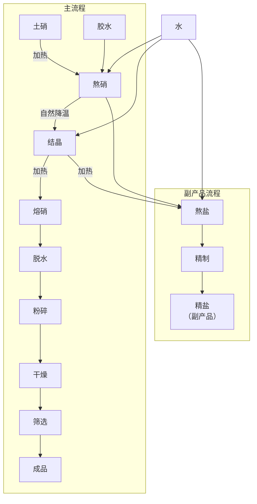

# 第十三章 火硝制造法

## 1 火硝的制取

火硝主要成分是硝酸钾或硝酸钠，它是制造黑火药和周氏炸药主要原料之一。硝酸钾为无色透明或白色结晶体，化学式为 $KNO_3$，分子量为101，比重为1.9～2.1，熔点336℃，吸湿性较强，受热分解时按下式反应放出氧

$$
4 KNO_3 \ce{->} 2 K_2O + 2 N_2 + 5 O_2
$$ 

硝酸钠的化学式为  $NaNO_3$，分子量为 85，外观为无色透明的斜方六面结晶体，比重为 2.21，熔点为 208℃，吸湿性较强，受热分解时按下式反应放出氧

$$
4 NaNO_3 \ce{->} 2 Na_2O + 2\ N_2 + 5 O_2
$$ 

火硝在周氏炸药中用量很大，约占组成物成分的  $64 \pm 2\%$。

火硝是采用民间副业生产的土硝，经提纯精制而得。土硝俗称毛硝，由含硝的土壤中提取，成分中含纯硝约50%，另含有结晶水，食盐和其他杂质，精制提纯后即为火硝。

土硝生产是沿河岸居住的人民多年来的传统副业生产，有丰富的提制土硝的经验。他们提炼出的土硝源源不断地供给军火生产的需要。

制硝流程

1. 扫取硝土：

    火硝是由硝土中提炼出来的。硝土是含有氮的有机化合物，受地中硝化细菌作用而形成的。它的生长与空气湿度、气温、土壤性质有极大关系。我省人民对扫硝土，有“三看”“一选”的说法。一看风向：西北风，西南风较好（我省无棣县经验，西北风西南风每百斤硝土可出二斤硝，其他风向每百斤硝土仅出半斤硝。这是因为无棣县东北、东、东南三面临海，从海面吹来的风较温和，硝容易溶化坠入地下）。二看时间：黎明前后扫硝土最好，这个时间硝土里的硝针很长，容易识别，而且硝土的含硝量也比较高。等太阳升起，潮湿土壤经过照晒后，硝容易溶化坠入地下（中下午扫硝土时，肉眼不易识别，可用舌头尝一尝，如感发凉，然舌头便是硝土，但含硝量不高）。三看土色：一般黑色土较好，黄色土次之，淡白色土最次。无棣县曾做过对比，结果是：在黑色土上扫的硝土每百斤可出硝2斤，在黄色土上扫的硝土每百斤出硝1.5斤，在淡白色土上扫的硝土每百斤出硝1斤左右。一选：即对地点的选择。出硝地点一般在墙根、崖头、厕所、破屋等周围及栏棚、磨屋等潮湿地方。因此，应在这些地方扫硝土。同时还应掌握：天气干燥的时候扫较湿的地方，天气潮湿的时候扫较干的地方。

2. 淋硝：

    硝土扫来以后便要进行淋硝，淋硝主要有以下几个工序：

    1. 砌筑淋硝池：淋硝池的大小，主要根据计划装硝土的多少而定。一般做法是用砖砌成长3.3米，宽1.7米，高0.5米的长方形池子（淋硝池外形见图1）。池子底部用红粘土做成左右两边高于中间5—10厘米，前端低于后端5—10厘米的鱼背形状，并用夯夯实。在低的一端砖墙上做一洞口，以备向外流硝水。然后在池内的两端垫上15—20厘米高的砖，砖的上面每隔0.5米放一根木棒，在木棒上面铺上秣稽，秣稽上再铺上旧席（新席不易漏水）。另外，还要准备瓷缸、铁锅、木盆等做为淋具。

        

        
        
        
图 1 淋硝池外形

        

    2. 装池子：在席的上面先铺上2—3厘米厚的草木灰（便于向外取硝土），在灰的上面装上筛过的硝土，装满后用脚踏实，然后在池上的四周，用硝土筑成高15厘米的小土堰。

    3. 淋硝：硝是从硝土中用水过淋下来的。每百斤硝土可用水60斤（最好用烧沸过的甜水），放水时要分批进行，每次放水都要比小土堰低3厘米为宜。放水后等两小时左右，硝水便从池中流入瓷缸内。硝水的质量可用比重计鉴定，一般应保持25度左右，如不到20度时，便应将缸内的硝水舀出来，再放到池内重新过淋（如没有比重计，可将淋出的硝水，用舌头试一试，若没有刺激的感觉，便要重新过淋）。

    4. 熬硝：把淋下来的硝水放入铁锅内（九分满），用火烧沸，这时硝水表面便会出现一层很厚的黑沫，应及时的把它打捞出来。等硝水蒸发三分之一的样子，锅中发现有盐粒时，要打捞出来，然后用罐子把锅内的硝水打出一点，滴在去了外皮的秫耠上（去了外皮后有一层白粉末要很好保留）稍等二、三分钟，用手指甲一推，冷却的硝珠就立时掉下来，秫耠上也没有湿印，这就证明正是火口，应马上撤火。如秫耠上留有湿印，就是嫩了；如有胶性皮很硬就是老了。老嫩都不好，老了出硝虽多但质量低，嫩了质量虽好但出硝少，所以熬硝时应很好掌握火口。

        硝水熬好后，可舀在盆内，半小时后里面的盐汁就可沉下，再倒入另一个盆里，等8个小时左右，硝即冷却成块，然后把卤水慢慢倒出，再把硝块倒在用草木灰垫的台子上，等没有了水分，用木板把硝块底部翻过来，把冷却时沉到底下的盐刮掉，便成硝渣。

    5. 提硝：第一次熬的硝渣，杂质较多，必须加以提炼。提炼的办法是：把原硝砸碎放到盆内，先用清水洗涮一次，然后再放到锅内，添上高出硝块3厘米的清水进行烧沸，等起沫时，加入水胶水少许（胶水制法，是用水胶1两兑水1斤4两，熬成胶水。提炼100斤硝用胶水4两左右），把沫粘在一起，用策篤捞出来。等锅内的硝，熬到用链子挑起硝水，见链子成鱼鳞状并像皮带似的向下流，这时再等五分钟左右，硝便成熟。然后从锅内舀出放到泥盆内（并在盆边放上两根秫稽以备起硝）。8小时左右，泥盆的硝水便会凝结成洁白色的纯硝，取出后放到用草木灰垫的台子上吸干水分即可（硝盆与硝块见图2）。

    

    
    
图 2 硝盆与硝块

    

3. 种硝：

    种硝在我省办法颇多，现仅介绍几种较简单的办法。

    1. 把淋不净的硝土、倒在荒碴地上，用锹撒开，经过雨淋、泼水将硝坠入地下，再经过晒干反潮以后，约半月时间就可出硝土，时间一久便成硝地。

    2. 硝水种硝：将淋下的硝水泼在荒碱地上，连泼几次，在气候、温度适合的条件下，即成硝地。

    3. 用草木灰和尿水种硝：确定种硝地点后，先用抓钩把地面抓破，然后再将草木灰撒到地上，再泼上尿，连续泼几次，约10天时间即成硝地。

## 2 火硝的精制

来自民间的土硝，仍含有不少泥土杂质以及结晶水等，需要进行精制。

土硝(又称毛硝)运来以后，先将其中的杂质用人工挑出，然后将一定数量的毛硝放入大铁锅中，并加入约为毛硝量二分之一的冷水。通常一锅中可加入毛硝50斤，净水25斤。用火加热到煮沸，半小时后再加入少量的冷水，至沸腾时停止，这时大部分杂质均浮于溶液的表面，然后用工具把杂质捞出来，在溶液的表面上加入少量的胶水，可使溶液表面的粘度增加，以便更容易地取出杂质。如此反复操作数次，使杂质全部清除，然后静置。待溶液清净后，将它盛入陶瓷缸中，使其自然降温结晶(图21)。

已结晶的毛硝，其中含有结晶水，需要进行脱水。脱水时将结晶硝放入大铁锅中加热，使水份蒸发。呈熔融状态的结晶硝，水份很快蒸发掉，即刻用铁勺将毛硝盛在铁板或石板上，让其自然冷却，即可得无水精硝。

冷却后的无水火硝成为块状，用铜锤打成碎块。量少时可用人工捣碎，量大时就用碾子或其他工具压成细粉，并筛选使粒度一致。

已经粉碎的火硝，如水份超过10%，则需要干燥，火硝对火焰敏感，不能直接用火加热，应采用火墙式干燥室，隔墙在室外烧火加热。将火硝铺在干燥盘上，送入干燥室内，在室温80℃的条件下干燥6～10小时(图22)。

流程4 火硝精制提纯工艺流程

<!--  -->

1—硝溶液；2—铁锅；3—隔火墙；4—炉灶。

图21 熬硝

1—干燥架；2—火硝；3—干燥炉。

图22 火硝干燥

经过干燥后的火硝，用每平方厘米 120 孔筛网的筛子进行筛选，合格品可送去配制周氏炸药。