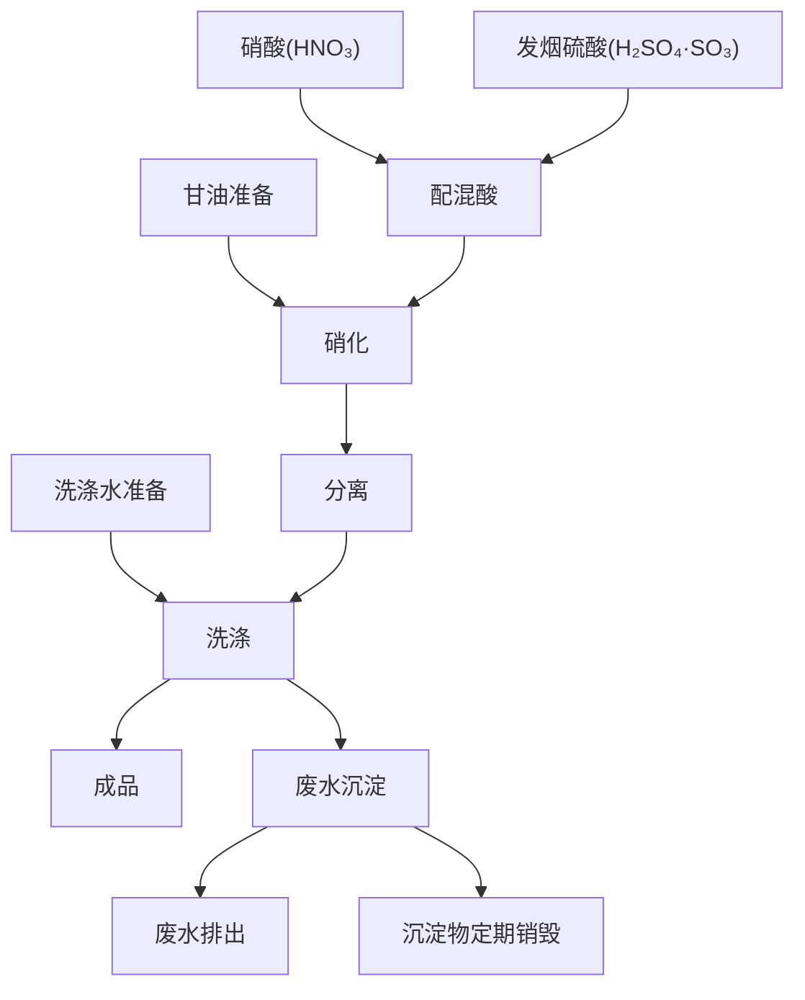

# 第二章 硝化甘油制造法

## 1 概 述

硝化甘油学名为三硝酸甘油脂。它是以甘油为原料经混酸作用而制得，是一种液态的烈性炸药。它可用谷糠粉、细木粉、麻杆炭粉和硅藻土等多孔物质吸收，再与硝酸铵、火硝等混合制成各种混合炸药。作为装填地雷、手榴弹、爆破筒和爆破药包的装药。硝化甘油也是制造双基无烟火药和胶质炸药的主要原料。

制造硝化甘油所用的原料为甘油和混酸。酸的来源是采用缸塔法自制(详见第十二章)，也曾少量外购。而甘油是以解放区的各种动、植物油(其中以植物油为主)经皂化而制得。

制造硝化甘油的方法，如诺贝尔式硝化法、纳唐式硝化法和连续硝化法等在工业中均被采用过。但上述的工艺方法需要较复杂的专用设备。如
通常所采用的纳唐式硝化设备(图15)，它是一个圆形的铅质容器，在容器内装有蛇形管，通过蛇形管内的冷却水来控制硝化温度。采用上述方法除需整套专用设备外，还需设置冷却盐水、压缩空气等辅助系统。

  
  

  <li>1—硝化器；</li><li>2—排油窥视孔；</li><li>3—溜子的检查口盖；</li><li>4—排油溜子；</li><li>5—窥视窗；</li><li>6—接触温度计；</li>
  <li>7—压缩空气管；</li><li>8—冷却盐水管；</li><li>9—酸管；<li>10—混酸管；</li><li>11—废酸出口管；</li><li>12—置换酸管</li>
  

图15 纳唐-汤姆逊硝化器

在战争环境中，生产方式和设备的选择，必须满足“上马快”，投产快，设备轻巧和机动灵活，设备与材料自给等要求。经过反复研究和试验，当时是采用以瓷盆为硝化设备，因而称之为“盆式硝化法”。这种方法所采用的设备简单，生产时机动性大，产量可大可小；可以一盆投产也可以数盆同时生产。

## 2 硝化甘油的性质

硝化甘油的分子式为  $C_3H_5(ONO_2)_3$，分子量为 227，通常用 NG 字母做为它的简写符号。纯硝化甘油是无色透明的油状液体，工业品为黄色或棕黄色。15℃时比重为 1.600，20℃时为 1.591。粘度比水大 2.5 倍，20℃时为 35.5 厘沲，它的粘度随温度的升高而降低。

硝化甘油有安定型和不安定型两种。安定型的凝固点为13.2℃，熔点13.5℃；而不安定型的凝固点为2.1℃，熔点2.8℃。

硝化甘油微溶于水，易熔于硫酸，遇强碱分解

$$
C_3H_5(ONO_2)_3 + 5KOH \ce{->} KNO_3 + 2KNO_2 + HCOOK + CH_3COOK + 3H_2O
$$ 

所以在制造中常用酒精碱液破坏(分解)残存的微量甘油。

纯硝化甘油在 50℃ 时开始分解， 135℃ 时激烈分解，加热到 145℃ 时则产生大量棕烟，当温度达到  200~218℃ 时会发生爆炸，其爆炸分解反应式为

$$
2C_3H_5(ONO_2)_3 \ce{->} 6CO_2 + 5H_2O + 3N_2 + \frac{1}{2}O_2
$$ 

硝化甘油对撞击摩擦敏感，在金属之间或在磁与磁之间撞击摩擦均易引起爆炸。它对火焰也十分敏感；遇火焰作用，即会引起剧烈燃烧，甚至转为爆轰。硝化甘油的爆速，根据卡斯特的研究为7450米/秒。对冲击摩擦的感度，根据柯克-奥斯莫的研究，以2公斤重的落锤进行10次试验中，引起爆炸的最小高度为15厘米。

硝化甘油具有刺激性甜味，当人体呼吸到硝化甘油蒸气和皮肤与它接触时，会引起头痛和心跳。在操作过程中要避免人体直接与它接触。如发生中毒症状，可用茶叶、咖啡因或黑咖啡等进行解毒，也可到空气新鲜的地方休息一下。

凝结的硝化甘油或硝化甘油中混有机械杂质等，都会在很大程度上增加它的敏感度。

## 3 由植(动)物油中制取甘油

制造硝化甘油炸药，需要有纯度较高的甘油。要求甘油的比重不低于1.2600，通常均采用比重为1.2600～1.2620的甘油。甘油含水量应不大于2%。在甘油中不允许含有机械杂质和丙烯醛以及其它还原性物质。

当时由于炸药用量日益增加，所需甘油的数量也随之增多。在此形势下，为了使重要的原料有可靠的来源，就采用由植(动)物油中制取甘油。

在战争年代，解放区广大乡村中有较丰富的动植物油，尤其是植物油，如葵花籽油、大麻籽油、花生油、亚麻籽油和棉籽油等。由于人民群众的积极支持，甘油原料用之不尽，取之不竭。

根据制取甘油的经验来看，不论是植物油还是动物油均能提出合格的甘油。为了节约动物油脂，供给人民需要，多采用植物油制取甘油。其中以大麻籽油、核桃油、花生油较好，而棉籽油较差。

提取甘油时，先将油脂制成钙皂，再由钙皂中洗出甘油，经过滤和浓缩即可制得合格的甘油。

### (一) 油脂皂化成钙皂

油脂皂化的设备是利用民间煮饭用的大铁锅。先将锅擦干净，将占锅容积1/4～1/5的油脂经过称量后加入锅中，在灶内徐徐生火加热使温度平稳上升，当锅内物料的温度上升到70～80℃时，将事先准备好的浓度为30%的氢氧化钙乳状液加入锅中，其加入量为油脂加入量的17～18%。加入氢氧化钙水溶液的时用木棒搅拌，锅内物料温度保持在70～80℃，这时油脂和氢氧化钙溶液进行以下反应：

$$
\ce{
2 \begin{array}{l}
  \ce{CH2COOCR} \\
  | \\
  \ce{CHCOOCR}  \\
  | \\
  \ce{CH2COOCR}
\end{array}
+ 3 Ca(OH)2
->
\begin{matrix}
  \ce{(RCOO)2Ca}\\
  \\
  \ce{(RCOO)2Ca}\\
  \\
  \ce{(RCOO)2Ca}
\end{matrix}
+ 2 \begin{array}{l}
  \ce{CH2OH}\\
  |\\
  \ce{CHOH}\\
  |\\
  \ce{CH2OH}
\end{array}
}
$$

氢氧化钙水溶液全部加完后仍继续搅拌，一直搅拌到反应完全为止。当物料沸腾时有大量泡沫产生。沸腾保持一些时间以后，停止或以微火加热，防止泡沫溅出。待反应快完成时可逐渐降温，这时物料的粘度也随之增加，直到呈糊状时反应即告停止。油脂皂化的设备如图16所示。

1—铁锅；2—套圈；3—炉灶；4—隔火墙

图16 油脂皂化锅

皂化结束后，将料液用工具盛入可临时装配的活动槽中(如图 17 所示)，或凹形铁板上，待钙皂冷却后将槽的侧板拆下来，取出物料，破碎和磨成细粉。

在制钙皂过程中，加热油脂要注意防火，可采用图16所示的隔墙加热的方法。在安装锅时应在锅口的上部用木板或水泥制做一个套圈，避免当物料沸腾时溅出锅外。油脂加热，温度要徐徐上升，不能火力过猛，如温度骤然上升，易引起料液外溅。氢氧化钙水溶液加入的数量不宜过多或过少，过多则在甘油水中含的  $Ca(OH)_2$ 杂质多；过少则碱化不完全，物料发粘，甘油不易提出。

图17 装配槽 1—槽体；2—底板。

### (二) 水洗钙皂提出甘油

所制成的钙皂由装配槽中卸出并破碎成小块，再用碾子压成细粉，愈细愈好。在缸或大盆内加入清水，再将钙皂粉加入水中浸泡洗涤，使甘油溶于水中。当甘油水浓度达到12%以上时，就用孔径不大于0.15毫米的筛网过滤，分离出不溶于水的钙皂粉并除去甘油水中的机械杂质。甘油水经过滤后即可送去蒸发浓缩。

### (三) 甘油水浓缩

过滤后的甘油水浓度通常为 12～16%，但需使其浓度增大到 97% 以上，这一过程可分为两个工艺步骤进行。

(1)先将稀甘油水倒入锅或缸中，以火加热，控制物料温度在100℃左右，使水分蒸发。此时适当掌握温度，既能尽快浓缩，又不致沸腾翻起沉淀下去的钙皂粉粒，进而提高甘油的质量。在锅内的物料浓度一般可达到60%(沸点109.6℃)～70%(沸点114℃)。如使甘油浓度增加到95%以上，则物料温度需在175℃以上。在常压的条件下，用锅蒸发浓缩达不到目的，故先蒸发至60～70%。

表11 甘油浓度(%)与甘油沸点的关系

<table border=1 ><tr><td rowspan="2">压力(毫米水银柱)</td><td rowspan="2">单位</td><td colspan="10">甘油浓度</td><td rowspan="2">水沸点</td></tr><tr><td class="center">10%</td><td class="center">20%</td><td class="center">30%</td><td class="center">40%</td><td class="center">50%</td><td class="center">60%</td><td class="center">70%</td><td class="center">80%</td><td class="center">90%</td><td class="center">95.64%</td></tr><tr><td class="center">760.00</td><td class="center">℃</td><td class="center">100.7</td><td class="center">100.6</td><td class="center">102.9</td><td class="center">104.5</td><td class="center">106.7</td><td class="center">109.6</td><td class="center">114.0</td><td class="center">121.5</td><td class="center">139.8</td><td class="center">175.8</td><td class="center">100</td></tr><tr><td class="center">525.00</td><td class="center">℃</td><td class="center">90.6</td><td class="center">91.5</td><td class="center">92.8</td><td class="center">94.2</td><td class="center">96.3</td><td class="center">99.3</td><td class="center">103.5</td><td class="center">114.3</td><td class="center">127.8</td><td class="center">161.1</td><td class="center">90</td></tr><tr><td class="center">355.00</td><td class="center">℃</td><td class="center">80.5</td><td class="center">81.4</td><td class="center">82.6</td><td class="center">84.0</td><td class="center">86.0</td><td class="center">88.8</td><td class="center">92.8</td><td class="center">99.3</td><td class="center">116.0</td><td class="center">146.0</td><td class="center">80</td></tr><tr><td class="center">233.53</td><td class="center">℃</td><td class="center">70.4</td><td class="center">71.2</td><td class="center">72.4</td><td class="center">73.7</td><td class="center">75.6</td><td class="center">78.5</td><td class="center">82.2</td><td class="center">88.3</td><td class="center">104.0</td><td class="center">132.1</td><td class="center">70</td></tr><tr><td class="center">149.19</td><td class="center">℃</td><td class="center">60.3</td><td class="center">61.0</td><td class="center">62.2</td><td class="center">63.5</td><td class="center">65.5</td><td class="center">68.1</td><td class="center">71.5</td><td class="center">77.3</td><td class="center">92.0</td><td class="center">117.6</td><td class="center">60</td></tr><tr><td class="center">92.30</td><td class="center">℃</td><td class="center">50.7</td><td class="center">50.9</td><td class="center">52.1</td><td class="center">53.4</td><td class="center">55.2</td><td class="center">57.6</td><td class="center">61.0</td><td class="center">66.2</td><td class="center">80.1</td><td class="center">103.1</td><td class="center">50</td></tr></table>

(2)经浓缩至60～70%的甘油，用工具掏入瓷盆里，在火炕●式的沙盘上进一步蒸发浓缩。蒸发浓缩甘油的装置是在火炕上放置一层厚度一定的砂子做为传热介质，再将盛有甘油的瓷盆置于砂中，如图18所示。

1—磁盘；2—甘油；3—砂子；4—土坯或砖砌的火炕

图18 甘油蒸滤砂盘

在火炕的一端加火，使砂子的温度升高，盆中的甘油即逐渐蒸浓并需保持温度平稳上升，这一阶段需3～5天。在蒸浓的同时，物料中的游离钙皂和其他微量杂质沉淀，使甘油与沉淀物以及杂质自行分开。用工具将甘油取出则沉淀物和杂质残留于盆底，这样可制出较纯的甘油。

已经蒸浓合格的甘油可以直接用于硝化，也可以装入洁净密封的桶中，放置于干燥的地方。甘油在低温时会凝结成晶体(如98.2%的甘油凝固点为13.5℃)，结晶的甘油对硝化甘油制造过程中的安全有影响，所以存放甘油地点的温度不宜低于15℃。

## 4 硝化甘油制造

硝化甘油是以硝酸和硫酸配制的混酸，其中加入甘油经硝化作用而制得。制造硝化甘油的主要工序为：配制混酸、硝化、分离和洗涤。

### (一) 配混酸

硝化所用的混酸是由硝酸和硫酸混合而成。当时所使用的混酸成分为：

| 成分   | 含量         |
|:-------|-------------|
| 硝酸   | 48～50%      |
| 硫酸   | 49～51%      |
| 水     | ≤ 1%         |

混酸与甘油的投料比，按重量比为7:1。硝化所使用的硝酸比重要求在1.50以上，硫酸比重为1.84以上。原料酸测定比重后，按配比要求称量，配制混酸。

配酸时，用陶瓷缸作为配酸设备。将缸擦洗干净后，先向缸中加入定量的硝酸，再加入硫酸，并不断用铅棒搅拌使它混合均匀(如图19所示)。

在配酸过程中有酸烟排出，对人体有害。搅拌时，操作人员应站在配酸缸的上风方向操作。

1—木槽；2—混酸；3—陶瓷缸

图19 配酸装置

<!--  -->

流程 3 硝化甘油制造流程

配酸过程中由于放热作用，使物料温度升高，此时酸量有所损耗。为了减少酸量损耗，就需降温冷却。在当时是采用冷水槽来降低料液温度。

酸全部加完后继续搅拌 15～20 分钟，再令其静置 72 小时以上，使酸中杂质充分沉淀。配制合格的混酸即可送去硝化使用。

### (二) 甘油准备

甘油使用前先测定比重，比重应达到1.2584～1.2620。测定比重后以孔径为0.15毫米的筛网过滤，清除甘油中的机械杂物。按照规定重量一份一份的装入广口瓶或其它容器中，准备送去硝化。在当时是采用盆法硝化，每盆硝化的甘油量为1～3公斤。称取甘油时，数量要准确。过滤和称量操作要迅速，避免甘油长时间与空气接触吸收水分。在冬季操作时，将甘油置于室温较高的地方，使它预先加温到16～18℃再送去使用，否则甘油温度过低，也会影响硝化作业的正常进行。

### (三) 硝化

硝化是以1份的甘油与7份的混酸(按重量比)作用制成硝化甘油。它的硝化反应方程式为：

$$
C_3H_5(OH)_3 + 3HNO_3 \ce{->} C_3H_5(ONO_2)_3 + 3H_2O 
$$

由上式可见，每 100 公斤甘油(100% 计)完全硝化，在理论计算上可生成 246.7 公斤的硝化甘油和 58.7 公斤的水，而需要硝酸为 205 公斤(硝酸量以 100% 计)。在硝化过程中硫酸不直接参加反应，而起脱水作用。

甘油硝化过程应控制硝化温度不超过 23℃。如温度上升到 25℃，即会产生大量棕烟，温度继续上升，就有引起爆炸的危险。加料时向酸中加入甘油，顺序不能颠倒。在硝化过程中甘油与混酸作用放出热量(1公斤甘油硝化时放出193.9仟卡热量)。同时硝化反应所生成的水将混酸冲淡也产生稀释热，使物料温度升高。为降低硝化温度，除控制加入甘油的速度和充分的搅拌外，还需要进行冷却。

在战争年代，要求设备轻巧、生产灵活机动和投产快。因此当时选用搪瓷盆或陶瓷盆做为甘油的硝化容器。瓷盆来源广泛，既耐酸腐蚀，又移动方便，产量和盆的数量都不受条件限制。晴天时硝化作业就在河沟或泉水旁进行操作，利用河水或泉水做为冷却水。有时干脆将小船划到河的中央，在船上办起硝化甘油制造“工厂”，用河水降温冷却。当风雨天或严冬季节，就在室内作业。

进行硝化作业时，首先将已准备好的混酸使其温度降低到 10℃ 以下，最高也不超过 17℃。为了控制温度，当时没有采用人工制冷设备，而是选择每一天中气温较低的时间来进行硝化作业，如清晨水温、气温较低，适合硝化作业。先将称量好的混酸倒入事先准备妥当的表面光洁的搪瓷盆或陶瓷盆中。再将准备好的甘油呈线状缓慢地加入混酸中(最好是以雾状喷入)，加入甘

1—木槽；2—木条；3—瓷盆。

图20 硝化槽

油的同时，用棒(玻璃、铝、橡皮均可)迅速的搅拌，并密切地观测硝化液温度的变化，如温度上升到 22℃ 时应立即停止加入甘油，待温度下降后再继续加甘油操作。当温度上升到 23℃ 时，应加强搅拌使温度降低。若温度一直上升到 25℃ 并有棕烟和气泡出现时，则应迅速地把硝化液倒入水中。在室内作业时，硝化前就应将盆置于有水的木槽托板上，当温度上升到 25℃ 时，将盆倾倒水中；若在室外作业时，就将硝化液和盆一起倒入河水或泉水中以免发生事故。

按上述过程将甘油全部加完后，再继续搅拌3～5分钟，整个硝化过程就告结束。

硝化过程结束后，硝化甘油和酸酸由于比重不同而自行分开(硝化甘油比重为1.6, 外观为油状透明体, 硝化酸酸比重为1.7)。用勺或虹吸管把硝化甘油取出，送去洗涤。

硝化作业是硝化甘油制造中的主要工序。操作是否正常直接影响到产品质量、得率和生产安全。所以对硝化的操作提出以下注意事项：

>(1) 硝化前要检查混酸的成分是否合格，酸量是否正确；

>(2)硝化前要检查甘油的温度与质量，如发现有凝结现象，甘油就不能采用；

>(3)硝化前要检查所使用的器皿是否清洁完整，温度计是否正确可靠；

>(4)投料时应先加混酸，然后将甘油缓缓地加入混酸中，加料速度不能过快，加料次序不能颠倒；

>(5)甘油加入时不能停止搅拌；

>(6) 硝化过程中要密切注意并掌握温度变化;

>(7)距硝化操作地点 50 米范围内，不准有明火；

>(8)非直接操作人员应离开硝化操作地点，以免影响操作正常进行。

### (四) 硝化甘油洗涤

洗涤又称为安定处理。酸性的硝化甘油极不安定，保存期问易分解，所以必须将硝化甘油所带的残酸洗掉。洗涤硝化甘油的设备仍然是采用瓷器皿或铅制的洗涤槽。

洗涤硝化甘油所用的水必须洁净，事先应将水沉淀并用细布过滤，除去杂质。

硝化甘油洗涤分为五次进行，洗涤的工艺条件如下表所示：

表12 硝化甘油洗涤的工艺条件

| 洗涤次数    | 洗涤水类别              | 洗涤水温度     | 搅拌时间 |
|------------|-------------------------|---------------|---------|
| 第一次洗涤  | 净水                    | 不高于25℃     | 5分钟   |
| 第二次洗涤  | 净水                    | 30～35℃       | 5分钟   |
| 第三次洗涤  | 净水                    | 40～45℃       | 10分钟  |
| 第四次洗涤  | 2.5～3%浓度的碳酸钠水溶液 | 40～50℃      | 5～8分钟 |
| 第五次洗涤  | 净水                    | 30～35℃       | —       |

洗涤操作的具体步骤为：将待洗涤的硝化甘油盛于瓷盆内，先以温度不高于 25℃ 的温水洗涤，边洗涤，边搅拌，搅拌的工具可用玻璃棒或橡皮棒；然后再用 30~35℃ 和 40~45℃ 的温水各洗一遍。为了中和物料中的残酸，再用浓度为 2.5~3% 的碳酸钠水洗涤一次。碱水洗涤后，最后再用 30~50℃ 的温水洗涤一次，以除去碱份。

在硝化甘油的洗涤过程中，搅拌要轻，不要剧烈搅动，防止冲击摩擦或将硝化甘油溅到盆外。洗涤后的产品，经充分静置后，若有仪器可进行阿贝尔安定度试验(试验时，以温度为75℃，碘化钾淀粉试纸变色时间不少于15分钟为合格)。所制成的炸药，若不长期保存，也可采用石蕊试纸进行鉴定。

洗涤后的硝化甘油在表面上还残存有一部分洗涤水，可用勺将水排出。所制得的产品即为硝化甘油液体炸药。

洗涤也是硝化甘油制造过程中的一个比较主要工序，为保证质量和安全应注意以下各项：

>(1)所使用的洗涤水温度不超过 50℃;

>(2)洗涤水必须干净、清洁，不含有机械杂质，并事先经过沉淀过滤；

>(3)洗涤时要充分搅拌，但不能撞击和摩擦器壁，用力不能过猛。

### (五) 硝化甘油暂存

硝化甘油成品不宜存放时间过长，存放地点的温度应保持在15℃以上。当温度低于13℃时，硝化甘油易产生凝结，凝结的硝化甘油极为敏感。如发现硝化甘油凝结时，绝对禁止进行任何加工，必须经稳妥的熔化(如将硝化甘油连同容器一起置于热水槽中熔化)后，方准使用。

硝化甘油受阳光作用，也易分解，存放产品的地点要防止阳光直接照射。

制造硝化甘油过程中，要注意避免硝化甘油撒落在地上或其它物件上。若撒出的量少时，可先用湿布轻轻擦净，再用酒精碱液处理；如撒出量较大，先用木粉将甘油吸收，再用湿布擦净和酒精碱液处理。

酒精碱液的配方为

>(1)酒精 70%

>(2)氢氧化钠

>(3)水

因含有杂质或由于其他原因而不能使用的硝化甘油应及时毁掉。销毁可用十倍于硝化甘油量的木粉将硝化甘油吸收，然后在处理场地上将它撒成一条直线，操作人员站在上风方向点火，将它烧毁。

洗涤硝化甘油的废水，不要排在工作地点附近，最好用一个大缸收集起来，经充分沉淀再排出；沉淀出的硝化甘油，如不含杂质，经净水洗涤后仍可使用。

在艰苦的战争年代，就是采用上述办法制造出了硝化甘油高致炸药。有了它就打开了制造炸药的大门，配制出多种多样的以硝化甘油为敏感剂的混合炸药，如周氏炸药，硝化甘油和麻杆炭粉混合物，硝化甘油强棉炸药及含有硝化甘油的硝酸铵类炸药等。

表13 甘油比重浓度换算表(19.6℃时)

| 比重   | 0     | 1     | 2     | 3     | 4     | 5     | 6     | 7     | 8     | 9     |
|--------|-------|-------|-------|-------|-------|-------|-------|-------|-------|-------|
| 1.252  | —     | —     | —     | —     | 95.00 | 95.03 | 95.07 | 95.11 | 95.15 | 95.19 |
| 1.253  | 95.23 | 95.27 | 95.31 | 95.35 | 95.39 | 95.43 | 95.46 | 95.50 | 95.55 | 95.58 |
| 1.254  | 95.62 | 95.65 | 95.69 | 95.77 | 95.79 | 95.80 | 95.84 | 95.88 | 95.92 | 95.96 |
| 1.255  | 96.00 | 96.03 | 96.07 | 96.11 | 96.15 | 96.19 | 96.23 | 96.26 | 96.30 | 96.34 |
| 1.256  | 96.38 | 96.42 | 96.46 | 96.50 | 96.54 | 96.58 | 96.62 | 96.66 | 96.70 | 96.74 |
| 1.257  | 96.78 | 96.82 | 96.86 | 96.90 | 96.94 | 96.98 | 97.02 | 97.05 | 97.09 | 97.13 |
| 1.258  | 97.17 | 97.21 | 97.24 | 97.28 | 97.32 | 97.36 | 97.40 | 97.44 | 97.48 | 97.52 |
| 1.259  | 97.56 | 97.60 | 97.64 | 97.68 | 97.72 | 97.76 | 97.80 | 97.84 | 97.88 | 97.92 |
| 1.260  | 97.96 | 98.00 | 98.03 | 98.07 | 98.11 | 98.15 | 98.19 | 98.23 | 98.26 | 98.30 |
| 1.261  | 98.34 | 98.36 | 98.41 | 98.45 | 98.49 | 98.53 | 98.57 | 98.60 | 98.64 | 98.68 |
| 1.262  | 98.72 | 98.76 | 98.80 | 98.84 | 98.88 | 98.92 | 98.96 | 99.00 | 99.03 | 99.07 |
| 1.263  | 99.11 | 99.18 | 99.22 | 99.26 | 99.30 | 99.34 | 99.37 | 99.40 | 99.45 | 99.48 |
| 1.264  | 99.49 | 99.53 | 99.56 | 99.60 | 99.64 | 99.68 | 99.72 | 99.76 | 99.80 | 99.84 |
| 1.265  | 99.88 | 99.92 | 99.96 | 10.000|       |       |       |       |       |       |

表14 硫酸的比重与浓度表(15℃时)

| 比重   | $H_2SO_4(\%)$ | 比重   | $H_2SO_4(\%)$ | 比重   | $H_2SO_4(\%)$ |
|--------|---------------|--------|---------------|--------|---------------|
| 1.000  | 0.09          | 1.180  | 24.76         | 1.360  | 45.88         |
| 1.005  | 0.83          | 1.185  | 25.40         | 1.365  | 46.41         |
| 1.010  | 1.57          | 1.190  | 26.04         | 1.370  | 46.94         |
| 1.015  | 2.30          | 1.195  | 26.68         | 1.375  | 47.47         |
| 1.020  | 3.03          | 1.200  | 27.32         | 1.380  | 48.00         |
| 1.025  | 3.76          | 1.205  | 27.95         | 1.385  | 48.53         |
| 1.030  | 4.49          | 1.210  | 28.58         | 1.390  | 49.06         |
| 1.035  | 5.23          | 1.215  | 29.21         | 1.395  | 49.59         |
| 1.040  | 5.96          | 1.220  | 30.84         | 1.400  | 50.11         |
| 1.045  | 6.67          | 1.225  | 31.11         | 1.405  | 50.63         |
| 1.050  | 7.37          | 1.230  | 31.48         | 1.410  | 51.15         |
| 1.055  | 8.07          | 1.235  | 31.70         | 1.415  | 51.66         |
| 1.060  | 8.77          | 1.240  | 32.28         | 1.420  | 52.15         |
| 1.065  | 9.47          | 1.245  | 32.86         | 1.425  | 52.63         |
| 1.070  | 10.19         | 1.250  | 33.43         | 1.430  | 53.11         |
| 1.075  | 10.90         | 1.255  | 34.00         | 1.435  | 53.59         |
| 1.080  | 11.60         | 1.260  | 34.57         | 1.440  | 54.07         |
| 1.085  | 12.30         | 1.265  | 35.14         | 1.445  | 54.55         |
| 1.090  | 12.99         | 1.270  | 35.71         | 1.450  | 55.03         |
| 1.095  | 13.67         | 1.275  | 36.29         | 1.455  | 55.50         |
| 1.100  | 14.35         | 1.280  | 36.87         | 1.460  | 55.97         |
| 1.105  | 15.03         | 1.285  | 37.45         | 1.465  | 56.43         |
| 1.110  | 15.71         | 1.290  | 38.03         | 1.470  | 56.90         |
| 1.115  | 16.36         | 1.295  | 38.61         | 1.475  | 57.37         |
| 1.120  | 17.01         | 1.300  | 39.19         | 1.480  | 57.83         |
| 1.125  | 17.66         | 1.305  | 39.77         | 1.485  | 58.28         |
| 1.130  | 18.31         | 1.310  | 40.35         | 1.490  | 58.74         |
| 1.135  | 18.96         | 1.315  | 40.93         | 1.495  | 59.22         |
| 1.140  | 19.61         | 1.320  | 41.50         | 1.500  | 59.70         |
| 1.145  | 20.26         | 1.325  | 42.08         | 1.505  | 60.18         |
| 1.150  | 20.91         | 1.330  | 42.66         | 1.510  | 60.65         |
| 1.155  | 21.55         | 1.335  | 43.20         | 1.515  | 61.12         |
| 1.160  | 22.19         | 1.340  | 43.74         | 1.520  | 61.59         |
| 1.165  | 22.83         | 1.345  | 44.28         | 1.525  | 62.06         |
| 1.170  | 23.47         | 1.350  | 44.82         | 1.530  | 62.53         |
| 1.175  | 24.12         | 1.355  | 45.35         | 1.535  | 63.00         |

| 比重   | $H_2SO_4(\%)$ | 比重   | $H_2SO_4(\%)$ | 比重   | $H_2SO_4(\%)$ |
|--------|---------------|--------|---------------|--------|---------------|
| 1.540  | 63.43         | 1.660  | 73.64         | 1.780  | 84.50         |
| 1.545  | 63.85         | 1.665  | 74.07         | 1.785  | 85.10         |
| 1.550  | 64.26         | 1.670  | 74.51         | 1.790  | 85.70         |
| 1.555  | 64.67         | 1.675  | 74.97         | 1.795  | 86.30         |
| 1.560  | 65.08         | 1.680  | 75.42         | 1.800  | 86.90         |
| 1.565  | 65.49         | 1.685  | 75.86         | 1.805  | 87.60         |
| 1.570  | 65.90         | 1.690  | 76.30         | 1.810  | 88.30         |
| 1.575  | 66.30         | 1.695  | 76.73         | 1.815  | 89.05         |
| 1.580  | 66.71         | 1.700  | 77.17         | 1.820  | 90.05         |
| 1.585  | 67.13         | 1.705  | 77.60         | 1.825  | 91.00         |
| 1.590  | 67.59         | 1.710  | 78.04         | 1.830  | 92.10         |
| 1.595  | 68.05         | 1.715  | 78.48         | 1.835  | 93.43         |
| 1.600  | 68.51         | 1.720  | 78.92         | 1.840  | 95.60         |
| 1.605  | 68.97         | 1.725  | 79.36         | 1.8405 | 95.95         |
| 1.610  | 69.43         | 1.730  | 79.80         | 1.8410 | 97.00         |
| 1.615  | 69.89         | 1.735  | 80.24         | 1.8415 | 97.70         |
| 1.620  | 70.32         | 1.740  | 80.68         | 1.8420 | 98.20         |
| 1.625  | 70.74         | 1.745  | 81.12         | 1.8425 | 98.70         |
| 1.630  | 71.26         | 1.750  | 81.56         | 1.8430 | 99.20         |
| 1.635  | 71.57         | 1.755  | 82.00         | 1.8435 | 99.45         |
| 1.640  | 71.99         | 1.760  | 82.44         | 1.8440 | 99.70         |
| 1.645  | 72.40         | 1.765  | 82.88         | 1.8445 | 99.95         |
| 1.650  | 72.82         | 1.770  | 83.32         | —      | —             |
| 1.655  | 72.23         | 1.775  | 83.90         | —      | —             |

表15 制造硝化甘油所用的设备、工具和仪器

| 工序      | 设备              | 工具                              | 仪器          | 备注                          |
|-----------|------------------|-----------------------------------|---------------|-------------------------------|
| 甘油准备  | 广口瓶、秤         | 细白布                            | 比重计、温度计 |                               |
| 配混酸    | 瓷缸              | 铅棒、法兰绒、漏斗(铝或铝)          | 比重计、温度计 |                               |
| 硝化      | 搪瓷盆或瓷盆、水槽 | 橡皮棒、铝勺                       | 温度计        | 最好用刻度为 $1^\circ$ 的温度计 |
| 洗涤      | 搪瓷盆、瓷盆或铅槽 | 虹吸管、橡皮棒、铝勺、铅漏斗、法兰绒 | 温度计        |                               |
| 废水处理  | 瓷缸              |                                   |              |                               |