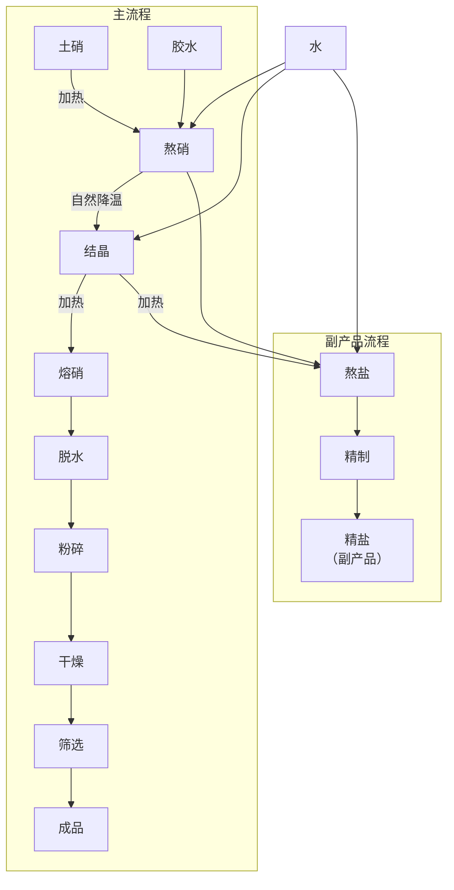
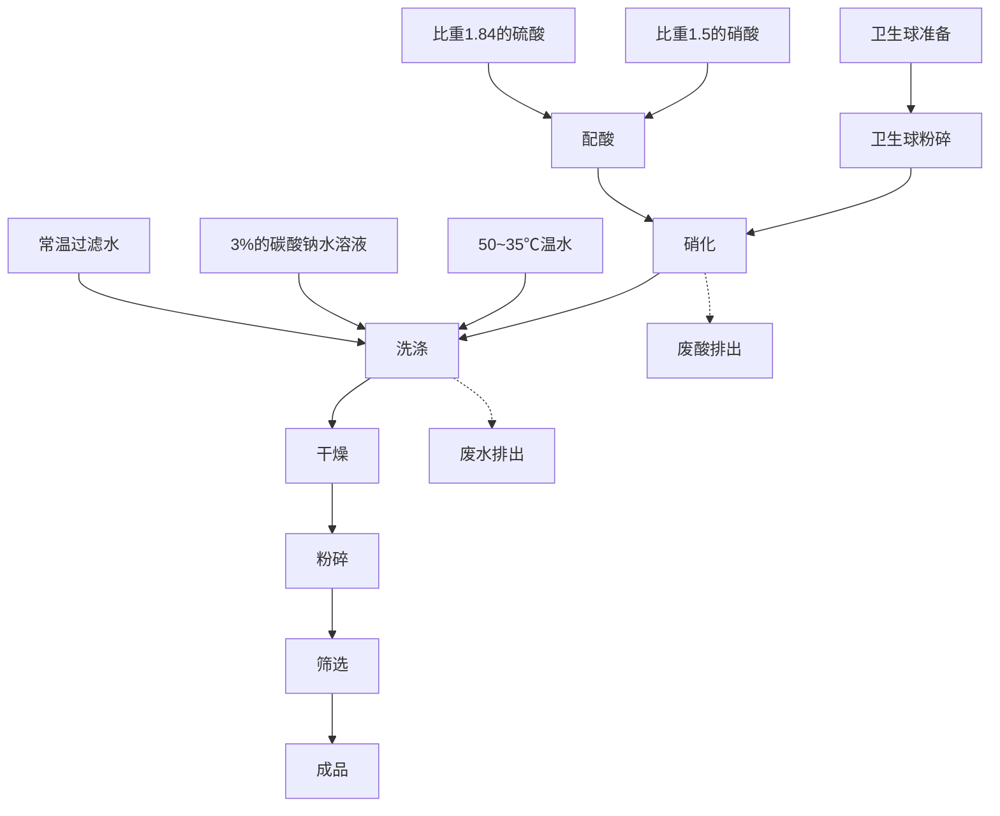
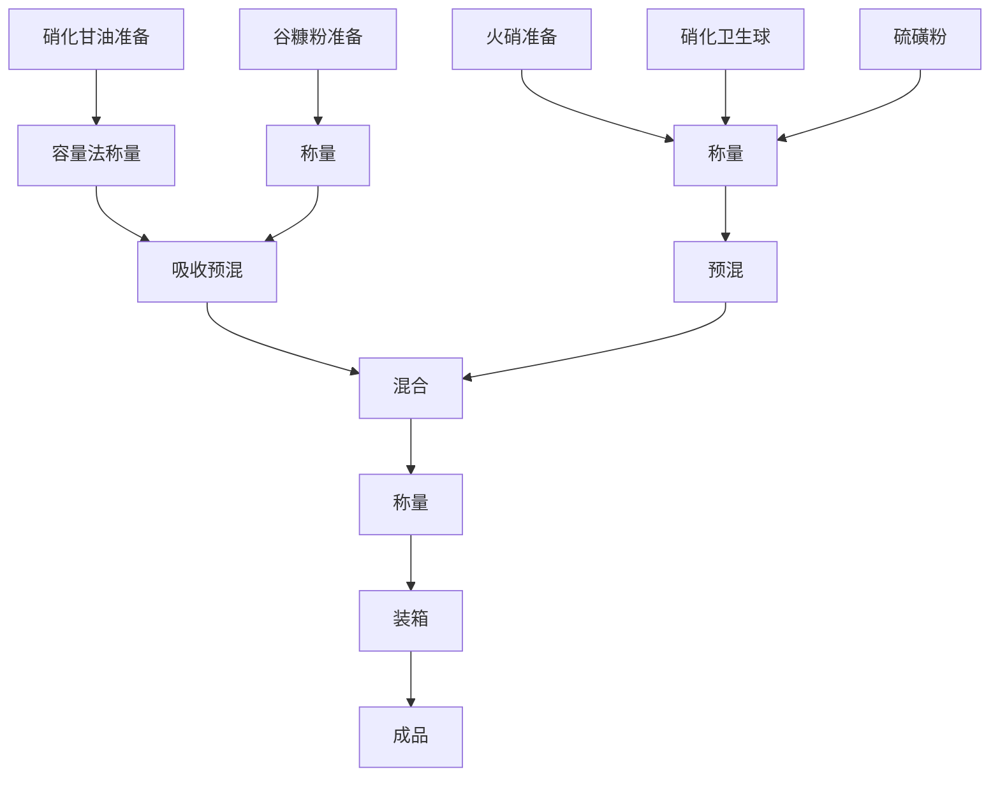

# 第三章 周氏炸药制造法

## 1 概 述

周氏炸药是以硝化甘油为敏感剂的具有较良好起爆性能和较高爆炸威力的粉状物质。在抗战初期开始制造，抗日战争和解放战争中大量用作地雷、手榴弹、炸药包和爆破筒等爆破器材的装药。

抗日战争初期，地雷和手榴弹等爆破器材装药材料的来源，曾一度依靠从敌人手中缴获的梯恩梯或苦味酸等，但数量较少。为大量供应爆破器材使用的装药，就自行制造各种炸药，使装药材料立足于解放区内。周氏炸药就是在这种情况下制成的，它有很大的政治意义和经济意义。

当时解放区已生产了硝化甘油和黑火药。硝化甘油是液体炸药，威力大，起爆性能高，但不宜于单独使用。而黑火药爆炸威力较小，爆炸破片数量少，杀伤半径也小。对于壳体装药的炸药来说，要有足够的爆炸威力，也要有一定的安定性。因此，解决高级炸药的途径，只能是以简易的办法充分利用解放区的物质资源来进行。经过多次研究试验，终于试制成功了适合弹药装药性能要求的炸药，这种炸药即定名为“周氏炸药”。

周氏炸药外观为灰黄色粉末状的物质，用手摸时有油腻感觉，它的假比重为0.95～1.05，对冲击摩擦和火焰均敏感，加热至210℃时分解；它是由硝化甘油、火硝(硝酸钾或硝酸钠)、硫磺粉、谷糠粉和二硝基萘五种原料所组成。

周氏炸药中含有硝化甘油，所以不易受潮，且起爆容易。同时除含有硝化甘油外，还含有二硝基萘和火硝，爆炸威力强。另外在其组成物中含有相当数量的谷糠粉，能够较好地吸收硝化甘油，给制造和装药提供了安全条件。根据实际使用效果鉴定，周氏炸药的起爆性能和爆炸威力是良好的。它是粉状物质，可做为手榴弹、地雷和药包等爆破器材的装药。例如：在枪榴弹中装入35克的周氏炸药，雷管起爆后，可以得到130～150块破片，这说明了周氏炸药的爆炸威力是很大的。装药的实际爆破试验，也充分证明了周氏炸药的良好性能。

为检验周氏炸药的性能，进行过较大数量的装药试验，曾在解放区试验过装药量为16公斤的铸铁壳体大号地雷。当引爆后，一声巨响，碎石横飞，将重约百余斤的大石头抛出4米以外。距爆炸中心1米左右重约500公斤的大石头被炸得四分五裂。爆炸时所产生的破片和强大的爆轰波，折断了周围10米以外的树枝。在爆炸中心形成直径约1米的爆炸漏斗坑。

在实际使用中也是如此，炸毁标准铁轨仅需周氏炸药1公斤。装药量15公斤的大号地雷，能将火车头炸翻。周氏炸药的制造成功，使炸药的供应立足于解放区，有力地支援了长期抗战的需要。

## 2 组成物的配份

抗战时期所制造的周氏炸药，其组成物配份比例如表 16 所示。

成份中要注意硝化甘油的含量不宜过多或过少。根据实际应用得知，如硝化甘油含量过少则对起爆性能和爆炸完全性有影响，同时产品防潮能力也随硝化甘油含量的减少而降低；如硝化甘油含量过大，由于硝化甘油有渗油性，对于装药成品的使用、运输和存放均会增加不安全的因素。所以，在配份中最好采用3～4%硝化甘油，最大含量也不应超过5%。

表16 组成物配份

| 组成物名称          | 组成物%         | 备注             |
|--------------------|----------------|------------------|
| 硝化甘油            | $3.5 \pm 1$    | 表中组成物百分数均按重量比计算  |
| 火硝(硝酸钾或硝酸钙) | $64 \pm 2$     |     |
| 硫磺粉              | $16 \pm 1$     |                  |
| 谷糠粉[^1]          | $15 \pm 2$     |                  |
| 二硝基萘            | $1.5 \pm 1$    |                  |

周氏炸药中的氧化剂是火硝(硝酸钾或硝酸钙)，若没有火硝也可以用硝酸铵代用，这对炸药的爆炸性能无大的影响。但硝酸铵比火硝更易吸潮，给装药和成品保管带来了不利因素。所以若用硝酸铵代替火硝，在生产中必须防止硝酸铵吸水和受潮。

谷糠粉[^1]是作为燃烧剂和吸收硝化甘油用的，来源丰富且加工较容易。在没有谷糠粉的情况下，也可采用细木粉，但木粉的粉碎比谷糠粉[^1]要困难些。

硫磺作为炸药的可燃剂，能提高炸药的敏感度并使炸药的粘合性加大。

二硝基萘是一种比较鲀感的爆炸物质，它能提高炸药的爆炸威力。在当时由于二硝基萘供应不足，有时就在炸药中不加入这种成分，而相应的提高火硝的用量。二硝基萘的含量较少，仅为 $1.5\pm1\%$，不加入此成分，对爆炸威力影响不大。

周氏炸药各种组成物的含量，可根据用途和壳体材料的不同，通过爆破威力试验进行调整。

[^1]: 谷子加工后所得的副产品，即谷子的外壳

##  3 火硝的精制

火硝主要成分是硝酸钾或硝酸钠，它是制造黑火药和周氏炸药主要原料之一。硝酸钾为无色透明或白色结晶体，化学式为 $KNO_3$，分子量为101，比重为1.9～2.1，熔点336℃，吸湿性较强，受热分解时按下式反应放出氧

$$
2KNO_3 \longrightarrow K_2O+N_2 + 2\frac12 O_2 
$$ 

硝酸钠的化学式为  $NaNO_3$，分子量为 85，外观为无色透明的斜方六面结晶体，比重为 2.21，熔点为 208℃，吸湿性较强，受热分解时按下式反应放出氧

$$
2NaNO_3 \longrightarrow Na_2O + N_2 + 2\frac12 O_2
$$ 

火硝在周氏炸药中用量很大，约占组成物成分的  $64 \pm 2\%$。

火硝是采用民间副业生产的土硝，经提纯精制而得。土硝俗称毛硝，由含硝的土壤中提取，成分中含纯硝约50%，另含有结晶水，探盐和其他杂质，精制提纯后即为火硝。

土硝生产是沿河岸居住的人民多年来的传统副业生产，有丰富的提制土硝的经验。他们提炼出的土硝源源不断地供给军火生产的需要。

来自民间的土硝，仍含有不少泥土杂质以及结晶水等，需要进行精制。

土硝(又称毛硝)运来以后，先将其中的杂质用人工挑出，然后将一定数量的毛硝放入大铁锅中，并加入约为毛硝量二分之一的冷水。通常一锅中可加入毛硝50斤，净水25斤。用火加热到煮沸，半小时后再加入少量的冷水，至沸腾时停止，这时大部分杂质均浮于溶液的表面，然后用工具把杂质捞出来，在溶液的表面上加入少量的胶水，可使溶液表面的粘度增加，以便更容易地取出杂质。如此反复操作数次，使杂质全部清除，然后静置。待溶液清净后，将它盛入陶瓷缸中，使其自然降温结晶(图21)。

已结晶的毛硝，其中含有结晶水，需要进行脱水。脱水时将结晶硝放入大铁锅中加热，使水份蒸发。呈熔融状态的结晶硝，水份很快蒸发掉，即刻用铁勺将毛硝盛在铁板或石板上，让其自然冷却，即可得无水精硝。

冷却后的无水火硝成为块状，用铜锤打成碎块。量少时可用人工捣碎，量大时就用碾子或其他工具压成细粉，并筛选使粒度一致。

已经粉碎的火硝，如水份超过10%，则需要干燥，火硝对火焰敏感，不能直接用火加热，应采用火墙式干燥室，隔墙在室外烧火加热。将火硝铺在干燥盘上，送入干燥室内，在室温80℃的条件下干燥6～10小时(图22)。

流程4 火硝精制提纯工艺流程

<!--  -->

1—硝溶液；2—铁锅；3—隔火墙；4—炉灶。

图21 熬硝

1—干燥架；2—火硝；3—干燥炉。

图22 火硝干燥

经过干燥后的火硝，用每平方厘米 120 孔筛网的筛子进行筛选，合格品可送去配制周氏炸药。

##  4 二硝基萘制造

二硝基萘化学式为  $C_10 H_6 (NO_2)_2$，外观为小粒状的固体物质，颜色由黄色到褐色，比重为 1.5，凝固点不低于 150℃。它与金属不起化学作用，它的爆炸性能较弱，因此在军事上不单独使用。通常是与其他烈性炸药混合起来使用，如 48% 的二硝基萘与 52% 的梯恩梯组成梯萘炸药；以 80% 的苦味酸和 20% 的二硝基萘组成熔合炸药。

二硝基萘是用萘($C_10H_8$)经混酸硝化而制成。

民间存有大量的用萘制成的卫生球。可以粉碎的卫生球为原料制造二硝基萘。当时用卫生球粉制造出的二硝基萘，称之为“硝基卫生球”。

其制法如下：

### (一) 萘(卫生球)准备

卫生球运来以后，先将杂质挑出，经粉碎筛选后，即可送去硝化。

### (二) 配混酸

用卫生球粉(萘)制造二硝基萘，所用的混酸成分见表17。

表17 混酸成分

| 名称   | 规格       | 重量%        |
|--------|-----------|--------------|
| 硝酸   | 比重1.50  | 25 ± 2%       |
| 硫酸   | 比重1.84  | 75 ± 2%       |
| 水     |           | ≤ 1.5%       |

按表 17 成分的要求，用一个洁净陶瓷缸根据计算的用量，先把硝酸小心地倒入缸中，再向缸内加入定量的硫酸，不断的用铅棒搅拌，使其混合均匀。配酸时要注意，不要把酸溅到缸的外面，搅拌时不能用力过猛，以免溅到身上，烧伤手脚。

流程 5 二硝基萘(硝基卫生球)制造工艺流程

<!--  -->

除冬季外，一般都是在室外进行配酸，为了降低配酸的温度，有时用小河沟的流水冷却配酸缸，配好的混酸，经检验合格后即可使用。

### (三) 硝化

硝化是制造二硝基萘的主要工序。硝化是以瓷盆为硝化器，用玻璃棒搅拌和用泉水冷却；在冬季可用一个大陶瓷盆，盆内盛满调温用水，水内放置一个硝化用的铅桶或瓷盆，以供进行硝化时用(图 23)。

硝化作业中混酸与卫生球粉的投料比(按重量比)为4:1。

首先称取 4 份的混酸加入硝酸盆中，然后将一份的卫生球粉缓慢地加入盆中，加料时进行搅拌。由于混酸的硝化作用，使物料温度升高。如温度过高时对产品质量有影响，所以控制加料时反应温度在70℃左右为宜。当温度超过70℃，可以减低投料的速度，也可以在缸内通入冷水。如温度过低，可在缸中加入热水，也可以提高加料的速度来调整温度。

1—硝化物；2—铅桶；3—盖板；4—水；5—大陶盆；6—工作台。

图23 硝化装置

物料加完后，使硝化液的温度保持在 60℃ 左右，保温 1 小时。然后将缸内的水全部排出，使槽内硝化物经自然冷却至常温，再用工具将酸排出，所得的成品即为二硝基萘。硝化后的物料即可进行洗涤除酸。

### (四) 洗涤

洗涤的目的，是除去硝化物的酸份。洗涤工作是在一个大瓷盆中进行，首先将硝化物倒入大盆中，先用30～35℃的温水洗涤两次，再用常温的净水(过滤水)洗涤两次，为使硝化物中的残酸全部除掉，再用浓度3%的碳酸钠溶液洗涤两次，以中和物料中的酸份；最后再用净水洗涤，除掉多余的碱份，一直洗到中性为止。洗涤后的二硝基萘即可送去干燥以除去水份。

### (五) 干燥

二硝基萘的干燥，不能直接用火加热，可采用火墙式干燥室的方法干燥。

洗涤后的产品，用布袋将水滤出，打开布袋将湿的产品(大约含水量在5~8%)铺在干燥盘上(使物料的厚度最好在5厘米以下)并送入干燥室中，其温度保持在50~60℃，干燥时间不少于6小时。干燥过程每隔1~2小时，用小木板或勺将物料翻动一次，干燥至物料的含水量低于0.5%时，即可送去粉碎。

### (六) 粉碎与筛选

二硝基萘比较钝感，因此可用民间碾米的碾子碾成细粉末。当用量较小时，可以人工捣碎，粉碎后的物料可用每平方厘米80孔的筛子筛选。

## 5 燃烧剂的加工

周氏炸药中的燃烧剂为谷糠粉，谷糠粉是粮食加工时的副产品，其来源丰富，在炸药中能较好地吸收硝化甘油，并能减低火硝的吸潮作用，也能增加炸药的流散性。

谷糠粉运来后，先用每平方厘米 4 孔的筛子筛选一次，将残留在筛网上面的杂质除掉。为了防止物料中混有铁钉、铁屑等杂质，可用吸铁石或以人工将铁质杂物检出，再将谷糠粉用碾子压碎或用人工捣碎。一般的谷糠粉含水份均较低，不需干燥。如含水量超过0.5%时，可将谷糠粉倒入煮饭的锅中炒干。炒干时火力不要太大，并要勤翻动，以免炒焦。炒干后的谷糠粉用每平方厘米80孔的筛子筛选(或在炒干前筛选)。

燃烧剂中的另外一种物质是硫磺。它的精制和加工见第五章第三节(硫的加工)。

经过精制的硫为块状，首先用铜锤将硫打碎，再用药碾子或用手工捣成细粉，通过每平方厘米80孔的筛子筛选后即可送去使用。

## 6 周氏炸药配制

周氏炸药的配制，是由三个主要工序组成，即谷糠粉吸收硝化甘油预混合；火硝、二硝基萘、硫黄粉三种成分预混合；最后将两种经过预混的物料放在一起再混合。混合后即为周氏炸药成品。

### (一) 吸收预混合

吸收预混合工序是利用谷糠粉将硝化甘油全部吸收(应使吸收均匀)。吸收用的设备是一个光滑洁净的瓷盆或陶瓷盆，量大时可用一个大木槽。按炸药的配份要求，先将已称量的谷糠粉加入盆中。再用木质的或橡皮的定量勺将硝化甘油呈线状均匀地倒入谷糠粉中，同时用橡皮板或木缝轻轻地翻动，使其混合均匀，混合至硝化甘油被完全吸收为止。

因硝化甘油对冲击摩擦敏感，运输时要小心。另外，在上述预混合操作中，加入硝化甘油的速度不要太快，以防发生危险。

### (二) 三成分预混合

火硝、二硝基萘和硫磺粉三种成分预先混合的目的是保证各种物料与已吸收硝化甘油的谷糠粉混合均匀，同时可缩短最后一次混合的操作时间。

三成分混合曾采用过两种方法：

一种方法是用一个表面光滑四周没有裂纹的木槽，将三种物料按规定比例称量后，加入木槽中，再用耙子搅拌使其混合均匀。

另一种方法是用直径为0.8米、宽度为0.49米的木制球磨机，在机内加入与物料的比(重量比)为1:1的木球，木球的直径为25～35毫米，物料加入量为50公斤，用人工摇动手柄。每一次混合物料的时间为35～40分钟。在有电源的地方，可改用电机带动(图24)。

1--加(出)料口；2--木制转简；3--手摇把；4—木球。

图24 人工球磨机

球磨机每分钟最适宜的转数，按下式计算：

$$
转数 =\frac{37.2}{\sqrt{转筒直径}}
$$ 

### (三) 周氏炸药混合

混合是将已吸收硝化甘油的谷糠粉与预混过的火硝、硫磺和二硝基萘三种成分的混合物加在一起混合均匀。

这一混合工序，因物料内含有硝化甘油，所以不宜采用球磨机。可采用一个表面光滑无裂纹的大木盘或木槽，先将混好的三成分组成物加入木盘中，再将谷糠粉(已吸收硝化甘油)均匀地加在盘内物料的上面，用带有橡皮耙头的耙子轻轻的翻动物料，直至混合均匀为止。

流程 6 周氏炸药制造流程
 

<!--  -->

周氏炸药对火焰、冲击、摩擦均为敏感，操作时切忌明火。混合时要小心操作，避免用力过猛。生产中所用的工具不能用铁制的。

抗战时期，在以毛泽东思想武装起来的革命人民和兵工工作者，克服了种种困难，在缺乏原料，没有正规的厂房和设备的条件下，千方百计地制造出高效能的炸药，并使原材料立足于解放区。周氏炸药的制造成功，解决了手榴弹、地雷、炸药包和爆破筒等爆破器材所需的炸药，大量地满足了前方和地方武装的需要。

表18 周氏炸药制造时所使用的设备、工具和仪器

| 工序             | 设备               | 工具           | 仪器     |
|------------------|--------------------|----------------|----------|
| 硝化甘油称量     | 定量勺(木或橡皮)   |                |          |
| 固体组成物称量   | 秤                 |                |          |
| 吸收预混         | 大瓷盆             | 木板或橡皮板   | 温度计   |
| 预混             | 木制球磨机         |                |          |
| 混合             | 大木盘             | 耙子           | 温度计   |
| 称量             | 秤                 |                |          |
| 装箱             | 工作台             |                |          |