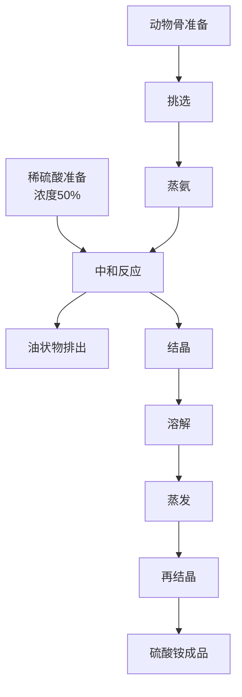
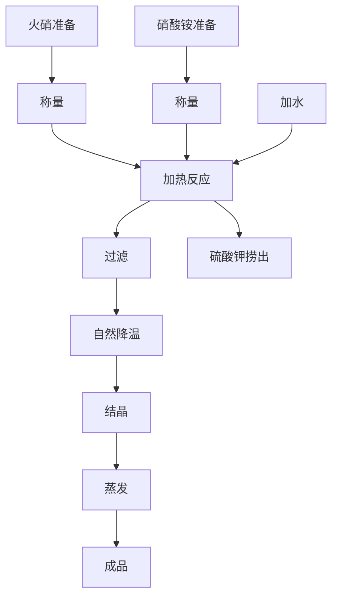
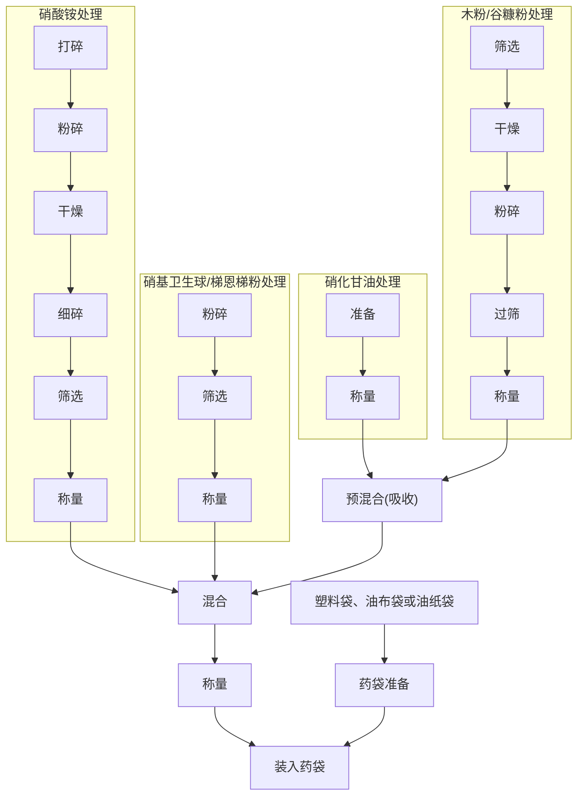
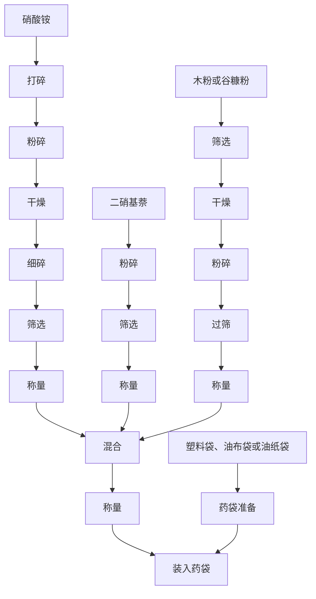
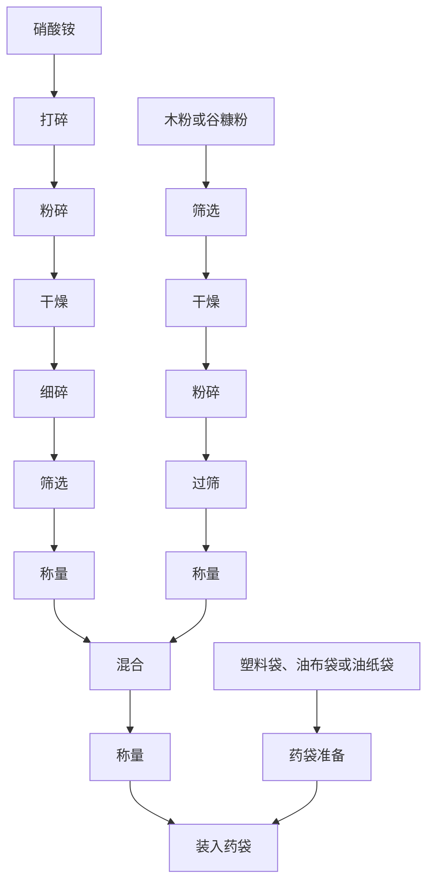
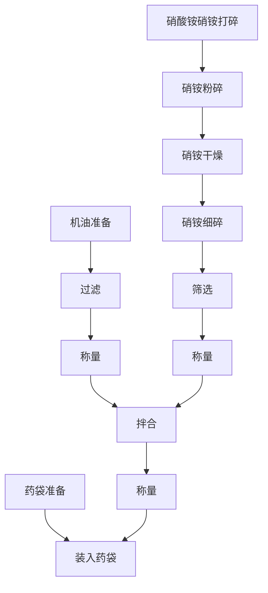

# 第四章 硝酸铵类炸药制造法

## 1 概 述

1941 年以后，解放区各个战场都先后开展了规模巨大的全民爆破运动。因此，对爆破器材的需要量便极大地增长，尤其是爆破药包、地雷和爆破筒需要量更大。为了满足抗战新形势的要求，除扩大周氏炸药生产外，还充分利用各种原料，制造了硝酸铵类炸药。

硝酸铵类炸药，又名矿山炸药，广泛地应用于工业爆破和矿山爆破，它的主要成分是硝酸铵，故称之为硝酸铵炸药。

抗战时期硝酸铵的来源，一方面是由市场上购买成品的硝酸铵或硫酸铵；另一方面就地取材，利用动物骨干镏与硫酸作用制成硫酸铵，再以硫酸铵与火硝作用，制成硝酸铵。然后与木粉、谷糠粉或机油等燃烧剂以及硝化甘油、二硝基萘等敏感剂配制在一起，大量制造各种类型的硝酸铵类炸药。

前后共生产过四种主要类型：

第一类是粉状甘油炸药。这种炸药，主要成分是硝酸铵，在其中加有谷糠粉和少量硝化甘油，这类炸药起爆敏感，威力大，有一定的防潮能力。

第二类即含有固体敏感剂的硝铵炸药。主要成分是硝酸铵，其中加入二硝基萘作为敏感剂，这类炸药的起爆性能较好，爆炸威力与第一类基本相同，但防潮性较差。

第三类是不含有敏感剂的硝酸炸药，为硝酸铵与木粉或谷糠粉的混合物。此类炸药在散置状态下起爆性能较差，起爆时需用梯恩梯传爆药柱或扩爆管。此种炸药的防潮性也差。

第四类即硝铵机油炸药，是在硝酸铵中加以少量机油或柴油。起爆性能比第三类好，亦无防潮性。

抗战时期除生产过上述四种类型的硝铵炸药外，也曾在炸药中混入炒干的食盐或磨细的石英粉等，制出各式各样的炸药。抗战时所采用过的炸药品种，如下表所载。

表19 抗战时期的硝酸铵类炸药

<table border=1 ><tr><td class="center" rowspan="2">炸药名称</td><td class="center" colspan="8">成分 %</td></tr><tr><td class="center">硝酸铵</td><td class="center">硝化甘油</td><td class="center">谷糖粉或木粉</td><td class="center">二硝基苯</td><td class="center">泥煤粉</td><td class="center">厩机油</td><td class="center">沥青</td><td class="center">丝煤粉</td></tr><tr><td class="center">硝铵炸药</td><td class="center">88</td><td class="center">-</td><td class="center">12</td><td class="center">-</td><td class="center">-</td><td class="center">-</td><td class="center">-</td><td class="center">-</td></tr><tr><td class="center">硝铵炸药</td><td class="center">90</td><td class="center">-</td><td class="center">10</td><td class="center">-</td><td class="center">-</td><td class="center">-</td><td class="center">-</td><td class="center">-</td></tr><tr><td class="center">硝铵炸药</td><td class="center">88</td><td class="center">-</td><td class="center">4</td><td class="center">-</td><td class="center">8</td><td class="center">-</td><td class="center">-</td><td class="center">-</td></tr><tr><td class="center">硝铵炸药</td><td class="center">95</td><td class="center">-</td><td class="center">-</td><td class="center">-</td><td class="center">-</td><td class="center">-</td><td class="center">5</td><td class="center">-</td></tr><tr><td class="center">硝铵炸药</td><td class="center">88</td><td class="center">-</td><td class="center">2</td><td class="center">-</td><td class="center">-</td><td class="center">-</td><td class="center">-</td><td class="center">10</td></tr><tr><td class="center">硝铵炸药</td><td class="center">84</td><td class="center">-</td><td class="center">4</td><td class="center">12</td><td class="center">-</td><td class="center">-</td><td class="center">-</td><td class="center">-</td></tr><tr><td class="center">硝铵炸药</td><td class="center">85</td><td class="center">-</td><td class="center">15</td><td class="center">-</td><td class="center">-</td><td class="center">-</td><td class="center">-</td><td class="center">-</td></tr><tr><td class="center">铵萘炸药</td><td class="center">88</td><td class="center">-</td><td class="center">-</td><td class="center">12</td><td class="center">-</td><td class="center">-</td><td class="center">-</td><td class="center">-</td></tr><tr><td class="center">硝铵机油炸药</td><td class="center">94</td><td class="center">-</td><td class="center">-</td><td class="center">-</td><td class="center">-</td><td class="center">6</td><td class="center">-</td><td class="center">-</td></tr><tr><td class="center">粉状硝铵甘油炸药</td><td class="center">83</td><td class="center">6</td><td class="center">-</td><td class="center">-</td><td class="center">11</td><td class="center">-</td><td class="center">-</td><td class="center">-</td></tr><tr><td class="center">粉状硝铵甘油炸药</td><td class="center">68</td><td class="center">4</td><td class="center">10</td><td class="center">4</td><td class="center">8</td><td class="center">-</td><td class="center">6</td><td class="center">-</td></tr><tr><td class="center">粉状硝铵甘油炸药</td><td class="center">90</td><td class="center">6</td><td class="center">4</td><td class="center">-</td><td class="center">-</td><td class="center">-</td><td class="center">-</td><td class="center">-</td></tr></table>

## 2 硝酸炸药的性质

硝铵炸药的性质和它的成分有关，根据配分不同，它的物理化学性质也不同，现分述如下：

1. 12%的二硝基萘与88%硝酸铵的混合物，是一种外观为黄色粒状或粉状物质。密度为1.12～0.98，加热到230～240℃时发生分解，当加热到300℃以上时便发生爆炸。对火焰及摩擦敏感度较烈性炸药小，爆速为2000～2500米/秒。

2. 83%硝酸铵，6%硝化甘油和11%泥煤粉的混合物，外观为深灰色粉末，用手摸时有油腻感觉，对火焰及摩擦作用敏感，加热至210℃分解，具有一定的防潮能力，爆速为3000米/秒。

3. 90%硝酸铵，10%木粉或谷糠粉的混合物，外观为浅灰色或浅黄色粉状物质，密度为0.85~1.00，对火焰、冲击、摩擦较纯感，具有硝酸铵的特性。它的爆速为1900~2200米/秒。

4. 89%硝酸铵与11%棉籽饼的混合物，外观为淡黄色粉末，密度0.80～0.90，对火焰和摩擦的敏感度较小，加热到220℃以上分解，具有硝酸铵的特性。它的爆速为2295米/秒。

由于成分中含有大量的硝酸铵，所以具有吸湿性并形成块状。
硝铵炸药的主要成分是硝酸铵，具有爆炸性、吸湿性和粘块性。

## 3 硝酸铵的性质

硝酸铵是制造硝酸炸药的主要原料，所以对硝酸铵的性质应有足够的了解和掌握，这样对制造硝酸炸药会有很大的帮助。

### (一) 硝酸铵的物理性质

1. 多结晶现象。硝酸铵是白色或淡黄色的结晶物质，比重1.44~1.79，假比重0.86~0.97。由于含水分不同，其熔点为145~169℃。

硝酸铵有五种结晶形状(如图 25 所示): 正方晶体、正六面晶体、菱形晶体(分为  $\alpha$ 和  $\beta$ 两种)和斜六面晶体。

1—正方晶体；2—正六面晶体；3—α菱形晶体；4—β菱形晶体；5—斜六面晶体。

图25 硝酸铵各种晶体形状

硝酸铵随温度不同其结晶亦随之转变，温度低于16℃时，结晶形状为正方晶体和正六面晶体；在16～18℃时晶体变成菱形α和β，比重1.726，这种晶体可保持到32.1℃，在此温度区间，硝酸铁无结块现象。当温度高于32.1℃时，菱形晶体的体积增大3%，幷分解成菱形β状之细晶粉，比重1.66，在潮湿大气中迅速硬化。在84.2℃时，此晶体又转变成斜六面晶体，比重1.69，有棱形和三角形棱边，在形成晶体时放热。硝酸铁的特性之一是随温度的变化其结晶形状也发生变化。制造硝酸铁炸药时，室温最好不要太高，保持在16～32℃之间为宜。

2. 吸湿性和结块性。硝酸铵具有较强的吸湿性，对硝铵炸药的质量有很大的影响，所以在制造和贮存时要注意防潮。硝酸铵的吸湿速度随下列因素变化：

    1. 空气湿度比吸湿点高时，吸湿性速度快。如在 30℃ 时，硝酸铵的吸湿点为59.9%。当空气湿度为70%时比湿度65%时的吸湿性速度快；

    2. 当相对湿度一定时(如相对湿度为70%时已达到硝酸铵的吸湿点)，则温度越高吸湿性速度越快；

    3. 表面积大时，吸湿快，所以粉状的硝酸铵比粒状的硝酸铵吸湿速度快。

由上述情况看来，制造硝铵炸药，要尽量减少室内湿度。室内不要放置散发湿气的设备。不要向地面上洒水，雨季生产要适时关启门窗，保持室内低温干燥。硝酸铵的吸湿临界湿度如图25.A所示。

图25. A 硝酸铵吸湿临界温湿度

硝酸铵混合物的吸湿点与成分有关，根据混入的物质不同，其吸湿点发生变化的情况见表20。硝酸铵具有结块性质，

其原因为以下两方面：

第一，硝酸铵的结晶形状，随温度变化而改变，晶体在转变过程中，其体积发生变化的同时放热或吸热。当颗粒的体积膨胀时，颗粒之间接触更加紧密，这时可能产生结块现象。

表20 硝酸铵混合物吸湿点

| 混合物组成(分子比)     | 吸湿点(相对湿度%) |
|-----------------------|------------------|
| 硝酸铵                | 59.4             |
| 硝酸铵 + 硝酸钠        | 46.3             |
| 硝酸铵 + 硝酸钾        | 61.6             |
| 硝酸铵 + 氯化铵        | 51.4             |
| 硝酸铵 + 硫酸铵        | 62.3             |

第二，在贮存和运输过程中，由于吸湿使水分增加，以后又遇到自然干燥或其他使水分减少的情况，这样可以生成新的结晶，出现结块现象。

### (二) 硝酸铵的化学性质

1. 硝酸铵与金属的作用：干燥的硝酸铵不与铁、铝、汞和锡等金属起作用，所以对于干燥的硝酸铵可以用铝或铁等金属制的工具加工。但熔化的硝酸铵，对铜、镁、铝、铅、镍和锌等金属均起作用，尤其与铜的作用最为激烈。与金属作用的结果，生成具有爆炸性较大的亚硝酸盐，因此，在制造中应避免上述金属零件和杂物落入硝酸铵中。

2. 硝酸铵的热分解和爆炸性：硝酸铵在常温下可以分解，放出氨气和分解出硝酸并吸热。所分解出的硝酸又可以促使硝酸铵继续分解。

当温度为 110℃ 时，纯硝酸铵可按下式分解. 

$$
NH_4NO_3 \ce{->} HNO_3 + NH_3 - 41300卡 
$$ 

在 185℃ 时，分解生成氧化氮和水

$$
NH_4NO_3 - \ce{->} N_2O + 2H_2O + 30300卡
$$ 

在 230℃ 以上时，分解速度加快，同时有弱的闪光发生，此时分解出氮和氧

$$
2NH_4NO_3 \ce{->} 2N_2+O_2 + 4H_2O + 30700卡
$$ 

硝酸铵对冲击、震动和摩擦均钝感，生产中可以用铁器粉碎。

干燥的硝酸铵，在起爆力较大的雷管作用下能引起爆炸。硝酸铵中混有机械杂质及有机物时，会增加它的敏感度。

用硝酸铍溶液浸渍的纸张和布袋等织物，在加热100℃以上时，会引起自燃。制造硝酸铍炸药时的废纸或废布袋不要乱掷，以免引起火灾。

## 4 动物骨[^1]干馏制造硫酸铵

抗日战争初期，硝酸铵的来源比较困难，硫酸铵的来源也时有缺。为坚持长期抗战，使原材料立足于解放区，奠定硝酸炸药的原料基础和充分利用物质资源，就利用动物骨[^1]干镏制造硫酸铵，再由硫酸铵制成硝酸铵，以补充硫酸铵和硝酸铵的来源不足。下面是制造硫酸铵和硝酸铵的工艺方法。

[^1]: 即猪，牛，羊等的骨头

### (一)原料准备及反应原理

原料是动物骨[^1]和浓度50%的稀硫酸。

动物骨[^1]干馏的气体与稀硫酸反应制成硫酸铵，其基本原理为：

动物骨[^1]干馏分解出氨气，将其通入稀硫酸中，反应式为

$$
2NH_3 + 2H_2O \ce{->} 2NH_4OH
$$ 

$$
2NH_4OH + H_2SO_4 \ce{->} (NH_4)_2SO_4 + 2H_2O
$$ 

### (二)中和法制造硫酸铵

动物骨经选择后投入干馏炉中，徐徐加热，温度逐渐上升，这时动物骨中的氨气，随水蒸汽和其他有机物一起，由管道导至中和反应缸中，与缸内事先加入的50%浓度的稀硫酸作用生成粗制的硫酸铁溶液。动物骨干馏和中和反应的设备如图 26 所示。

蒸氨炉是用耐火砖砌成，有加料口和火门，并有管道与中和反应缸相连接。

中和反应缸是由缸体和大瓷盆所组成，在缸内盛有稀硫酸，缸为耐酸材料制成(当时是利用民间的瓷缸)。

为了充分利用氨气，中和反应缸可采用两组，并在缸口上反盖一瓷盆以防止氨气挥发(稀硫酸加入后将缸盖扣紧)。经中和作用制出的产品为粗制硫酸铵，其中含有不少杂质和有机物。

1—蒸氨炉；2—管道；3—火瓷盆；4—缸体。

图26 动物骨干馏炉及中和反应缸

### (三) 硫酸铵精制

硫酸铵精制，主要有浓缩、结晶、再熔解、再浓缩和再结晶等工序组成。

1—物料；2—陶缸；3—砂子；4—火炕。

图27 火炕砂盘干燥装置

中和生成的硫酸铵，在溶液表面有一层黑色的油状物质，用勺将它排出，经适当滤液后再将硫酸铵盛入瓷缸中结晶。结晶时应在常温条件下放置一昼夜，结晶后的硫酸铵滤去母液即是粗产品。

粗制硫酸铍加入溶解缸中(瓷缸)，在缸内加入适量的温水，使硫酸铍溶于水中。溶解的硫酸铍进行加热浓缩，达到饱和点后静置降温，一昼夜后硫酸铍就可结晶出来。

结晶的硫酸铵仍含有水分，需烘干除去水分。烘干用的砂盘和缸如图 27 所示，这种方法当时称谓砂盘干燥法。

流程 7 用动物骨干镏制造硫酸铵的工艺流程

<!--  -->

## 5 用硫酸铵制造硝酸铵

### (一) 硝酸铵与硫酸铵的鉴别

抗战时期，硫酸铵除自制外，也从市场上购买。当时把硝酸铵与硫酸铵通称为“肥田粉”，硝酸铵和硫酸铵从外观很难鉴别。当时由于仪器、药品的限制，采用下列简易办法来鉴别硝酸铵和硫酸铵：

在玻璃杯中盛入适量的水，加入少量的硝酸钡(若不用硝酸钡时，可用浓度10～15%的石灰水)，再将待试的“肥田粉”溶液加入其中，少许搅拌后静置一小时，以观其反应：若杯中有沉淀物产生，即是硫酸钡；无沉淀物产生是硝酸钡。

### (二)用硫酸铵制造硝酸铵的反应过程

用硫酸铵制造硝酸铵，将硫酸铵与火硝按一定比例配合并加入适量的水，使它发生复分解而制成硝酸铵。复分解的反应式如下

$$
(NH_4)_2SO_4 + 2KNO_3 \ce{->} 2NH_4NO_3 + K_2SO_4
$$ 

经复分解反应，生成硝酸铵与硫酸钾。

流程 8 用硫酸铵制造硝酸铵的工艺流程

<!--  -->

### (三) 工艺过程和设备

将硫酸铵与火硝准备好，先在铁锅(或缸)中加入约为容积一半的清水，再将20公斤的硫酸铵加入，用棒搅拌，令它全部溶解。然后再将 33 公斤的火硝加入并迅速地搅拌和加热，约经 30 分钟，在锅底部即有硫酸钾结晶生成，这时可用工具将结晶捞出。

1—白布；2—筛子；3—木框；4—陶缸；5—过滤后的溶液。

图28 过滤装置

溶液的温度较高，趁热将溶液用粗布过滤，过滤的是用一个瓷缸，在缸口上部放置一木框，框上放一筛子，筛上铺白粗布，用以过滤溶液，具体装置如图 28 所示。

过滤后，物料的温度也随之降低，硝酸铵在缸中开始有结晶析出，再放置5～6小时，使其完全结晶，所制出的产品，即为硝酸铵。所制出的成品质量与过滤工序的操作有关。若过滤较好，制出的产品质量一致；如过滤操作的不恰当，一般是上层结晶较纯，下层含有杂质(主要是硫酸钾)。结晶的硝酸铵含有一定水分，应再经蒸发和脱水以制得成品。

## 6 制造硝铵炸药中的原材料准备

抗战时期所生产的硝铵炸药，虽然使用的原料种类很多，但归纳起来原料可分为氧化剂(如硝酸铵)，敏感剂(如硝化甘油和二硝基萘)等。原材料准备的步骤如下：

### (一) 硝酸铵准备

硝酸铵是硝酸炸药的主要成分。对硝酸铵要求水份应少于0.3%，细度通过每平方厘米15孔的筛网，愈细愈好。准备工作由粉碎、干燥和筛选工序组成。

1. 硝酸铵粉碎：硝酸铵的粉碎方法较多，如采用凸输式、鼠笼式粉碎机或输碾机都能很好地粉碎。在抗战时期，为适应当时条件，采用民间的石碾子进行粉碎。粉碎方法是：先将硝酸铵放在木槽或石板上，用锤子打成每边长小于60毫米的小块，置于石碾上(量小时也用药店用的压药碾子)，用畜力带动进行粉碎。粉碎过程一次加料不要过多，边粉碎，边加料，并不停的用小木板翻动物料。

    硝酸铵有较强的吸湿性，通常用纸袋包装，虽经妥善保管，但含水量仍可达5～8%。因此，未经干燥的硝酸铵，用上述方法一次操作，使细度达到全部通过每平方厘米15孔的筛网是较困难的，需细碎后再干燥，然后再精碎一次。

2. 硝酸铵干燥：要求硝酸铵含水量不大于0.3%。其干燥方法很多，如烟道气干燥法，热风干燥法和干燥室干燥法等，但不允许直接用火加热干燥。抗战时期是采用火炕干燥的方法，先在火炕上安置一些干燥架，然后将粉碎的物料置于干燥盘内铺平，放入干燥架上(如图29所示)进行干燥。

    

    
    
1—干燥架；2—干燥盘；3—物料；4—炉灶。 

    
图29 火炕法干燥硝酸铵

    

    以火炕法干燥时，应将干燥室的门窗封严，防止室内热量散失。室内温度保持在60～80℃，干燥时间约为24小时。每隔2～4小时用木铲翻动一次物料，以加速干燥。经干燥的物料，再经碾细或人工捣细。人工捣细时，是将硝酸铁加入瓷缸或木槽中，用铜锤或铁锤捣碎，操作要迅速，以免长时间与空气接触而吸湿。其捣碎工具如图30所示。

    

    
    
图30 人工捣碎工具 1—锤；2—缸； 3—物料。

    

3. 硝酸铵筛选：筛选是将不合格的大块选出，再行粉碎。当时用的是人工操纵的往复筛，操作方便，劳动强度较小。具体操作方法是，将筛子四角用绳子吊在棚顶上，人工拉动手柄，做往复运动。

    筛选时，为防止尘粉飞扬，可用布将筛子四周围起来，在筛的下面放置清洁的大木盘，收集筛下的物料。合格的产品，可送去使用或置于干燥室中备用。

### (二) 燃烧剂准备

当时用的燃烧剂有木粉、谷糠粉、泥煤粉、谷物壳、棉籽饼和树皮等。燃烧剂准备的主要工序为挑选、干燥、粉碎和筛选。

购来的原料先用粗孔筛筛选，除去其中较大的杂物，再清除物料中混有的碎铁屑、铁块和铁钉等。

配制炸药所用的燃烧剂，细度要求通过每平方厘米16孔的筛网，含水量不大于2%。由于来自民间的木粉、谷糠粉、谷物壳等含水量较大，在这种情况下，不易粉碎的很细，必须先进行干燥，然后粉碎。

1. 燃烧剂干燥：燃烧剂干燥方法很多，如气流式、回转式或热风干燥法等均能收到很好的干燥效果。在抗战时期，结合当时当地的客观条件，主要是采用烟道气干燥法和干燥室干燥法，也应用过锅炒的办法。虽然当时应用的方法简单，但质量仍能得到保证。

    1. 烟道气干燥法：是利用烟道气的热量，加热铁板来干燥木粉、谷糠粉等。烟道气的干燥装置如图31所示。烟道气干燥装置，是用一块10～15厘米厚的铁板制成长方形的平底锅。将物料置于平底锅上，在燃烧室生火加热，使平底锅温度升高，同时用人工翻动物料。干燥过程中温度不宜过高，以免物料碳化。这种装置的设备简单，效率较高。

        

        
        
1—炉灶；2—平底锅。

        
图31 烟道气干燥法

        

    2. 炒干法：用民间烧饭的锅灶，将物料加入锅中进行加热，并不断地用工具翻动物料至炒干为止。这种方法简易可行，是当时普遍采用的方法。但操作时注意以下几点：

        1. 加料不宜过多，最好是全锅容积的1/3左右。若加料过多，不易搅拌均匀，影响干燥质量；

        2. 加热时火力不要太旺，以防止当物料内部水分尚未蒸发，而表面上已被烧焦；

        3. 物料要勤翻动，搅拌要均匀。

    3. 干燥室干燥法：以火炕或火墙加热室内的空气，室内置有木架，将物料装入盘内置于干燥架上。保持室内温度为65～75℃，经24小时物料水分可由30%降低到2%以下。这种方法所干燥出的物料外观较好，但效率较低。

        由于棉籽饼吸湿性小，所以用它作为燃烧剂时，可不进行干燥。

2. 燃烧剂粉碎：木粉、谷糠粉等经过干燥后即可粉碎，粉碎是用畜力或水力带动石磨将物料压成细粉，再用每平方厘米16孔的筛网筛选。

在炸药中也应用过煤粉和机油作为燃烧剂。

### (三) 敏感剂准备

炸药中所使用的敏感剂是硝化甘油与二硝基萘。硝化甘油系液体炸药，不需加工。但在使用前要检查是否有凝结现象，如发现凝结，需将它和容器一起置于温度较高的地方，待完全熔化后再用。

二硝基萘是粉状固体物质，它的细度与混合后的炸药威力有关，物料愈细，炸药威力愈大。粉碎是用碾子压碎或人工捣碎，通过每平方厘米16孔的筛网筛选。

## 7 粉状硝铵甘油炸药配制

粉状硝铵甘油炸药，其主要成分是硝酸铵、硝化甘油和谷糠粉(或木粉)，其中也可加入二硝基萘或梯恩梯。这种炸药的配制过程，是由吸收和混合两个主要工序组成。

1. 吸收：吸收用的工具是大瓷盆(或木盆)。将按成分比例秤量好的谷糠粉加入盆中铺平，再以定量的硝化甘油呈绕状均匀地加入谷糠粉中。搅拌要轻，用力不要过猛。

2. 混合：所用的工具同吸收工序。混合时，是将称量好的硝酸铵加入盆中，再将谷糠粉加入，如需要二硝基萘或梯恩梯也同时加入。定量物料加完后，用木耙翻动，混合均匀。混合时翻动不宜过猛，以免药尘飞扬。混均匀后，再将已吸收硝化甘油的谷糠粉加入其中，再混合，至混合均匀为止。

硝化甘油对冲击、摩擦和火焰均十分敏感，在配制硝铵甘油炸药时，应注意安全。

流程 9 “第一类型”粉状硝铵甘油炸药生产工艺流程

<!--  -->

## 8 含有固体敏感剂的硝酸炸药配制

含有固体敏感剂的硝铵炸药，其主要成分是硝酸铵、谷糠粉(或木粉)和二硝基萘(或梯恩梯)。配制这类炸药主要的工序是混合。

混合的方法，可用手工也可用机械。机械混合法是采用球磨机(图32)。球磨机外壳是以木材、铝、钢等制成，在机内加入木球或塑料球。加料次序是先加入硝酸铵，再加入木粉或谷糠粉，然后再加入二硝基萘或梯恩梯，用人力或电力带动球磨机运转。混合40～50分钟就可出料。

流程10 “第二类型”含有固体敏感剂的硝铵炸药生产工艺流程

<!--  -->

图32 球磨机
 

抗战时期多采用手工混合。所用的装置是洁净的大木盆或大瓷盆。将物料按比例称取好，加入盆中，用木耙搅拌混合均匀后即为成品。

## 9 不含敏感剂的 硝铵炸药配制

不含敏感剂的硝铵炸药，制法简单，主要工序是混合。混合的方法有以下两种：

1. 碾子混合法：以水力、蓄力或人力带动磨米用的石碾子，将硝酸铵和谷糠粉(或木粉)放在碾盘上，边碾压，边翻动，使其混合均匀。

    用这种方法混合要特别注意安全，加料不能过少，以防碾子空转引起火花。另外，投料也不宜过厚，料层太厚不易翻动均匀，一般以15～20毫米的料层厚度为宜。

    碾子混合法不仅能使物料混合均匀，而且使物料又得到一次破碎的机会。碾子混合比人工混合所得的产品质量高，但此种方法只能用于不含有敏感剂的硝铵炸药。

2. 手工混合法：手工混合法与含固体敏感剂的硝酸灼伤药混合方法相同。

流程11 “第三类型”不含敏感剂的硝铵炸药生产工艺流程

<!--  -->

## 10 硝铵机油炸药配制

硝铵机油炸药，主要成分是硝酸铵和一定数量的机油(柴油)。机油是有机物质，可以提高炸药的起爆敏感度。在硝酸铵中加入机油时，应先称取定量的硝酸铵和机油，机油经过滤后倒入洁净的大瓷盆中，然后往盆内加入一部分硝酸铵(加入到能完全吸收机油为宜)，再将其余的硝酸铵倒入大木盆内铺平，把已吸收机油的硝酸铵加入，用木耙混合均匀，即为成品。机油含量一般的为6～8%。

上述四种类型的硝酸铵类炸药的生产，有一个共同的特点，这就是要特别注意它的吸湿性和结块性。在生产过程中，要经常的保持室内干燥，适时通风换气，室内温度也不宜过高。

流程12 “第四类型”硝铵机油(柴油)炸药生产工艺流程

<!--  -->

## 11 爆破药包装药

军事爆破中常用的炸药药包重量为 0.5 公斤、1 公斤、2 公斤、3 公斤、5 公斤、8 公斤和 10 公斤，最大的可达 20 余公斤。药包的大小，根据爆破对象不同而选择。

表21 硝铵炸药生产时所使用的设备工具和仪器

| 工序                 | 设备               | 工器具                   | 仪器     |
|----------------------|--------------------|--------------------------|----------|
| 硝酸铵打碎           | 木槽               | 锤子                     |          |
| 粉碎                 | 石头碾子或药碾子   |                          |          |
| 干燥                 | 干燥装置           |                          | 温度计   |
| 细碎                 | 石头碾子或药碾子   |                          |          |
| 筛选                 | 筛子               |                          |          |
| 称量                 |                    | 秤                       |          |
| 木粉或谷糠粉筛选     | 筛子               |                          |          |
| 干燥                 | 锅                 |                          |          |
| 粉碎                 | 石头碾子           |                          |          |
| 过筛                 | 筛子               |                          |          |
| 称量                 |                    | 秤                       |          |
| 硝基卫生球粉碎       | 瓷盆               | 铜锣                     |          |
| 筛选                 | 筛子               |                          |          |
| 称量                 |                    | 秤                       |          |
| 硝化甘油称量         |                    | 橡皮桶、秤               |          |
| 预混合               | 木槽               | 耙子                     |          |
| 混合                 | 木槽               | 耙子                     |          |
| 称量                 |                    | 秤                       |          |
| 药袋准备             |                    | 剪子                     |          |
| 装入药袋             |                    | 漏斗、小锤子、秤         |          |

### (一) 装包的形状

药包的形状是多种多样的，有长方形、方形、圆柱形和圆形等，按使用的情况确定。如巷战时，炸墙用方形或扁方形很合适，如用圆形药包则不能充分使用爆炸的能量。

### (二) 药包的包装材料

包装材料的选用，要符合行军作战的条件，必须具有防潮性。一般多采用油布、油纸和塑料袋做为药包的包装材料。

### (三) 装药

药包装药可用机械装填，如单臂式螺旋装药机和天秤式螺旋装药机等，不论立式或卧式金属结构甚至是木结构都能很好地装填药包。而最简单的方法是手工装药，这也是抗战时期普遍采用的方法。手工装药时，先将药包准备好，用小铲子(或勺子)将炸药装入药包，经称重合格后，将口部缝严或用绳扎紧，装入木箱即为成品。

抗战时期制造了各种各样的硝酸铵类炸药和爆破药包，源源不断地供应了前线的需要。