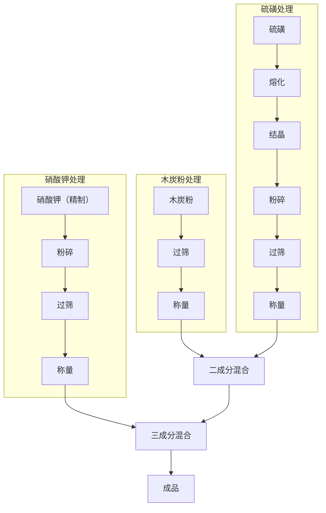

# 第五章 黑火药粉制造法

## 1 概 述

黑火药简称黑药，是我国伟大的发明之一。它的用途广泛，在军事上作为引火药，也曾做为炸药装填手榴弹和地雷，在民间用于玩具和焰火。

黑火药是由硝酸钾、硫磺粉和木炭粉三种原料按一定比例混合而成。经过造粒的即为黑火药，不经造粒而呈粉状的称为黑火药粉。

黑药所用的原料，在解放区广大的农村有极丰富的来源。因而，它是抗战时期大量生产的一种爆炸物。

黑火药的三种成分的比例，需根据用途不同来调整，一般所采用成分配比为：

| 成分     | 百分比 |
|----------|--------|
| 硝酸钾   | 75%    |
| 硫磺粉   | 10%    |
| 木炭粉   | 15%    |

上述成分在火药中的作用为:

(一)硝酸钾：作为氧化剂，当火药燃烧时，按下列反应放出氧：

$$
2KNO_3 \ce{->} 2KNO_2 + O_2
$$ 

$$
4KNO_3 \xrightarrow{高温} 2K_2O + 2N_2 + 3O_2
$$ 

硝酸钾所放出的氧，帮助火药中硫磺与火药的燃烧，其反应式如下:

$$
C + O_2 \ce{->} CO_2
$$ 

$$
S + O_2 \ce{->} SO_2
$$ 

(二)木炭粉：为燃烧物质。

(三)硫磺粉：燃点较低，因而使火药容易点燃。

组成物成分的比例，对火药的性质有一定的影响，如硝酸钾含量增加时，能提高火药的威力和燃烧速度；当硝酸钾的含量一定时，则火药的能量随硫磺的增加而减少，随木炭粉含量的增加而提高。

## 2 黑火药粉的物理化学性质

黑火药粉为黑色粉末状物质，假比重为0.6～0.9公斤/升，吸湿性小，在正常的气温条件下不易吸湿；当含水量超过2%时，其爆炸威力和点火能力显著降低；含水量达到15%以上时，失掉其爆炸性，甚至用火点燃也很困难。

黑火药粉对火焰和冲击摩擦很敏感，受火焰和冲击作用时产生燃烧或爆炸。

爆炸反应与组成物的配比有关，如：

$$
\ce{\underset{\text{(77%)}}{16KNO_3} + \underset{\text{(12.3%)}}{21C} + \underset{\text{(10.7%)}}{7S} -> 13CO_2 + 3CO + K_2SO_4 + 5K_2CO_3 + 2K_2S_3 + 8N_2^}
$$

$$
\ce{\underset{\text{(79%)}}{10KNO_3} + \underset{\text{(10%)}}{12C} + \underset{\text{(11%)}}{4S} -> 8CO_2 + 3CO + 5N_2^ + K_2CO_3 + 2K_2SO_4 + 2K_2S}
$$

$$
\ce{\underset{\text{(75%)}}{74KNO_3} + \underset{\text{(10.3%)}}{16C_6H_2O} + \underset{\text{(14.7%)}}{327S} -> 56CO_2 + 14CO + 3CH_4 + 2H_2S
+ 4H2^ + 35N_2^ + 19K_2CO_3 + 7K_2SO_4 + 2K_2S + 8K_2S_3O_3 + 2K_2CN3 + (NH_4)_2CO_3 + C + 3S}
$$

黑火药粉的发火点为  260~270℃ 之间。它对铁与铁摩擦敏感，因而加工黑药时，不能单纯采用铁器。黑药的化学安定性较好，在常温条件下贮存不易起变化。

## 3 原材料加工

黑火药粉制造，所使用的原材料为木炭粉、硫磺粉和硝酸钾。

### (一) 木炭粉制造

木炭对黑药质量有直接的影响，木炭应具有点燃容易，燃烧速度一致和吸湿性小等性能，并且不含有杂质。烧木炭所用的木材一般为柳木、椽木和苏黎木，而多采用杨、柳木做为烧木炭的原料。

根据生产的经验，对木材的选择应注意下列几点：

1. 柳木和白杨木质地较软，适于烧制木炭。

2. 选择直径在10厘米以下的小树和树枝烧木炭，所得木炭较脆，灰份含量少，点燃容易以及燃烧速度快且均匀。

3. 伐树后，先把树皮剥下，放置10～15天以后，使树浆和水份蒸发掉，再行使用。

经过挑选后，把树皮剥净，锯成一段一段的小木棒，即可装窑烧炭。

烧炭窖的形式很多，抗战时，最简易的烧炭窑是挖一个坑，内放一个陶缸，如用麻杆烧炭则将麻杆托在缸的上面燃烧，燃烧物就掉入缸内，烧完后再将缸盖封上，用土封严并留一排气孔，使炭在缸内碳化，约经24小时即为合格的木炭。此外，还采用过以下两种形式：一种是，选择一块靠山坡或小丘土堆的地方挖一个坑，把木材排列在坑内，盖上20～30厘米厚的涩土，把表面打平，留一个火门，在火门的对侧砌一个烟窗，窑的顶部留两个通气孔，点火后即可烧炭；另一个窑，是在有涩土的地方，用石头或土坯砌成，下面挖一个坑做火门，窑顶盖上砂子或土井留有通气孔，其构造如图33所示。采用这种窑可装木材1000公斤左右，出炭约200公斤。一般成炭率可达20～25%。

装窑工作分几个步骤进行：首先按木材粗细长短分开，细的短的放在窑壁四周，粗的长的装在中间和靠近火门的部位。装填时要使木材之间留一些空隙。为使木炭质量一致，每一窑只能装入一种木材。木材装完后在火门的部位装入一些直径小且易点燃的干木柴，做为点火之用。

点火后把通气孔打开，估计火力在封闭后不致熄灭时把火门封上，同时将通气孔留下一半。燃烧4～5小时后，把通气孔全部关死。这时烟雾为黄黑色，经一段时间逐渐变成白色，待白色烟基本消失后，碳化过程即告结束。于是封闭烟道，使木炭冷却，全部碳化过程需75～80小时。封闭烟道的时间不能过早和过迟；过早碳化程度不够，过迟则碳化过程过度，灰份含量较多。

1—火门；2—隔火墙；3—装料出口；4—排气孔。

图33 烧炭窑

挑选出合格的木炭，放在木盘里，用锤子打碎，并用碾子压成细末；经过细碎的木炭粉通过每平方厘米110～120孔的筛网筛选，合格后送去混合。

### (二) 硫的加工

硫俗称硫磺，常温下为固体物质。一般分为多种结晶形和无定形。在自然界中呈八面结晶的硫(即斜方晶硫)散布最广，外观为黄色，比重为2.08，熔点为114.5℃。迅速冷却时会变成棱形(单斜晶体)，为长斜状棱形晶体，比重为1.95，熔点为119℃，这种硫性质不稳定。在温度低于 95.5℃ 时又变成斜方晶体，熔点为 113~114℃。

硫是一种很活泼的元素，以粉状存在时，放金属板上可使金属表面逐渐转变为硫化物；与铁、铜和锌等金属加热可直接化合为硫化物。细粉状的硫在常温下可与空气中的氧缓慢化合，生成亚硫酸酐与硫酐，再与空气中的水分相遇可生成亚硫酸及硫酸。硫在火药中增加了火药的吸湿性。硫是热和电的不良导体，受摩擦易产生电荷，所以制造火药粉时要注意这个特性。

制造黑火药粉所用的硫为精硫，外观为黄色或淡黄色，含硫量不少于99.5%。硫中不允许含有硫酸和亚硫酸，硫的比重应为1.99～2.07。

抗战期间，硫的来源很广，解放区的许多山区都有天然硫矿。山区的人民都能熟练地从硫矿中提炼出粗硫。山区所运来的硫(粗硫)；其中尚含有一定数量的杂质，需要加以精制。

粗硫所含的杂质一般为矿渣和不易挥发的砂土等。硫的沸点为 444.5℃，利用硫的这种性质，使硫与杂质分开。精制硫的方法很多，通常是采用专门的炉子和蒸馏器来进行硫的精制。当时未采用上述方法，而采用罐(或锅)精制硫。

罐精制硫时，先将粗硫块打成每边小于50毫米的碎块，放入罐中用微火徐徐加热，加热温度为130～140℃，不要超过 160℃。待硫全部熔化后，静止约十分钟，用铁勺将硫取出过滤。过滤冷却后的硫，即可使用。或者，在罐侧装一导管，加热使硫升华也可精制出硫。经提纯的硫，用药碾子将硫压成细末，也可用人工捣碎，细碎的硫经每平方厘米110～120孔的筛网筛选，合格的硫粉即送去使用(图 34)。

1—物料；2—船形槽；3—手柄；4—铜铊。

图34 药碾子

### (三) 硝酸钾准备

硝酸钾在黑火药粉中做为氧化剂使用，抗战时期是由土硝提制而得。其制备方法见[第十三章](./chapter%2013.md)。

精制和干燥过的硝酸钾，用碾子压成细粉经每平方厘米110～120孔的筛网筛选后，送去混合。

##  4 黑火药粉混合

黑火药粉的混合，分两个步骤进行，首先将硫磺和木炭混合，即谓二成分混合。混合均匀后，再加入硝酸钾进行混合，即谓三成分混合。经混合均匀，即为合格的黑火药粉。

二成分和三成分混合的方法很多，如用球磨机混合法和木槽搅拌混合法等。球磨机混合法需要专用设备，而木槽搅拌混合法操作方便，设备简单，一般多采用此法进行混合。

(1)二成分混合：二成分混合是采用一个长方形的大木槽，将已经准备好的木炭粉，按规定比例加入木槽并用耙子耙平，再加入定量的硫磺粉，用木耙反复地混合，使其均匀。混好的产品就是二味粉，送去与硝酸钾混合，配制黑火药粉。

(2)三成分混合：三成分混合是在混合均匀的硫磺木炭二味粉中加入一定数量的硝酸钾，构成三成分，混合均匀后，即成为黑火药粉。

三成分混合时，先将混好的二味粉加入木槽中，再加入硝酸钾，为了安全和不致有黑药粉尘飞扬，影响人体健康，所以同时需加入1～2%的净水，增加湿度和降低黑火药粉对摩擦的敏感性。

在三成分混合时，因木耙的搅拌作用，对黑药粉有所摩擦，容易引起危险，故应采用隔墙操作(操作人员在室外通过墙洞用耙子进行混合)。二成分和三成分混合，所用的木槽表面要光滑，且无钉子或钉帽露出，木耙的端部最好包上橡皮，混合的速度不宜太快，要轻轻地耙动，一直到完全混合均匀为止。由于混合时加入1～2%的水，使黑火药受潮，因此使用前要干燥。

干燥黑火药粉当时采用过两种办法，一种是把黑药粉铺在板子上或席子上晒干；另一种办法是在隔火墙加热的干燥室里干燥，室温为50～60℃，干燥16～24小时。

黑火药粉对火焰特别敏感，遇到火焰立即起火。黑火药粉配制的整个过程中，要特别注意安全。

流程13 黑火药粉配制工艺流程

<!-- -->

表22 制造黑火药所用的设备、工具和仪器

| 工序 | 设备 | 工具 | 仪器 |
|------|------|------|------|
| 伐木 |  | 锯 |  |
| 切断 |  | 锯 |  |
| 烧炭 | 土窨 |  |  |
| 挑选 |  | 刀 |  |
| 粉碎 | 碾子 |  |  |
| 筛选 | 筛子 |  |  |
| 硫精制 | 雏子或锅 |  | 温度计 |
| 粉碎 | 碾子 |  |  |
| 筛选 | 筛子 |  |  |
| 组成物称量 |  | 秤 |  |
| 二成分混合 | 木槽 | 木耙子 |  |
| 三成分混合 | 木槽 | 木耙子 |  |
| 干燥 | 干燥室 | 架子、药盘 | 温度计 |