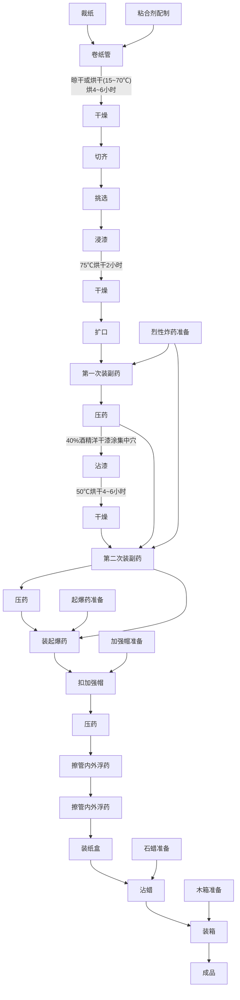

# 第六章 火雷管制造法

## 1 概 述

火雷管在军事上和爆破工程中用途非常广泛。它用于制造地雷、手榴弹的发火机构和起爆炸药药包等。火雷管是由壳体、加强帽、起爆药和烈性炸药所组成，遇到火焰作用立即爆炸，从而引起手榴弹、地雷及炸药药包的炸药爆炸。因此火雷管一直作为爆破器材的起爆元件(图 35)。

抗战时期，尤其是在后期，爆破运动空前的开展，全民投入了这一波澜壮阔的对敌斗争中，对爆破器材如手榴弹、地雷和炸药包等的需要量极大的增加，对雷管的需要量也就相应地增加很多。当时除需要电雷管外，更需要大量生产火雷管。

火雷管的壳体材料，通常是采用紫铜板制成。当时为了坚持长期抗战，节约金属原材料，除生产一部分铜壳和铁壳火雷管外，还大量生产了纸壳雷管。

1—壳体；2—加强帽；3—绸垫；4—起爆药；5—烈性炸药。

图35 火雷管

雷管中所用的起爆药是雷汞或雷银，均由工厂自制。根据物理性质不同，雷汞多用于铜壳雷管，雷银则用于纸壳雷管。

雷管所用的炸药一般为梯恩梯或苦味酸，当时大都是在战斗中缴获的。由于烈性炸药用量日益增加，所以必须节约使用梯恩梯，使其用于更重要的弹药中。因此，雷管所用的炸药除使用梯恩梯或苦味酸外，也大量装填过硝炭炸药(硝化甘油与麻杆炭粉的混合物)和强棉硝化甘油炸药(硝化甘油与强棉的混合物)。

## 2 火雷管的构造

抗战时期所生产的雷管，种类很多，除装有起爆药和烈性炸药的复式雷管外，也有只装有起爆药的单式雷管。单式雷管主要

1—管壳；2—加强帽；3—绸垫；4—起爆药。

图36 单式雷管

用于弹药引信和信管上(图 36)。

当时大量制造的还是复式雷管。就纸壳雷管来说，制造过以下几种类型，如图 37 所示。

A型为单式雷管，管壳为纸制，加强帽和底篙为铜皮制成。起爆药为90%的雷汞和10%的氯酸钾。

B型及C型均为纸外壳和金属加强帽。起爆药是雷汞或雷银。B型为Λ式金属底窝，而C型的金属底窝为W式。

D型结构与B、C型同，但其底窝是纸制的并与壳体连接在一起。

E型结构也与B、C型同，但底部是纸制的平底。

1—纸管壳；2—金属加强帽；3—绸垫；4—起爆药；5—底窝；6—烈性炸药。

图37 纸壳火雷管

### (一) 管壳尺寸和加强帽

上述 B、C、D、E 型纸壳雷管，在不同时期都进行过大量生产，根据实际使用证明，纸管壳和加强帽的尺寸，应采用如下规格(表 23)。

表23 纸管壳和加强帽尺寸

<table border=1 ><tr><td class="center">规格型号</td><td colspan="3">雷管壳尺寸(毫米)</td><td colspan="4">加强帽尺寸(毫米)</td></tr><tr><td class="center">雷管型号</td><td class="center">外径</td><td class="center">内径</td><td class="center">全长</td><td class="center">外径</td><td class="center">内径</td><td class="center">全长</td><td class="center">傅大孔径</td></tr><tr><td class="center">B、C、D、E</td><td class="center">$7.8^{0.3}$</td><td class="center">$6.25_{-0.1}$</td><td class="center">$40\pm1$</td><td class="center">$6.16\pm0.06$</td><td class="center">$5.55\pm0.05$</td><td class="center">$6.5_{-1}$</td><td class="center">2.0</td></tr></table>

加强帽对雷管的起爆力有很大的影响(表 24)，如以雷汞为起爆药，当无加强帽时需要药量为 0.8～1.1 克，而有加强帽时仅需 0.29～0.30 克。采用加强帽虽然要消耗一些紫铜板，但却节省了较多的起爆药。

表24 起爆药对梯恩梯的极限起爆量

<table border=1 ><tr><td rowspan="2">起爆药种类</td><td class="center">装药压力</td><td colspan="2">极限起爆量(克)</td></tr><tr><td class="center">(公斤/厘米 $^2$)</td><td class="center">无加强帽</td><td class="center">有加强帽</td></tr><tr><td class="center">雷汞</td><td class="center">200</td><td class="center">0.8</td><td class="center">0.29</td></tr><tr><td class="center">雷汞</td><td class="center">200</td><td class="center">1.1</td><td class="center">0.30</td></tr><tr><td class="center">雷汞</td><td class="center">200</td><td class="center">1.1</td><td class="center">0.30</td></tr></table>

加强帽的材料为铜皮，如用铁皮时要防止氧化生锈，可采用磷化或电镀处理，但也可以采用简单的氧化处理法。氧化处理法是将铁加强帽，置于苛性钠与亚硝酸钠的溶液中，加热到150℃，煮8～10分钟，当加强帽的表面呈深黑色或淡蓝色时即可。如制造的雷管为临时使用，不需长期存放，则铁质加强帽，不作表面处理也可使用。

### (二)主装药和副装药

在雷管中起爆药称为主装药(如雷汞、雷银)，烈性炸药称为副装药。

雷管爆炸是由于主装药受外界的火焰或机械冲击作用而引起，并引爆副装药爆炸。主装药和副装药的品种、药量不同，将直接影响到产品的性能。在战争年代，主装药是采用雷汞或雷银，副装药是根据有什么材料就用什么材料的原则，并千方百计的制造副装药。例如在1944年～1945年的一年多的时间内，曾用过梯恩梯、苦味酸和硝碳混合物以及硝化甘油强棉混合物等副装药。当时采用过的主、副装药的种类及装药量如表25所示。

表25 主装药和副装药的种类及药量

<table border=1 ><tr><td class="center" colspan="2">主装药(起爆药)</td><td colspan="2">副装药(烈性炸药)</td><td rowspan="2" class="center">备注</td></tr><tr><td class="center">名称</td><td class="center">重量(克)</td><td class="center">名称</td><td class="center">重量(克)</td></tr><tr><td class="center">雷汞或雷银</td><td class="center">$ 0.5 \pm 0.02 $</td><td class="center">苦味酸</td><td class="center">$ 1.0 \pm 0.02 $</td><td style='text-align: center; word-wrap: break-word;vertical-align: middle;' rowspan="7">硝化甘油与麻杆碳粉的混合物 硝化甘油与硝化强棉混合物</td></tr><tr><td class="center">雷汞或雷银</td><td class="center">$ 0.5 \pm 0.02 $</td><td class="center">梯恩梯</td><td class="center">$ 1.0 \pm 0.02 $</td></tr><tr><td class="center">雷汞或雷银</td><td class="center">$ 0.5 \pm 0.02 $</td><td class="center">硝碳炸药</td><td class="center">$ 0.9 \pm 0.02 $</td></tr><tr><td class="center">雷汞或雷银</td><td class="center">$ 0.45 \pm 0.02 $</td><td class="center">强棉硝化甘油炸药</td><td class="center">$ 0.9 \pm 0.02 $</td></tr><tr><td class="center">雷汞或雷银</td><td class="center">$ 0.4 \pm 0.02 $</td><td class="center">特屈儿</td><td class="center">$ 0.7 \pm 0.02 $</td></tr><tr><td class="center">雷汞或雷银</td><td class="center">$ 0.4 \pm 0.02 $</td><td class="center">黑索金</td><td class="center">$0.7 \pm 0.02$</td></tr></table>

上表所列的主装药中，雷银对摩擦的敏感度比雷汞高，在装药和压药时均应使用木质工具。

在副装药中，硝碳炸药是硝化甘油与麻杆碳粉按1:1的比例混合而成的。装填这种副药的雷管，起爆性能良好，防潮性强，但装药、压药的操作比较困难。另外，硝化甘油容易渗透纸雷管的壳体，已装药的雷管不宜长期保存；即使短期存放，室温也不宜低于13℃以下，以防止硝化甘油凝结。强棉(十一氮硝化纤维素)硝化甘油炸药，是强棉与硝化甘油按重量比1:1吸收而成。用于雷管装药，它的爆炸性能良好，但也存在着硝化甘油易渗出管壳的缺点。所以已装药的产品也不宜长期保存。

## 3 纸管壳制造

卷制雷管壳所用的纸，最好采用规格为纵向拉力9公斤，横向拉力为3公斤以上的牛皮纸(水泥袋纸)，抗战时期除用上述

流程14 雷管装药装配工艺流程

<!--  -->

规格的牛皮纸外，也大量使用过两层废报纸中间夹一层麻纸●的管壳材料。

### (一) 裁纸

将纸选择好，用刀子裁成一定规格的尺寸，纸壳不宜过薄，如用水泥袋的牛皮纸以卷4层为准，管壳厚度以0.55～0.65毫米为宜。

### (二) 卷纸管

1. 粘合剂的选择：卷纸管需要用粘合剂，最好的粘合剂是酐酪素(即酪素胶)。在当时曾使用过以下几种粘合剂：

    1. 鱼胶：将鱼胶用 80℃ 以上的热水浸 1～2 天后煮沸，使它熔解成胶水。胶水的温度保持在 25～30% 之间就可以使用。

        鱼胶溶液粘度大，但稍冷却即成为鱼冻状，失去其粘合力。因此，采用鱼胶粘合卷管时需要热卷。

    2. 桃胶：将桃胶用热水溶成40～50%浓度的胶液即可应用。桃胶液冷却后粘度不降低。使用时冷卷、热卷均可。若在桃胶液中加入5%的江米粉，可增加桃胶液的粘合力。

    3. 木工胶水。

    4. 胶浆：胶浆是由苏打0.45克，酪(酪素胶)4.5公斤，水3.2公斤，混合在一起加热至80℃制成。

    5. 面胶：面胶的成分是豆面10%，小麦面粉60%，虫胶30%，加水加热调成糊状即可。

    6. 卷管：卷管最好用机器卷制，当时所常采用的是搓管工具，俗称“千斤顶”。搓管工具采用木制，制造容易，操作简便，所卷出的纸管，质量坚硬，磨品率低，其构造如图38所示。

从图上可以看出，搓管工具是用一个坚固的木板凳，上面固定一个坚固的托架，在托架的中间横梁上安装一个用人工操作可以往复运动的表面光滑的半月形厚木板(厚度不小于80厘米)。半月形搓板的下面，固定一块质量坚硬表面光滑的厚木板。这种工具，每台每小时的生产量为2000～2500个。

这种搓管工具的特点是，卷出的纸管质量较好，材料到处都有，制造简单。当有敌情时立即可以拆卸，携带轻便。

搓管的操作方法是，操作人员坐在木板凳的一端，将裁好的纸条，一面全部涂上粘合剂，放好半月形的金属冲头(其直径大小等于管壳的内径)，将纸放在件号2的木板上，用力往复的推动半月形搓板的上端支杆，往复搓制3~4次，即卷成纸管。

1—木板凳；2—厚木板；3—半月形搓子；4—支杆；5—金爵环。

图38 搓管工具

带有金属底窝纸雷管壳，在搓管前，将金属底窝按在冲头的一端，再行卷制。也可以先搓好纸管，再把金属底窝外表面涂上虫胶漆，再装入管体。

E型平底的管壳，是将纸管制成以后，在管底部涂上虫胶漆，再封上一个纸垫。

### (三) 纸管干燥

卷好的纸管，不能直接使用，需要进行干燥。纸管在较高的温度下干燥容易变形，为此，先将纸管在室温的条件下阴干4～5小时。阴干后送入烘房，再在温度为60～70℃的情况下烘干4～6小时，使其完全干燥。

### (四) 齐口和挑选

干燥过的管壳，需切成规定长度，切管可以在车床上进行，也可以用刀具手工操作。切好的纸管用冲子、卡尺进行尺寸和壁厚检验，将不合格的管壳挑选出来。

图39 多孔桶

### (五) 纸管浸漆、干燥和扩口

纸管浸漆是为了提高防潮能力。浸漆是将管壳浸入浓度为25%的酒精洋干漆中，浸9～10分钟，取出后，装入一个多孔的小桶，用人工甩动，使多余的溶液甩掉(图39)；再将纸管送入

干燥室，干燥 2 小时，干燥温度为 60～70℃。

干燥后的纸管在装药前，需进行扩口，以防止装药和压药时将口部压破。扩口的工具，可用冲子，也可用手扳压力机。扩口后的管壳应比原尺寸大4~6公忽。

## 4 炸药制备

### (一) 梯恩梯准备

箱装或袋装的梯恩梯，外观为黄色或淡黄色，呈鳞片状。装雷管用的炸药要有一定的细度。上述的梯恩梯不能用于装药，首先需用铜锤或木锤将炸药捣碎，再用每平方厘米60孔的筛子筛选，筛选合格的即可用为装药。梯恩梯对冲击敏感，粉碎时不能使用铁器。

粉碎后的梯恩梯，如果再经过造粒，可提高产品质量。造粒可使流散性加大，对装、压药更为方便。

梯恩梯造粒的方法是在1公斤的梯恩梯中加入400毫升浓度1%的桃胶或透明胶的溶液，混合均匀，装入布袋内，用手挤去多余的水分，再用每平方厘米18孔的筛子造粒。筛网最好采用丝织品、马尾或铜丝。造粒可使梯恩梯在含有一定胶液的状态下通过筛网成为颗粒。

经造粒的梯恩梯，送往火墙式干燥室干燥，不允许用火直接干燥，在室温40～45℃的条件下烘干24小时，当含水量小于0.02%时即可装药。如果采用黑索金或特屈儿时，其粉碎方法与梯恩梯相同，但不需造粒。

### (二) 苦味酸准备

如采用苦味酸为副药，要经过粉碎、筛选和干燥工序。苦味酸与金属起作用，能生成具有爆炸性的不安定盐类，所以苦味酸粉碎时要用木器(如木锤、木槽)操作。苦味酸对人体也有侵害，为防止尘粉飞扬，粉碎时可加入3~4%的烧酒。

粉碎后用每平方厘米 18 孔的绢筛或马尾筛(不能用金属筛)筛选，然后放入木盘，送入干燥室干燥，干燥的方法和条件与梯恩梯相同。

### (三) 硝碳混合物制备

硝碳混合物是用麻杆炭粉吸收硝化甘油而制得。

硝化甘油为液态炸药，不能直接装入雷管，需用其他多孔物质来吸收。根据多次试验证明，采用麻杆碳粉吸收硝化甘油较适宜。

硝碳混合物配制的，是将已称量好的一份麻杆碳粉倒入盆中，再将定量的硝化甘油，呈绫状均匀加入，用橡皮棒或光滑的小木棒小心搅拌，使其混合均匀。

硝碳混合物的硝化甘油与麻杆碳粉的比例按重量比为1:1。

硝碳混合物的两种成分混合操作时，要特别注意安全，每次混合量不超过 500 克。最好采用图 40 所示的具有防护板的装置，操作时将工作台靠近窗口，操作人员在防护板的后面，通过观察孔察看，并以光滑的木板或胶皮棒搅拌，混合均匀后，送去装药。

1—胶皮盆或瓷盆；2—观察孔；3—20毫米厚铅板；4—12～15毫米厚铜板。

图40 硝碳混合装置

### (四) 强棉和硝化甘油混合物制备

强棉和硝化甘油混合物是以十一硝基以上的硝化纤维素和硝化甘油配制的混合物，这种混合物具有极高的爆炸力。这种混合物制造时，是用一个洁净的胶皮盆或瓷盆，将一份强棉置于其中，再缓慢地加入一份硝化甘油。硝化甘油与强棉的投料比以重量计为48:52。强棉与硝化甘油混合物的混合方法与设备，和硝碳混合物相同。

用于制备硝碳混合物及强棉硝化甘油混合物所用的硝化甘油，在使用前必须用过滤的方法除去水分。过滤硝化甘油是用一个瓷质漏斗，在漏斗孔的上面放上一层脱脂棉，在脱脂棉的上层，再铺上一层颗粒约1毫米厚的经过炒干的食盐粉，在漏斗的下面放置一个洁净的瓷盆。将准备好的硝化甘油呈线状倒入漏斗，使它通过食盐过滤。

漏斗上面的食盐粉，由于过滤硝化甘油其中含硝化甘油量可达30%左右。这部分食盐收集起来可送去配制周氏炸药。

## 5 装药和压药

### (一) 装、压副药

雷管的装副药和压副药，分两个工序进行。装药数量和压药压力，根据所选用的装药品种不同而异。当时所采用的装药量和压药压力如表 26 所示。

(1)装副药：装副药前所使用的工具，根据所选用副药种类而定。若副药采用的是硝碳混合物或强棉硝化甘油混合物，就不能采用机械装药法，只能用定量勺或托盘天平一份一份的称取，再用牛角勺装入管壳。

抗战时期也采用过由三板组成的定量装药板(用铜板、铅板、塑料板均可)，如图 41 所示。

图41 装药板

1—漏斗；2—上药板；3—下药板；4—定量板；5—手柄。

装药操作是将炸药倒入装药板上的漏斗里，药从第一板的漏斗孔漏到第二板的定量孔，再抽动第二板，使装满炸药的定量孔对准下漏板的漏斗孔(定位由定位销控制)，于是定量的炸药，就漏入纸管壳中。装药板孔眼的多少，可视需要而定，装好副药的壳体即可送去压药。

表26 副药装量和压药压力

<table border=1 ><tr><td rowspan="2">装压药次数 装药量和装药压力 副药名称</td><td colspan="2">第一次装压副药</td><td colspan="2">第二次装压副药</td></tr><tr><td class="center">装药量(克)</td><td class="center">压药压力(公斤/厘米 $ ^2 $)</td><td class="center">装药量(克)</td><td class="center">压药压力(公斤/厘米 $ ^2 $)</td></tr><tr><td class="center">特屈儿</td><td class="center">0.35</td><td class="center">300</td><td class="center">0.35</td><td class="center">300</td></tr><tr><td class="center">黑索金</td><td class="center">0.35</td><td class="center">300</td><td class="center">0.35</td><td class="center">300</td></tr><tr><td class="center">梯恩梯</td><td class="center">0.5</td><td class="center">300</td><td class="center">0.5</td><td class="center">300</td></tr><tr><td class="center">苦味酸</td><td class="center">0.5</td><td class="center">250</td><td class="center">0.5</td><td class="center">250</td></tr><tr><td class="center">硝碳混合物</td><td class="center">0.4</td><td class="center">150</td><td class="center">0.5</td><td class="center">150</td></tr><tr><td class="center">强棉硝化甘油混合物</td><td class="center">0.4</td><td class="center">150</td><td class="center">0.5</td><td class="center">150</td></tr></table>

(2)压副药：压药是雷管制造中的主要工序，直接影响响产品的质量和安全。压药的工艺设备很多，如可用弹簧曲轴压力机、油压机、手扳杠杆压力机和手扳螺旋压力机等。弹簧曲轴压力机和油压机，每次压制的产品数量较多，但设备较笨重。为符合战时环境，当时曾采用手扳杠杆压力机和手扳螺旋压力机。杠杆压力机每次可压一个或数个雷管，而螺旋压力机每次可压10个。手扳杠杆压力机如图42所示。

1—杠杆1；2—重锤；3—滑块；4—冲头；5—组合模；6—滑块；7—杠杆2；8—工作台。

图42 手扳杠杆压力机

手扳杠杆压力机由两个杠杆所组成。用手压杠杆 2，使滑块向上移动，这时放置在滑块上的组合模亦随之上升，模中冲头顶到上方的滑块，上方的滑块也上升顶到杠杆1，适当调整重锤所形成的力矩大小，即可确定模内压药的压力。压药时只要使杠杆2的重锤稍许提高，压药即告完毕。对杠杆来讲，重锤所形成的力矩，应等于上方滑块上升时所形成的力矩，即组合模内冲头的压力所形成的力矩。根据上述原理可计算出重锤的重量或重锤距支点的距离(图43)。

图43 杠杆原理

设 P —— 重锤的重量；

$ P_1 $——杠杆的本身重量；

Q——冲头的压力；

l ——杠杆短臂的长度，

则  $PL + P_1L_1 = Q^l$，但在实际生产中  $P_1L_1$ 与  $Q^l$ 为已知，故  $PL = Q^l - P_1L_1$。若重锤 P 已确定则可求出 L。

$$
L=\frac{Q^l-P_1L_1}{P}
$$ 

如果臂长 L 为已知，则可据下式求出所需要重锤的重量:

$$
P=\frac{Q^l-P_1L_1}{L}
$$

冲头所需要的压力是根据压药所需的压力而定。如压药所需的压力为P(公斤/厘米 $ ^2 $)，冲头半径为r(厘米)，则 $ Q=P\pi r^2 $(公斤)。

压药所采用的手扳螺旋压力机如图 44 所示。

1—手轮；2—冲头；3—滑块；4—托板；5—压力调节杆；6—重锤。

图44 手扳螺旋杠杆压力机
 

压副药是雷管制造中的主要工序，由于对烈性炸药施加一定的压力，所以在操作时有一定的危险性，有将雷管压爆的可能。因此，除压药时正确的掌握压药的高度和压力外，为确保安全，当时在设备周围，安装18～20毫米厚的铅罩，并以密实的砖墙作为防护墙，与其他工序的操作地点隔开(图45)。

### (二) 装起爆药、扣加强帽和压起爆药

雷管经过二次装、压副药后，再装入起爆药[^1]。装起爆药后要扣上加强帽。先把加强帽准备好，在加强帽内放置一个绸垫，再将加强帽扣入管壳中。

[^1]: 当时所采用的起爆药有两种，铜管壳者多是装雷汞，纸管壳则装雷银，每发的装药量为0.5克

1—压力机；2—铅罩；3—防护墙。

图45 压药防护装置

1—防爆玻璃(厚20毫米)；2—铅板(厚12毫米)。

图46 护胸板

装起爆药和扣加强帽时要注意安全，这两道工序操作时最好是在护胸板内进行。护胸板的形状如图 46 所示，材料用铅板制成，顶部设有观测孔，最好在观测孔处装以 20 毫米厚的防爆玻璃。

在装起爆药和扣加强帽的操作地点，起炸药和雷管的存量愈少愈好，一般起爆药存量不大于100克，雷管的转手量不应超过50发。扣好加强帽的雷管，在手扳杠杆压力机或手扳螺旋压力机上压药，其压药方法与压副药相同。

## 6 内外表面清理、涂漆和包装

### (一) 管内外表面浮药的清理

已压药的雷管，必须加以清理，因在管体内、外壁上经常会粘有一些浮药。清理时可采用鸭绒或鹅绒制成的小绒撺，在上面蘸上酒精。擦内壁时要注意安全，应在防护板的保护下进行操作。擦内壁浮药装置如图47所示。

1—观察防护玻璃；2—操纵杆；3—钢珠；4—小鸭绒(鹅绒)掸；5—工作台。

图47 擦管内壁浮药装置

擦管内壁浮药装置的外罩是用钢板或铅板制成的，在一侧开一个小洞，洞内装有钢珠，再穿入一个操作拉杆，操作人员在室外操纵拉杆以绒择擦拭内表面的浮药。擦拭操作时，要特别注意不要使绒择头或杆把的端部，触及到加强帽的传火孔。因此，在掸把上缚一个定位销子，如图48所示。

1—定位销；2—鸭绒掸；3—雷管。

图48 定位销装置

内管清理完毕后，还需清理管外壁的浮药。当时所采用的方法是，在工作台上铺一层中间夹有棉花的细白布垫子，把清理过内壁浮药的雷管，水平地排在垫子上，在雷管的上面再盖上一块沾上酒精的细白布垫，用手轻轻地推动雷管来回滚动，这样往复推动，就将管壁外面的浮药擦净。擦外管浮药的工具如图 49 所示。

1—雷管；2—沾有酒精的细白布；3—细白布垫子。

图49 外壁清理装置

### (二) 加强帽与管壁结合处涂漆

雷管内表面清理干净后，为提高防潮能力，在加强帽与雷管接缝处涂50%的酒精虫胶漆(虫胶50%，酒精50%)。涂漆时，用小竹签蘸上漆，轻轻地在加强帽与管壁结合处涂一圈，要涂得均匀，涂层不能过厚(图50)。

图50 涂虫胶漆

### (三) 包装

经过检验合格的雷管，即装入纸盒。为防止雷管装入盒中互相碰撞，在纸盒里放置带有蜂窝孔的格纸。

雷管装药装配时，要注意安全。上述各个操作工序，应分别在单独的工作间内操作。操作时要轻拿轻放，不要将雷管掉在地上和使雷管受震动。雷管对火焰十分敏感，在厂房、库房的周围，绝对禁明火。

成品雷管除进行外观、尺寸检验外，最实际的办法是进行爆炸试验，雷管的试验记录片断如表 27 所示。

表27 纸雷管起爆地雷试验记录片断

<table border=1 ><tr><td rowspan="2"></td><td colspan="2">地雷规格</td><td colspan="2">砥雷管规格</td><td rowspan="2">地雷壳破片数(块)</td><td rowspan="2">起爆程度</td></tr><tr><td class="center">弹壳重(克)</td><td class="center">炸药重(克)</td><td class="center">炸药装量(克)</td><td class="center">起爆药装量(克)</td></tr><tr><td class="center">1#地雷</td><td class="center">341</td><td class="center">25</td><td class="center">1.0</td><td class="center">0.5</td><td class="center">140</td><td class="center">起爆较完全</td></tr><tr><td class="center">2#地雷</td><td class="center">370</td><td class="center">46</td><td class="center">1.0</td><td class="center">0.5</td><td class="center">156</td><td class="center">起爆较完全</td></tr><tr><td class="center">3#地雷</td><td class="center">400</td><td class="center">31</td><td class="center">0.5</td><td class="center">0.5</td><td class="center">90</td><td class="center">起爆不完全</td></tr><tr><td class="center">4#地雷</td><td class="center">390</td><td class="center">31</td><td class="center">0.8</td><td class="center">0.5</td><td class="center">110</td><td class="center">起爆较完全</td></tr><tr><td class="center">5#地雷</td><td class="center">370</td><td class="center">31</td><td class="center">0.8</td><td class="center">0.5</td><td class="center">125</td><td class="center">起爆较完全</td></tr></table>

>1)地雷壳材料为铸铁。

>2)地雷装药为周氏炸药。

>3)纸(或铜)雷管中的副装药为硝碳混合物。

>4)纸(或铜)雷管中起爆药为雷银。

抗战时期，除按上述方法生产雷管外，由于临时任务要求，利用现有的材料制成了各种各样的雷管。如用细的塑胶管、自来水笔套和各种现成的金属非金属的管子做为管壳，在其中装入副药和起爆药，制成金属壳体或非金属壳体的雷管。

战争年代，为彻底打败侵略者，解放区军民千方百计地利用一切可以利用的物资，生产了大量的雷管，有力地支援了前方作战的需要。

表28 雷管装药装配所用的设备、工具和仪器

| 工序 | 设备 | 工具 | 仪器 |
| --- | --- | --- | --- |
| 裁纸 | 工作台 | 刀 | 尺 |
| 粘合剂配制 | 槽或盆 | 秤、量筒 | 温度计 |
| 卷纸管 | 木制搓管工具、粘合剂、槽 | 刷子 |  |
| 干燥 | 干燥架 | 干燥盘 | 温度计 |
| 切齐 | 刀 |  |  |
| 挑选 | 工作台 |  |  |
| 浸漆 | 槽或盆 |  |  |
| 干燥 | 干燥室 | 干燥架、干燥盘 | 温度计 |
| 扩口 |  | 冲子、木模 |  |
| 炸药准备 |  | 筛子、秤、木锤、盆、胶皮盆 |  |
| 装副药 | 装药板或小勺 | 感度1/10克天秤 |  |
| 压副药 | 压力机 | 模具 |  |
| 装起爆药扣加强帽 | 护胸板 |  |  |
| 压起爆药 | 压力机 | 模具 |  |
| 擦管内壁浮药 | 擦浮药装置 | 羽毛挥 |  |
| 擦管外壁浮药 | 工作台 | 衬棉白细布垫 |  |
| 装纸盒 | 工作台 |  |  |
| 涂漆 |  |  |  |
| 装箱 | 工作台 |  |  |