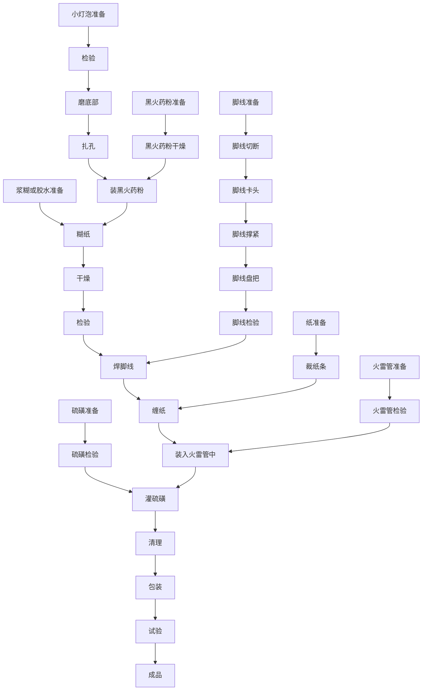

# 第七章 电雷管制造法

## 1 概 述

在火雷管中装入一个电桥发火机构即构成电雷管。电桥发火机构是以两根脚线和电桥丝组成。一般所采用的脚线规格是直径0.45毫米的纱包线，其电阻为 $ 0.11\pm0.01 $欧姆/米。脚线每根的长度是1.5～2米，在其端部穿入一个绝缘垫(用橡皮或厚纸板)。脚线的顶端，焊上电桥丝。

电桥是电雷管的主要部件，桥丝通常是采用直径0.03~0.04毫米的康铜合金丝，在桥丝上缠以少量的硝化棉(一般可装0.05克)。

电雷管装配时，为使电桥牢固的固定于雷管壳中，在绳缘垫上面灌硫磺或密封剂。

1—脚线；2—防潮剂；3—绝缘垫；4—桥丝；5—硝化棉；6—管壳；7—加强帽；8—绸垫；9—起爆药；10—烈性炸药。

图51 电雷管

电雷管的发火原理与火雷管不同，它是利用电流通过电桥使电桥丝灼热，点燃硝化棉和使雷管爆炸。

电雷管和火雷管相比其优点是，可以远距离操作，在水下或土壤等介质中均可从事爆破作业。

抗战时期，电雷管的应用也是很广泛的，如需要在较远的地点进行大爆破或在爆破条件不允许爆破人员就地点火起爆时，就需要用电雷管。在一次战斗中，敌人据点中有一个很大的堡垒，防守很严，按战斗要求必须攻克这一据点，倘若硬攻或强力爆破，要付出较大的代价。为着巧妙的打击敌人，就在距离敌人据点数十米以外，由地下挖一通道，将大型炸药包从地洞送入堡垒底下，装好电雷管，在数十米以外，接通电流，轰的一声巨响，敌人血肉横飞，与堡垒同归于尽。这样的爆破例子，当时很多，不胜枚举。

## 2 电雷管的构造

在抗战时期，为了充分利用各种物质，曾采用灯泡制成灯泡式电桥电雷管。

灯泡式电桥电雷管的构造如图 52、53 所示。外形与普通的电雷管相似，它是以火雷管为主体，从雷管的口部装入一个手电筒用的小灯泡，在灯泡中装入少量的黑火药粉，灯泡的两极处焊接上脚线，然后在口部灌入硫磺，使灯泡式电桥固定于火雷管中。当电源接通时，电流通过脚线使桥丝烧灼，点燃灯泡中的黑火药粉，火焰从底部的传火孔(大都是将灯泡炸开)排出，引爆雷管中的起爆药，使整个雷管爆炸。

1—脚线(铜丝或铁丝)；2—防潮剂(硫磺)；3—继上的纸条；4—手电筒用小灯泡；5—纸管壳；6—加强帽；7—雷汞或雷银；8—炸药。

图52 纸尧电雷管

这种形式的电雷管，结构简单，制造容易。

1—枪弹废铜壳。

图53 用枪弹废铜壳改装的铜电雷管

## 3 灯泡式电发火的制造

灯泡式电发火是电雷管中的发火机构，是由脚线(纱包线)、手电筒用的小灯泡和黑火药粉等构成，如图 54 所示。

流程15 电雷管装配工艺流程

<!--  -->

1—纱包线；2—手电筒用小灯泡；3—黑火药粉。

图54 电发火放大视图

### (一) 脚线准备

脚线的材料是直径0.45毫米的铜芯纱包线或铁芯纱包线，将它先剪成规定长度(通常为1.5～2.0米)，然后用小刀将两端部棉纱除去40～50毫米(如图55所示)。其一端与小灯泡焊接用，另一端在使用时与电源线路相接。

图55 纱包缝
 

除掉端部棉线的脚线，需在手摇的工具上拧紧(如图 56、57 所示)。

1—工作台；2—手摇把；3—圆盘；4—卡紧夹；5—卡紧夹；6—脚线。

图56 拧紧工具

1—纱包线；2—钢丝芯。
 

图57 拧紧后的脚线

### (二) 往小灯泡内装黑火药粉

购来的小灯泡，通常电压为1.5、2.0、2.4、2.5伏等。选择时以电压低的为宜，若电压高，需要的点火能量大，电阻也大，因而所需电源能量也大，如用电池起爆，则需用的电池数目多，在战场上携带不方便。

装黑火药粉以前，先检验灯泡，将坏的和桥丝断的挑出来，除外覌检查外，可用一组电池进行检验。合格的灯泡用人工在磨刀石(油石)上轻轻磨灯泡的底部，将其磨薄，然后在磨薄处用钢针穿一直径为4～5毫米的小孔，慢慢地将黑火药粉由小孔处灌入灯泡中，装入黑火药粉的数量以接近桥丝为准。黑火药粉加入量不宜过少，否则，当桥丝烧断，其热量引不起黑火药粉的起火。也可采用硝化棉作为点火材料。

磨灯泡时不要用力过猛，避免磨碎。灯泡磨好和穿孔之后，先检查桥丝是否正常，再装入黑火药粉。黑火药装入后，用纸将装药的孔糊住，粘纸用的粘合剂可用胶水、虫胶漆或浆糊。纸要糊严糊平。如图58、59所示。

糊过纸的灯泡，在室温条件下放置5~6小时，粘合剂即可干燥。

图58 装黑药粉

 

1—灯泡；2—黑药粉；3—装入口。

图59 糊纸

### (三) 黑火药粉准备

电发火中所使用的黑火药粉，使用前必须经过干燥，以免黑火药粉受潮影响发火效果。黑火药的干燥，不允许用火直接加热和用锅炒干，应将黑火药粉置于木盘上铺平，放入干燥室的木架上，在室温45～60℃的条件下烘干8～12小时。经过干燥的黑火药粉，应及时使用，不宜在空气中暴露放置，如黑火药吸湿后仍需干燥才能使用。

黑火药对冲击摩擦敏感，装填黑火药粉不能用铁质工具进行，最好使用塑料、牛角和铜质等软质材料制成的工具。

### (四) 焊脚线

装好药的灯泡需焊以脚线。焊脚线时以烙铁将锡涂在如图 60 所示的部位上，两根线分别焊在灯泡的两极上。接处要牢固，表面光洁要精心细致，避免弄断桥丝。平整。焊线操作时要精心细致，避免弄断桥丝。

1—脚线；2—灯泡。

图60 焊脚线 

焊线操作时也要注意安全，操作地点不得存放过多的雷管(一般不超过十发)和不允许存放黑火药粉。脚线焊好后，有电阻表时，可测定电路是否接通，同时可进行外观检验，合格品即可送去与雷管装配。

## 4 电雷管装配

### (一) 装配

用于制造电雷管的火雷管，无论采用金属壳或纸壳，装、压药的方法均与火雷管相同。但制作电雷管所用的火雷管，在壳体中须装入发火机构。因此，管体的长度比一般的火雷管长一些，约为 60 毫米。

火雷管的直径与长度，可根据每批灯泡的尺寸来决定。火雷管中装入发火机构以前，需检查内部是否清洁。灯泡式电发火装入前亦需擦拭干净。

装配时，灯泡螺口处与雷管口部要求连接牢固，为此需在灯泡的螺口部位(有螺纹的部位)缠上纸条。缠纸条的厚度，以能将电发火牢固地固定于雷管壳中为准(如图61所示)。

图61 缠纸条 1—纸条；2—灯泡。

灯泡缠上纸条后，小心地装入雷管壳中，装入的深度不能太长，以防灯泡破碎后，破片堵塞加强帽的傅火孔而影响雷管点火。根据经验，灯泡底部和雷管加强帽上部的距离以1～1.5毫米为宜。

图62 电发火装配

### (二) 灌硫磺固定剂

雷管灌硫磺的目的是使灯泡式发火机构牢固地固定于雷管中，当受震动时不发生位移，并能起到良好的防潮作用。

硫磺熔点较高，又是燃烧物质，在熔化时不宜用火直接加热，简易安全的办法是采用隔墙加热，也可用电炉加热。隔墙加热的方法是在工作间的隔墙上开一个洞口，在隔墙的对面靠墙装一个火炉，用煤或焦炭加热(如图 63 所示)，硫磺熔化后用小勺灌入雷管壳中(如图 64 所示)。

往管壳灌入硫磺可分2～3次进行。灌入硫磺的温度应保持在117～140℃之间，温度不宜过高。灌完硫磺的雷管，经过清理、外观擦拭和检验后，合格者即为成品。

1—熔硫磺锅；2—火炉。

图63 熔化硫磺

1—硫磺；2—雷管。

图64 灌硫磺封口

## 5 电雷管的检验

### (一) 起爆试验

抗战时期，对电雷管的检验，多是采用实际爆破的方法。

起爆试验的方法是将雷管与电线(当时多采用电话线)接通，用手摇发电机或用其他电源，通电起爆，爆炸者即为合格品。如图65所示。

1—母线；2—干电池或手摇发电机；3—工作台；4—电雷管；5—墙。

图65 起爆试验

试验时，先将脚线与电话线连接好，最后再接通电源。用交流电源时，一定要先接好线路，再接通电源。如发现有拒爆现象，首先切断电源再检查处理。

### (二) 电阻检验

若有电阻表时，可检验电阻。试验用的电流最大不能超过0.03安培。电流过大，会导致雷管爆炸。通常，装好的电雷管，铜脚线的长为一米，电雷管的电阻约为0.9～1.2欧姆；脚线长度为2.5米时，电阻约为1.2～1.5欧姆。

抗战时期曾自制电阻测定器，来检查电雷管的电阻。

## 6 简易电阻检查表

电雷管的电阻检验，当没有电阻表时，可应用下述方法测定电雷管的电阻。

### (一) 构造

1. 接线图(图 66)：

    

    
    
1—表盘；2—电阻盒；3—接触板；4—夹子；5—电池；6—被测定的脚线。

    
图66 接线图

    

2. 零件：

    1. 表盘：5 毫安直流电流表，用前先打开表壳调节弹簧游丝，使指针指在刻度盘的中间。
    2. 电阻盒： $ R_1 $， $ R_2 $， $ R_2^\prime $ 和  $ R_3 $ 为锰铜或康铜制作的电阻，用锡固定于接线柱 A，B，C，D，E 上。

        令  $ R_1=R_3=10 $ 欧姆；

        $ R_2=1.1 $ 欧姆(1.6 米长脚线标准电阻)；

        $ R_2^\prime=0.1 $ 欧姆；

        $ R_2+R_2^\prime=1.2 $ 欧姆(2 米长脚线电阻)。

    3. 接触板：起电开关作用，可用2毫米厚的紫镧板制作。它以螺钉固定于作业台上。

    4. 夹子：铜制，夹线尾用，固定于作业台上。

    5. 电池：1.5伏干电池或2伏蓄电池。

### (二) 用法

1. 检查 1.6 米脚线电阻(1.6 米脚线电阻规定为 0.95～1.25 欧姆)。

    1. 确定合格区间：开始操作时将按钮F与D连接，再以0.95和1.25欧姆的两个标准电阻代替 $ R_4 $。将0.95的电阻一端接于夹子上，另一端与按钮F接触，同时把F与电源相接，记录这时表盘(如图67所示)指针的位置。用同样方法将1.25的电阻代替 $ R_4 $，再记下指针位置，指针两次位置的中间范围即为合格区间。

        

        
        
图67 表盘

        

    2. 检查：用上述方法将脚线放在 $ R_4 $位置测定，如指针摆动范围不超出合格区间即为合格品。

2. 检查2米脚线电阻(2米脚线电阻规定为1.05～1.35欧姆)。

    1. 确定合格区间：将按钮改为与E连接后，再用两个1.05和1.35欧姆的标准电阻，以同样的方法重新确定合格区间。

    2. 检查：将2米脚线放在 $ R_4 $位置测定。
    
### (三) 原理

此法是根据韦士登电桥原理(图 68)进行的，即当电桥平衡(毫安计指针在零点)时， $ R_1R_4=R_3R_2 $。因  $ R_1=R_3=10 $ 欧姆，故  $ R_4=R_2=1.1 $ 欧姆(1.6 米脚线的电阻)。

图68 原理图

$ R_4<R_2 $ 时，指针右摆；

$ R_4>R_2 $ 时，指针左摆。

因此在测定 1.6 米的脚线时，以  $ R_2 $ 为标准脚线电阻。即 1.1 欧姆， $ R_4 $ 用 0.95 和 1.25 各一个测定合格区间。当脚线电阻大于 1.25 和小于 0.95 欧姆时，指针就会超出这个区间即为不合格品。

表29 电雷管装配时所用的设备、工具和仪器

| 工序 | 设备 | 工具 | 仪器 |
| --- | --- | --- | --- |
| 小灯泡检验 |  | 干电池 |  |
| 小灯泡磨底部 |  | 油石(磨刀石) |  |
| 小灯泡扎孔 |  | 钢针 |  |
| 装黑火药粉 |  | 牛角勺 |  |
| 糊纸 | 工作台 |  |  |
| 干燥 | 干燥室 | 架子、干燥盘 | 温度计 |
| 焊脚线 | 小火炉 | 烙铁 |  |
| 缭纸 | 工作台 |  |  |
| 小灯泡装入雷管体 | 工作台 |  |  |
| 灌硫磺 |  | 小勺 |  |
| 硫磺熔化 | 火炉、锅 | 小刀 | 温度计 |
| 裁纸 |  | 小刀 |  |
| 黑火药粉干燥 | 干燥室 | 架子、干燥盘 | 温度计 |
| 脚线切断 |  | 剪刀、尺 |  |
| 脚线卡头 |  | 小刀 |  |
| 脚线挥紧 |  | 抟紧工具 |  |
| 脚线盘把 | 工作台 |  |  |
| 脚线检验 |  |  | 电阻表 |